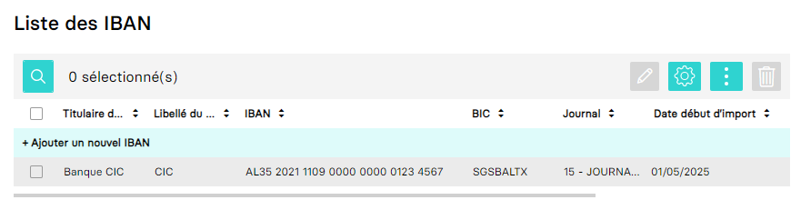

<span id="readme-top"></span>

# Banque

Dans MyUnisoft, la configuration des IBAN s'effectue à partir du menu: `Paramètres` > `Banques`.



## Exemple

Les banques permettent de lier des informations bancaires (IBAN, BIC) avec un [compte](./account.md) et un [journal](./journal.md).

```json
{
  "producerId": "1993",
  "IBAN": "AL35202111090000000001234567",
  "BIC": "SGSBALTX",
  "account": {
    "producerId": "2567424",
    "number": "5120900000",
    "name": "CIC Lyonnaise de banque"
  },
  "journal": {
    "producerId": "36502",
    "name": "BANQUE CIC",
    "type": "BANQUE",
    "customerReferenceCode": "CIC"
  },
  "additionalProducerProperties": {
    "isDefault": true
  }
}
```

> [!NOTE]
> La propriété additionnelle `isDefault` permet d'identifier la banque utilisée par défaut par le dossier comptable (utile par exemple dans le cadre des paiements de la TVA).

## Interfaces

Liste des interfaces communes:
- [SimplifiedAccount](./simplifiedAccount.md)

---

Ci-dessous les définitions avec TypeScript et JSON Schema.

<details open>
<summary>TypeScript</summary>

```ts
interface Bank {
  producerId: string;
  IBAN: string;
  BIC: string;
  account: SimplifiedAccount | null;
  journal: {
    producerId: string;
    name: string;
    type: "BANQUE";
    customerReferenceCode: string;
  };
  additionalProducerProperties: {
    isDefault: boolean;
  };
}
```
</details>

<details>
<summary>JSON Schema</summary>

```json
{
  "$schema": "http://json-schema.org/draft-07/schema#",
  "additionalProperties": false,
  "type": "object",
  "properties": {
    "producerId": {
      "type": "string"
    },
    "IBAN": {
      "type": "string",
      "maxLength": 200,
      "pattern": "^[a-zA-Z]{2}[0-9]{2}s?[a-zA-Z0-9]{4}s?[0-9]{4}s?[0-9]{3}([a-zA-Z0-9]s?[a-zA-Z0-9]{0,4}s?[a-zA-Z0-9]{0,4}s?[a-zA-Z0-9]{0,4}s?[a-zA-Z0-9]{0,3})$",
      "description": "International Bank Account Number"
    },
    "BIC": {
      "type": "string",
      "pattern": "^[a-z]{6}[2-9a-z][0-9a-np-z]([a-z0-9]{3}|x{3})?$",
      "description": "Bank Identifer Code (or also SWIFT code)"
    },
    "account": {
      "additionalProperties": false,
      "type": "object",
      "properties": {
        "producerId": {
          "type": "string",
          "nullable": true
        },
        "number": {
          "type": "string",
          "pattern": "^[a-zA-Z0-9]+$",
          "minLength": 6,
          "maxLength": 20,
          "description": "Bank account number (example 5120000)",
          "nullable": true
        },
        "name": {
          "type": "string",
          "description": "Name of the bank",
          "nullable": true
        }
      },
      "nullable": true
    },
    "journal": {
      "additionalProperties": false,
      "type": "object",
      "properties": {
        "producerId": {
          "type": "string",
          "nullable": true
        },
        "name": {
          "type": "string"
        },
        "customerReferenceCode": {
          "type": "string",
          "minLength": 2,
          "maxLength": 4,
          "pattern": "^[a-zA-Z0-9]+$",
          "description": "A code reference (unique for the accounting folder)"
        },
        "type": {
          "const": "BANQUE",
          "type": "string",
          "description": "Always a bank journal"
        }
      },
      "required": [
        "name",
        "type",
        "customerReferenceCode"
      ]
    },
    "additionalProducerProperties": {
      "type": "object",
      "properties": {
        "isDefault": {
          "type": "boolean",
          "description": "default RIB that could be automatically used internally for many operations (like TVA payments)"
        }
      },
      "required": [
        "isDefault"
      ],
      "nullable": true
    }
  },
  "required": [
    "producerId",
    "IBAN",
    "BIC",
    "journal"
  ]
}
```
</details>

<p align="right">(<a href="#readme-top">retour en haut de page</a>)</p>

## Compatibilité TRA

RIB (**BQC**). Page 51 de la spécification.

| nom de la colonne | position | chemin de la propriété MyUnisoft |
| --- | --- | --- | 
| FIXE | 1 | N/A |
| IDENTIFIANT | 4 | `BQC` |
| GENERAL | 24 | account.number |
| LIBELLE | 41 | account.name |
| BIC | 375 | BIC |
| BANQUE | 912 | journal.customerReferenceCode |
| CODEIBAN | 998 | IBAN |

> [!WARNING]
> Attention à ne pas confondre avec la section `BQE`

---

⬅️ [Introduction MAD](../../introduction.md)
