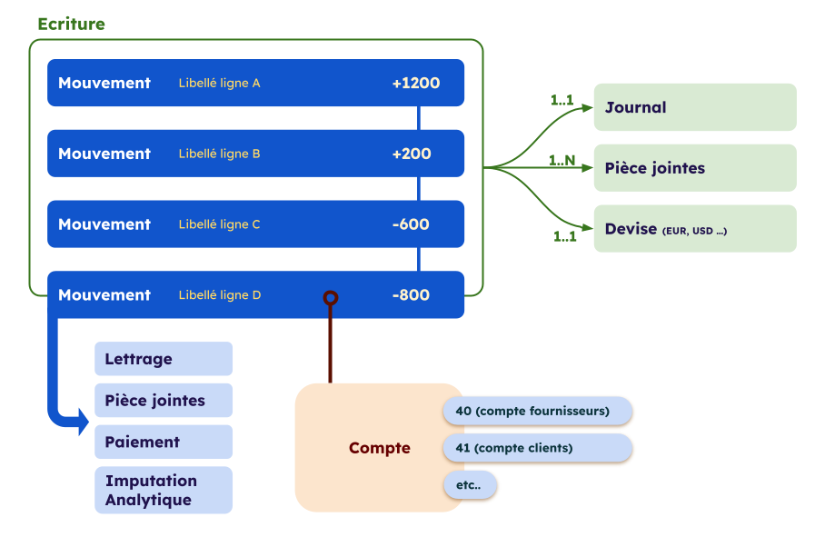

<span id="readme-top"></span>

# Écriture et Mouvements

Sur MyUnisoft les mouvements sont groupés dans une abstraction que nous appelons "Écriture comptable".



> [!NOTE]
> Un mouvement est aussi communément appelé une "ligne d'écriture".

## Exemple

```json
{
  "producerId": "13524346",
  "attachments": {
    "VotreDocumentSelectionne_12-06-2022 (5).pdf": {
      "type": "URL",
      "value": "https://app.myunisoft.fr/api/ged/ged/document/1-gTt2QkfLPABeb6Z/download"
    }
  },
  "date": "2023-02-01",
  "dueDate": null,
  "journal": {
    "producerId": "137145",
    "customerReferenceCode": "AC",
    "name": "ACHATS",
    "type": "Achat"
  },
  "currency": {
    "code": "EUR"
  },
  "movements": [
    {
      "producerId": "43221797",
      "description": "TEST",
      "value": {
        "credit": 1200,
        "debit": 0,
        "amount": 1200
      },
      "dueDate": null,
      "lettering": {
        "state": "none",
        "value": null
      },
      "freeNumber": null,
      "invoiceNumber": null,
      "attachments": {},
      "account": {
        "producerId": "1482937",
        "number": "6010000000",
        "name": "ACHATS MATIERES PREM"
      },
      "payment": null,
      "analytics": [
        {
          "producerId": "703",
          "code": "AXE1",
          "name": "LIBELLE AXE1",
          "sections": [
            {
              "producerId": "1694",
              "amount": 1200,
              "rate": 100,
              "code": "ATTENTE",
              "name": "Waiting section"
            }
          ]
        }
      ]
    },
    {
      "producerId": "43221798",
      "description": "TEST",
      "value": {
        "credit": 0,
        "debit": 1200,
        "amount": -1200
      },
      "dueDate": null,
      "lettering": {
        "state": "none",
        "value": null
      },
      "freeNumber": null,
      "invoiceNumber": null,
      "attachments": {},
      "account": {
        "producerId": "2567407",
        "number": "4551200000",
        "name": "COMPTE COURANT RACLE"
      },
      "payment": null,
      "analytics": []
    }
  ]
}
```

<p align="right">(<a href="#readme-top">retour en haut de page</a>)</p>

## Interfaces

Liste des interfaces communes:
- [Currency](./currency.md)
- [SimplifiedAccount](./simplifiedAccount.md)

---

Ci-dessous les définitions avec TypeScript et JSON Schema.

### Pièce/documents joints

Les écritures et mouvements peuvent avoir plusieurs types de pièce jointe;
- <kbd>URL</kbd> - Lien vers le fichier
- <kbd>File</kbd> - Chemin relatif vers un fichier (uniquement pour les archives en .zip)
- <kbd>Base64</kbd> - Fichier au format base64 (uniquement pour l'import)

> [!NOTE]
> En export le type `URL` est privilégié

<details open>
<summary>TypeScript</summary>

```ts
type Attachment = {
  type: "URL";
  value: string;
} | {
  type: "File";
  value: string;
} | {
  type: "Base64";
  value: string;
};
```
</details>

<details>
<summary>JSON Schema</summary>

```json
{
  "$schema": "http://json-schema.org/draft-07/schema#",
  "additionalProperties": false,
  "type": "object",
  "required": [],
  "oneOf": [
    {
      "type": "object",
      "properties": {
        "type": {
          "const": "URL"
        },
        "value": {
          "type": "string"
        }
      },
      "required": [
        "type",
        "value"
      ],
      "additionalProperties": false
    },
    {
      "type": "object",
      "properties": {
        "type": {
          "const": "File"
        },
        "value": {
          "type": "string"
        }
      },
      "required": [
        "type",
        "value"
      ],
      "additionalProperties": false
    },
    {
      "type": "object",
      "properties": {
        "type": {
          "const": "Base64"
        },
        "value": {
          "type": "string"
        }
      },
      "required": [
        "type",
        "value"
      ],
      "additionalProperties": false
    }
  ]
}
```
</details>

<p align="right">(<a href="#readme-top">retour en haut de page</a>)</p>

### Lettrage

Le lettrage permet de rapprocher une facture avec son paiement, il peut être partiel quand le paiement est fait en plusieurs fois. Une fois que la facture est payée en intégralité le lettrage sera complet.

<details open>
<summary>TypeScript</summary>

```ts
type Lettering = {
  state: "complete";
  value: string;
} | {
  state: "partial";
  value: `*${string}`;
} | {
  state: "none";
  value: null;
};
```
</details>

<details>
<summary>JSON Schema</summary>

```json
{
  "$schema": "http://json-schema.org/draft-07/schema#",
  "type": "object",
  "additionalProperties": false,
  "required": [],
  "oneOf": [
    {
      "type": "object",
      "properties": {
        "state": {
          "const": "complete"
        },
        "value": {
          "type": "string"
        }
      },
      "required": [
        "state",
        "value"
      ],
      "additionalProperties": false
    },
    {
      "type": "object",
      "properties": {
        "state": {
          "const": "partial"
        },
        "value": {
          "type": "string",
          "pattern": "^\\*.*$"
        }
      },
      "required": [
        "state",
        "value"
      ],
      "additionalProperties": false
    },
    {
      "type": "object",
      "properties": {
        "state": {
          "const": "none"
        },
        "value": {
          "type": "null"
        }
      },
      "required": [
        "state",
        "value"
      ],
      "additionalProperties": false
    }
  ]
}
```
</details>

<p align="right">(<a href="#readme-top">retour en haut de page</a>)</p>

### Imputation analytique

<details open>
<summary>TypeScript</summary>

```ts
export interface MovementAnalytics {
  producerId: string;
  code: string;
  name: string;
  sections: {
    producerId: string;
    amount: number;
    rate: number;
    code: string;
    name: string;
  }[];
}
```
</details>

<p align="right">(<a href="#readme-top">retour en haut de page</a>)</p>

### Mouvement (ou ligne d'écriture)

<details open>
<summary>TypeScript</summary>

```ts
interface Movement {
  producerId: string;
  description: string;
  attachments: Record<string, Attachment>;
  value: {
    credit: number;
    debit: number;
    amount: number;
  }
  dueDate: string | null;
  lettering: Lettering;
  freeNumber: string | null;
  invoiceNumber: string | null;
  account: SimplifiedAccount | null;
  payment: {
    producerId: string;
    name: string | null;
    code: string | null;
  } | null;
  sections: {
    producerId: string;
    amount: number;
    rate: number;
    code: string;
    name: string;
  }[];
  analytics: MovementAnalytics[];
}
```
</details>

<p align="right">(<a href="#readme-top">retour en haut de page</a>)</p>

### Ecriture

<details open>
<summary>TypeScript</summary>

```ts
interface EntryAdditionalProducerProps {
  partnerMetadata: {
    partnerId: string;
    json: string | null;
  } | null;
  publishingDestination?: string;
  comment: string | null;
}

interface Entry {
  producerId: string;
  attachments: Record<string, Attachment>;
  currency: Currency;
  date: string;
  dueDate: string | null;
  journal: {
    producerId: string;
    customerReferenceCode: string;
    name: string;
    type: string;
  };
  movements: Movement[];
  additionalProducerProperties: EntryAdditionalProducerProps;
}
```
</details>

<details>
<summary>JSON Schema</summary>

```json
{
  "$schema": "http://json-schema.org/draft-07/schema#",
  "type": "array",
  "items": {
    "additionalProperties": false,
    "type": "object",
    "properties": {
      "producerId": {
        "type": "string"
      },
      "attachments": {
        "type": "object",
        "additionalProperties": {
          "additionalProperties": false,
          "type": "object",
          "required": [],
          "oneOf": [
            {
              "type": "object",
              "properties": {
                "type": {
                  "const": "URL"
                },
                "value": {
                  "type": "string"
                }
              },
              "required": [
                "type",
                "value"
              ],
              "additionalProperties": false
            },
            {
              "type": "object",
              "properties": {
                "type": {
                  "const": "File"
                },
                "value": {
                  "type": "string"
                }
              },
              "required": [
                "type",
                "value"
              ],
              "additionalProperties": false
            },
            {
              "type": "object",
              "properties": {
                "type": {
                  "const": "Base64"
                },
                "value": {
                  "type": "string"
                }
              },
              "required": [
                "type",
                "value"
              ],
              "additionalProperties": false
            }
          ]
        },
        "required": []
      },
      "currency": {
        "additionalProperties": false,
        "type": "object",
        "properties": {
          "code": {
            "type": "string"
          },
          "rate": {
            "type": "number",
            "nullable": true
          }
        },
        "required": [
          "code"
        ]
      },
      "date": {
        "type": "string"
      },
      "dueDate": {
        "type": "string",
        "nullable": true
      },
      "journal": {
        "type": "object",
        "properties": {
          "producerId": {
            "type": "string"
          },
          "customerReferenceCode": {
            "type": "string"
          },
          "name": {
            "type": "string"
          },
          "type": {
            "type": "string"
          }
        },
        "required": [
          "producerId",
          "customerReferenceCode",
          "name",
          "type"
        ]
      },
      "movements": {
        "type": "array",
        "items": {
          "additionalProperties": false,
          "type": "object",
          "properties": {
            "producerId": {
              "type": "string"
            },
            "description": {
              "type": "string"
            },
            "attachments": {
              "type": "object",
              "additionalProperties": {
                "additionalProperties": false,
                "type": "object",
                "required": [],
                "oneOf": [
                  {
                    "type": "object",
                    "properties": {
                      "type": {
                        "const": "URL"
                      },
                      "value": {
                        "type": "string"
                      }
                    },
                    "required": [
                      "type",
                      "value"
                    ],
                    "additionalProperties": false
                  },
                  {
                    "type": "object",
                    "properties": {
                      "type": {
                        "const": "File"
                      },
                      "value": {
                        "type": "string"
                      }
                    },
                    "required": [
                      "type",
                      "value"
                    ],
                    "additionalProperties": false
                  },
                  {
                    "type": "object",
                    "properties": {
                      "type": {
                        "const": "Base64"
                      },
                      "value": {
                        "type": "string"
                      }
                    },
                    "required": [
                      "type",
                      "value"
                    ],
                    "additionalProperties": false
                  }
                ]
              },
              "required": []
            },
            "value": {
              "type": "object",
              "properties": {
                "credit": {
                  "type": "number"
                },
                "debit": {
                  "type": "number"
                },
                "amount": {
                  "type": "number"
                }
              },
              "required": [
                "amount",
                "credit",
                "debit"
              ]
            },
            "dueDate": {
              "type": "string",
              "nullable": true
            },
            "lettering": {
              "type": "object",
              "additionalProperties": false,
              "required": [],
              "oneOf": [
                {
                  "type": "object",
                  "properties": {
                    "state": {
                      "const": "complete"
                    },
                    "value": {
                      "type": "string"
                    }
                  },
                  "required": [
                    "state",
                    "value"
                  ],
                  "additionalProperties": false
                },
                {
                  "type": "object",
                  "properties": {
                    "state": {
                      "const": "partial"
                    },
                    "value": {
                      "type": "string",
                      "pattern": "^\\*.*$"
                    }
                  },
                  "required": [
                    "state",
                    "value"
                  ],
                  "additionalProperties": false
                },
                {
                  "type": "object",
                  "properties": {
                    "state": {
                      "const": "none"
                    },
                    "value": {
                      "type": "null"
                    }
                  },
                  "required": [
                    "state",
                    "value"
                  ],
                  "additionalProperties": false
                }
              ]
            },
            "freeNumber": {
              "type": "string",
              "nullable": true
            },
            "invoiceNumber": {
              "type": "string",
              "nullable": true
            },
            "account": {
              "type": "object",
              "properties": {
                "producerId": {
                  "type": "string",
                  "nullable": true
                },
                "number": {
                  "type": "string",
                  "nullable": true
                },
                "name": {
                  "type": "string",
                  "nullable": true
                }
              },
              "nullable": true
            },
            "payment": {
              "additionalProperties": false,
              "type": "object",
              "properties": {
                "producerId": {
                  "type": "string"
                },
                "code": {
                  "type": "string",
                  "nullable": true,
                  "description": "Short and unique code identifier",
                  "enum": [
                    "CB",
                    "VIRT",
                    "ESP",
                    "CHQ",
                    "PRLV",
                    "LCR",
                    null
                  ]
                },
                "name": {
                  "type": "string",
                  "nullable": true,
                  "description": "Complete name (or description)",
                  "enum": [
                    "Carte Bleue",
                    "Virement",
                    "Espèce",
                    "Chèque",
                    "Pr├®l├¿vement",
                    "Lettre de change",
                    null
                  ]
                }
              },
              "nullable": true,
              "required": [
                "producerId"
              ]
            },
            "analytics": {
              "type": "array",
              "items": {
                "type": "object",
                "properties": {
                  "producerId": {
                    "type": "string"
                  },
                  "code": {
                    "type": "string"
                  },
                  "name": {
                    "type": "string"
                  },
                  "sections": {
                    "type": "array",
                    "items": {
                      "type": "object",
                      "properties": {
                        "producerId": {
                          "type": "string"
                        },
                        "amount": {
                          "type": "number"
                        },
                        "rate": {
                          "type": "number"
                        },
                        "code": {
                          "type": "string"
                        },
                        "name": {
                          "type": "string"
                        }
                      },
                      "required": [
                        "producerId",
                        "amount",
                        "rate",
                        "code",
                        "name"
                      ]
                    }
                  }
                },
                "required": [
                  "producerId",
                  "code",
                  "name",
                  "sections"
                ]
              }
            },
            "additionalProducerProperties": {
              "type": "object",
              "properties": {
                "comment": {
                  "type": "string"
                }
              },
              "required": [
                "comment"
              ],
              "nullable": true
            }
          },
          "required": [
            "producerId",
            "description",
            "value",
            "lettering",
            "analytics"
          ]
        }
      },
      "additionalProducerProperties": {
        "type": "object",
        "properties": {
          "partnerId": {
            "type": "string"
          },
          "partnerMetadata": {
            "type": "object",
            "properties": {
              "partnerId": {
                "type": "string"
              }
            },
            "required": [
              "partnerId"
            ]
          },
          "publishingDestination": {
            "type": "string"
          },
          "comment": {
            "type": "string"
          }
        },
        "nullable": true,
        "required": [
          "partnerId",
          "partnerMetadata",
          "publishingDestination",
          "comment"
        ]
      }
    },
    "required": [
      "producerId",
      "attachments",
      "currency",
      "date",
      "movements"
    ]
  }
}
```
</details>

<p align="right">(<a href="#readme-top">retour en haut de page</a>)</p>

---

⬅️ [Introduction MAD](../../introduction.md)
