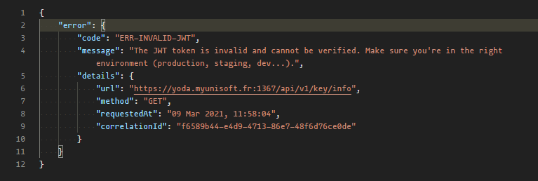

<p align="center">

</p>

L’API Partenaires permet à des logiciels partenaires ainsi que des cabinets membres de récupérer et d'envoyer de l'information depuis/vers MyUnisoft.

L’authentification du partenaire/cabinet est principalement basé sur:
- une clé **x-third-party** fournie par MyUnisoft (demande auprès de [c.mandrilly@myunisoft.fr](c.mandrilly@myunisoft.fr)).
- une clé [JWT](https://jwt.io/) (**API Token**) pour chaque cabinet et/ou société.

Ces deux clés sont nécessaires pour pouvoir utiliser les routes définies sur [https://docs.api.myunisoft.fr/](https://docs.api.myunisoft.fr/)

# Equipe 👥

| Prénom - Nom | Rôle(s) | Email |
| --- | --- | --- |
| Cyril Mandrilly | CTO | [c.mandrilly@myunisoft.fr](c.mandrilly@myunisoft.fr) |
| Thomas Gentilhomme | Lead Développeur API | [gentilhomme.thomas@gmail.com](gentilhomme.thomas@gmail.com) |
| Alexandre Malaj | Développeur API | [alexandre.malaj@gmail.com](alexandre.malaj@gmail.com) |
| Léon Souvannavong | Lead dev back-end (**a consulter pour la partie métier**) | [l.souvannavong@myunisoft.fr](l.souvannavong@myunisoft.fr) |

# Type d'accès 🔬
Notre API partenaires permet deux types distincts d'accès:

- 🔸 Un accès restreint a une **société** (dossier) d'un cabinet.

> L'accès limité par société est le modèle le plus courant car il permet d'interconnecter nos solutions de manière permanente par le biais d'un jeton n'ayant aucune date d'expiration (il peut être néanmoins révoqué par le gestionnaire du dossier ou par nos équipes techniques). C'est un modèle qui est aussi très flexible car nous n'avons pas à intervenir dans le processus de connexion. [Plus d'informations ici](./docs/connector.md).

- 🔹 Un accès à l'intégralité d'un **cabinet**.

> Un accès **cabinet** delivera un jeton ayant une durée de vie très courte pour garantir une meilleure sécurité des données appartenant au cabinet.

# Prérequis 👀

Les éléments et informations que le partenaire (ou cabinet) doit nous fournir (mail a [c.mandrilly@myunisoft.fr](c.mandrilly@myunisoft.fr) ou slack si déjà invité.).

## 🔸 Accès par société

Ces éléments permettront de créer le connecteur sur l’application MyUnisoft et de vous envoyer les informations techniques: 

- nom partenaire.
- description courte partenaire (3 lignes 25 char maximum).
- description longue.
- logo partenaire (png, hauteur 50px).
- texte complémentaire (par exemple ou coller la clé sur votre interface ou lien vers une doc/vidéo d’utilisation avec myunisoft)
- nom, prénom, email pour un accès à myunisoft.
- nom, prénom, email pour une invitation slack.

## 🔹 Accès cabinet

> ⚠️ **PAS ENCORE DISPONIBLE**.

---

Les éléments que nous renvoyons au partenaire une fois les éléments ci-dessus en notre possession:

- Clé **x-third-party** de production (C’est une clé secrète unique entre vous et nous qui sera nécessaire pour requêter l’API).
- Un compte au sein d'un schéma dédié aux intégrations partenaires (Permets à vos équipes de tester l'intégration).
- Lien vers la documentation **postman** ([https://docs.api.myunisoft.fr/#intro](https://docs.api.myunisoft.fr/#intro)).

# Liens racine de nos API 🌍

- API Partenaires: [https://app.myunisoft.fr/api/v1](https://app.myunisoft.fr/api/v1)
- Service Auth: [https://app.myunisoft.fr/api/auth/token](https://app.myunisoft.fr/api/auth/token)

# Authentification 🔐

Les sous-documentations suivantes vous guideront dans le flow d'authentification nécessaire selon le type d'accès que vous avez souhaité.

- [🔸 Accès par société](./docs/auth/societe.md)
> ⚠️ Dans le cadre **d'un accès société** l'authentification n'est nécessaire **que pour la phase de développement** du connecteur! Plus [d'informations ici](./docs/connector.md).


- [🔹 Accès cabinet](./docs/auth/cabinet.md)

# Utilisation d’une route exposée par l’API 🚀

Lors de l’utilisation d’une route exposée il est nécessaire d’avoir l’**API Token** dans l'en-tête HTTP **Authorization** (et surtout pas le User token délivré par le Service d'authentification MyUnisoft). Il est aussi important de noter qu'il s'agit d'un "[Bearer token](https://swagger.io/docs/specification/authentication/bearer-authentication/)".

Il est aussi nécessaire d’ajouter une en-tête HTTP “**X-Third-Party-Secret**” contenant la clé secrète communiqué par l’équipe technique MyUnisoft.

```bash
$ curl --location --request GET 'https://api.myunisoft.fr/api/v1/vat_param' \
--header 'X-Third-Party-Secret: nompartenaire-L8vlKfjJ5y7zwFj2J49xo53V' \
--header 'Authorization: Bearer {{JWT_TOKEN}}'
```

Pour plus d'informations nous vous invitons à consulter les sous-documentations suivantes:

- [🔸 Accès par société](./docs/endpoints/societe.md)
- [🔹 Accès cabinet](./docs/endpoints/cabinet.md)

## Rate-limit des routes exposées

L'API limite le nombre de requêtes par API Token, quelques en-têtes supplémentaires sont envoyés dans la réponse HTTP:

- **X-Rate-Limit-Remaining** (le nombre de requêtes restantes dans la période).
- **X-Rate-Limit-Reset** (timestamp correspondant au moment où la période sera réinitialisée).
- **X-Rate-Limit-Total** (le nombre total de requêtes pour une période).

La limite par **défaut est de 100 requêtes par minute**.

## Routes accessibles avec l'API Token

> ⚠️ Pour le moment uniquement possible avec un **🔸 accès société**.

Il est possible de récupérer la liste des routes (endpoints http) auxquelles vous avez accès **grâce à votre API Token** (Ce qui peut aussi vous permettre de vérifier la validité du token). La route GET **/api/v1/key/info** permet de récupérer la liste des routes ainsi que la méthode HTTP nécessaire (get, post, put ..).

Attention car la route nécessite que l'en-tête HTTP **Authorization soit l’API Token**.


# Gestion des erreurs
Chaque erreur est accompagnée d’un code unique (**l'intégralité des codes [ici](./docs/error_codes.md)**) et d’un message essayant de vous guider au mieux dans la résolution de l’erreur. La propriété “**details**” servira si besoin à nos équipes à tracer et identifier la source du problème en interne.



La propriété message est en ce qui la concerne vouée à évoluer à travers le temps. **Nous vous recommandons de ne pas l’utiliser comme référentiel pour automatiser une gestion d’erreur au sein de vos implémentations**.

L’API n’a pour le moment aucune gestion d’un **retour de multiple** “erreurs” mais il n’est pas exclu que cela soit le cas dans le futur. Tout retour HTTP n’ayant pas un statut code en 2xx retournera donc forcément un JSON avec une propriété racine “error”.

> ⚠️ Attention nous ne parlons pas des erreurs qui sont retournées sur les routes qui ne sont que des passerelles vers d’autres API internes. Nous travaillons encore à rendre tout cela plus clair et plus stable sur le moyen-long terme. ⚠️

# Guides supplémentaires 📌

Une liste de guides qui pourront certainement vous aider dans la réalisation de l'interconnexion.

- [Création d'une entrée comptable avec le format JSON](./docs/entry_json.md)
- [Création d'une entrée comptable avec le format TRA+PJ](./docs/entry_tra.md)
