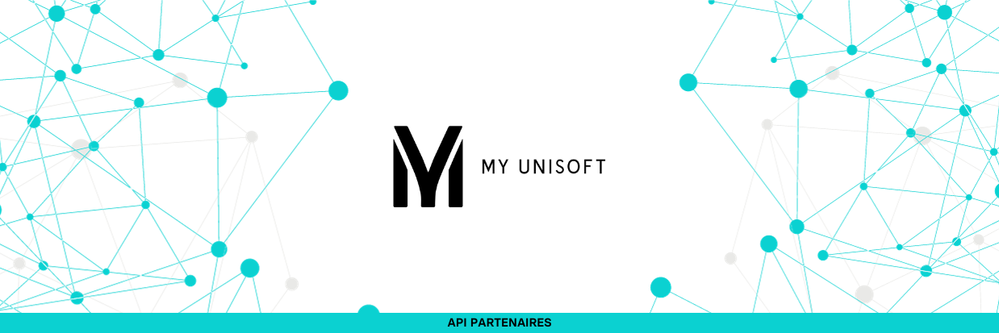

<span id="readme-top"></span>

<p align="center">

</p>

<p align="center">
  <a href="https://myunisoft-connected.fr/">
    
  </a>
  <a href="https://github.com/MyUnisoft/api-partenaires/blob/main/postman/API%20Partners%20(Public).postman_collection.json">
    
  </a>
</p>

L’API Partenaires permet à des logiciels partenaires ainsi que des cabinets membres de récupérer et d'envoyer de l'information depuis/vers MyUnisoft.

L’authentification du partenaire/cabinet est principalement basée sur:
- une clé <kbd>X-Third-Party</kbd> fournie par MyUnisoft (à fournir en en-tête HTTP pour chaque requête). C'est une clé `unique` qui ne doit surtout **pas être communiqué** en dehors de nos équipes techniques respectives.
- une clé [JWT](https://jwt.io/) (**API Token**) pour chaque cabinet et/ou société.

> [!IMPORTANT] 
> Ces deux clés sont nécessaires pour pouvoir utiliser les routes définies sur la documentation postman: [https://docs.api.myunisoft.fr/](https://docs.api.myunisoft.fr/)

# Prérequis 👀

<details>
<summary>✏️ Les éléments et informations à fournir</summary>
<br>

- nom partenaire.
- description courte partenaire (3 lignes 25 char maximum).
- description longue.
- logo partenaire (png, hauteur 50px).
- texte complémentaire (par exemple ou coller la clé sur votre interface ou lien vers une doc/vidéo d’utilisation avec myunisoft)
- nom, prénom, email pour un accès à myunisoft.
- nom, prénom, email pour une invitation slack/teams.
</details>

<details>
<summary>👉 Ce que nous renvoyons une fois les éléments ci-dessus en notre possession</summary>
<br>

- Clé <kbd>X-Third-Party</kbd> (C’est une clé secrète unique entre vous et nous qui sera nécessaire pour requêter l’API).
- Un compte au sein d'un schéma (cabinet) dédié aux tests d'intégration.
- Lien vers la documentation **postman** ([https://docs.api.myunisoft.fr/#intro](https://docs.api.myunisoft.fr/#intro)).
</details>
<br>

N'attendez pas pour rejoindre l'écosystème [MyUnisoft connected](https://myunisoft-connected.fr/) riche de plus d'une centaine d'intégrations!

## Activation de la clé secrète X-Third-Party

Vous n'avez rien à faire pour activer cette clé, ce sont les équipes MyUnisoft qui s'occupent de la générer et de l'activer (càd la rendre valide vis à vis de l'API partenaires).

> [!NOTE]  
> Il peut y avoir un certain délai entre la génération de la clé et son activation. La clé ne sera pas reconnue par notre API tant que la clé n'a pas été activée!

# Type d'accès 🔬

Notre API partenaires a deux types distincts d'accès, chacun de ces accès permet d'interconnecter nos solutions de manière permanente par le biais d'un jeton n'ayant pas de date d'expiration (il peut être néanmoins révoqué par le gestionnaire du dossier/cabinet ou par nos équipes techniques).

Il vous sera nécessaire de choisir l'un des deux type d'accès (ou de discuter plus amplement avec nous pour vous guider vers la bonne abstraction):

🔸 Un accès restreint a une **société** (dossier de production) d'un cabinet.

🔹 Un accès à l'intégralité d'un **cabinet**.

> [!NOTE]
> Le terme de **cabinet** ou **firm** est souvent utilisé à tort pour parler d'un schéma MyUnisoft. Un schéma peut contenir un à plusieurs cabinets et représente un client signé sur le plan commercial et technique.


> [!TIP]  
> Pour récupérer la liste et le paramétrage de plusieurs dossiers il est nécessaire d'avoir un accès cabinet. Il en va de même pour la récupération des entités qui ne sont pas liées au dossier (comme les utilisateurs et les portefeuilles).

<p align="right">(<a href="#readme-top">retour en haut de page</a>)</p>

# Authentification 🔐

### Partenaire

Voici la marche à suivre concernant l'authentification si vous êtes un partenaire: [Comment s'authentifier ?](docs/authentication/partenaire.md)

### Formule API Cabinet (destiné aux cabinets eux-mêmes).

Voici la marche à suivre concernant l'authentification si vous êtes un cabinet ayant souscrit à l'offre API Cabinet: [Comment s'authentifier ?](docs/authentication/cabinet.md)

<p align="right">(<a href="#readme-top">retour en haut de page</a>)</p>

# Utilisation d’une route exposée par l’API 🚀

Lors de l’utilisation d’une route exposée il est nécessaire d’avoir l’**API Token** en [Bearer token](https://swagger.io/docs/specification/authentication/bearer-authentication/) dans l'en-tête **Authorization**.

Il est aussi nécessaire d’ajouter une en-tête “**X-Third-Party-Secret**” contenant la clé secrète communiqué par notre équipe.

```bash
$ curl --location --request GET 'https://api.myunisoft.fr/api/v1/vat_param' \
--header 'X-Third-Party-Secret: nompartenaire-L8vlKfjJ5y7zwFj2J49xo53V' \
--header 'Authorization: Bearer {{API_TOKEN}}'
```

Pour plus d'informations nous vous invitons à consulter les sous documentations suivantes selon la nature de votre accès:

- [🔸 Accès par société](./docs/endpoints/societe.md)
- [🔹 Accès cabinet](./docs/endpoints/cabinet.md)
- [🔑 Liste des routes accessibles](docs/endpoints/keyinfo.md)

## Lien racine 🌍

La racine de notre API partenaires est la suivante: [https://api.myunisoft.fr/api/v1](https://api.myunisoft.fr/api/v1)

## Rate-limit des routes exposées 🚥

L'API limite le nombre de requêtes par API Token, quelques en-têtes supplémentaires sont envoyés dans la réponse HTTP:

- <kbd>X-Rate-Limit-Remaining</kbd> (le nombre de requêtes restantes dans la période).
- <kbd>X-Rate-Limit-Reset</kbd> (timestamp correspondant au moment où la période sera réinitialisée).
- <kbd>X-Rate-Limit-Total</kbd> (le nombre total de requêtes pour une période).

La limite par **défaut est de 20 requêtes par tranche de 10 secondes**. Certains endpoints d'import ou d'export lourd peuvent comptabiliser plusieurs utilisations d'un coup pour sécuriser les usages abusifs pouvant amener à une dégradation des performances de notre plateforme.

Lorsque la limite est dépassé l'API retournera une erreur `ERR-TOO-MANY-REQUEST` avec un statusCode HTTP égal à <kbd>429</kbd>.

<p align="right">(<a href="#readme-top">retour en haut de page</a>)</p>

# Documentation 📌

Une liste de guides qui pourront certainement vous aider dans la réalisation de l'interconnexion avec MyUnisoft.

- [Collection + Environment postman](https://github.com/MyUnisoft/api-partenaires/tree/main/postman)
- [Gestion et compréhension des retours/codes d'erreurs](./docs/erreurs.md)
- **[BETA]** [Webhooks](./docs/webhooks.md)

## Guides sur les API cabinets
- [Création et mise à jour d'un dossier de production](docs/accounting/firm/create_society.md)
- [Récupérer les utilisateurs et personnes physiques](docs/accounting/firm/users.md)
- [Récupérer les dossiers accessibles pour un utilisateur](docs/accounting/firm/dossier_accessible.md)
- [Récupérer les dossiers de productions (entreprises)](docs/accounting/society.md)
- [Récupérer le paramétrage comptable d'un dossier de production](docs/accounting/firm/accounting_parameters.md)
- [Récupérer les filiales associées à une entreprise](docs/accounting/firm/filiale_associate.md)

## Guides sur les API comptabilités

- **[BETA]** [MAD (MyUnisoft Accounting Data)](./MAD/introduction.md)
- [Récupérer les exercices](docs/accounting/folder/exercices.md)
- [Récupérer les banques (RIBS / IBAN)](docs/accounting/folder/RIB.md)
- [Récupérer les TVA](docs/accounting/folder/tva.md)
- [Récupérer les journaux](docs/accounting/folder/journaux.md)
- [Récupérer les méthodes de paiement](docs/accounting/folder/paiements.md)
- [Récupérer la déclaration EDI d'un exercice comptable](docs/accounting/folder/export/EDI.md)
- [Récupérer et travailler avec le plan comptable](docs/accounting/folder/account/plan_comptable.md)
  - [Comprendre les informations diverses et complémentaires d'un compte client ou fournisseur](docs/accounting/folder/account/miscellaneous_and_complementary_info.md)
  - [Mise à jour de la liste de contacts d'un compte client ou fournisseur](docs/accounting/folder/account/update_contact.md)
  - [Mise à jour complète d'un compte client ou fournisseur](docs/accounting/folder/account/update.md)
- [Récupération et/ou création d'un compte](docs/accounting/folder/account/create.md)
- [Gérer l'analytique d'une société (dossier)](docs/accounting/folder/analytique.md)
- [Récupération des données liées aux widgets et dashboards](docs/accounting/folder/dashboard.md)

### Ecritures et mouvements

- <kbd>Import</kbd> [JSON](docs/accounting/folder/import/json.md), [TRA+PJ](docs/accounting/folder/import/tra.md), [FEC](docs/accounting/folder/import/fec.md), [Factur-X](docs/accounting/folder/import/facturx.md)
- <kbd>Export</kbd> [JSON](docs/accounting/folder/export/ecritures.md), [FEC](docs/accounting/folder/export/FEC.md)
- [Attacher une pièce jointe à une écriture existante](docs/accounting/folder/import/pj.md)
- [Récupérer et créer des drapeaux (flag) sur des lignes/mouvements](docs/accounting/folder/import/flags.md)
- [Ajout ou modification d'un commentaire sur une écriture](docs/accounting/firm/entry_comment.md)

# Contact 👥

| Prénom - Nom | Rôle(s) | Email |
| --- | --- | --- |
| Thierry Davoigniot | PMO | [t.davoigniot@myunisoft.fr](t.davoigniot@myunisoft.fr) |
| Thomas Gentilhomme | Lead Développeur API & Connecteurs | [partners.tech@myunisoft.fr](partners.tech@myunisoft.fr) |

<p align="right">(<a href="#readme-top">retour en haut de page</a>)</p>
