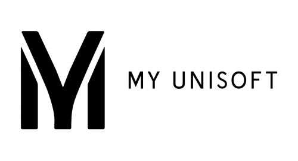
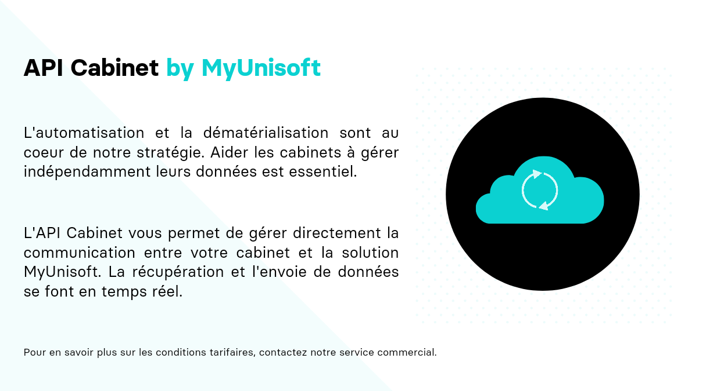

<p align="center">

</p>

L’API Partenaires permet à des logiciels partenaires ainsi que des cabinets membres de récupérer et d'envoyer de l'information depuis/vers MyUnisoft.

L’authentification du partenaire/cabinet est principalement basée sur:
- une clé **x-third-party** fournie par MyUnisoft (demande auprès de [c.mandrilly@myunisoft.fr](c.mandrilly@myunisoft.fr)). C'est une clé **unique** qui ne doit surtout **pas être communiqué** en dehors de nos équipes techniques respectives.
- une clé [JWT](https://jwt.io/) (**API Token**) pour chaque cabinet et/ou société.

Ces deux clés sont nécessaires pour pouvoir utiliser les routes définies sur la documentation postman: [https://docs.api.myunisoft.fr/](https://docs.api.myunisoft.fr/)

# Equipe 👥

| Prénom - Nom | Rôle(s) | Email |
| --- | --- | --- |
| Thierry Davoigniot | PMO | [t.davoigniot@myunisoft.fr](t.davoigniot@myunisoft.fr) |
| Rémy Longueville | Responsable des partenariats | [r.longueville@myunisoft.fr](r.longueville@myunisoft.fr) |
| Thomas Gentilhomme | Lead Développeur API & Connecteurs | [t.gentilhomme@myunisoft.fr](t.gentilhomme@myunisoft.fr) |

# Type d'accès 🔬
Notre API partenaires permet deux types distincts d'accès:

🔸 Un accès restreint a une **société** (dossier) d'un cabinet.

> L'accès limité par société est le modèle le plus courant car il permet d'interconnecter nos solutions de manière permanente par le biais d'un jeton n'ayant aucune date d'expiration (il peut être néanmoins révoqué par le gestionnaire du dossier ou par nos équipes techniques).
>
> C'est un modèle qui est aussi très flexible car nous n'avons pas à intervenir dans le processus de connexion. [Plus d'informations ici](./docs/connector.md).

🔹 Un accès à l'intégralité d'un **cabinet**.

> Cet accès à été principalement conçu pour être utilisé par les cabinets eux-mêmes. L'authentification delivera un jeton ayant une durée de vie très courte pour garantir une meilleure sécurité des données appartenant au cabinet.
>
> **Note: Nous travaillons encore sur ce modèle d'accès et des changements sont à venir**.

Il vous sera nécessaire de choisir l'un des deux (ou de discuter plus amplement avec nous pour que nous puissions vous guider vers la bonne abstraction).

# Prérequis 👀

Les éléments et informations que le partenaire (ou cabinet) doit nous fournir (mail a [c.mandrilly@myunisoft.fr](c.mandrilly@myunisoft.fr) ou slack si déjà invité.).

## 🔸 Accès par société

Ces éléments permettront de créer le connecteur sur l’application MyUnisoft et de vous envoyer les informations techniques: 

- nom partenaire.
- description courte partenaire (3 lignes 25 char maximum).
- description longue.
- logo partenaire (png, hauteur 50px).
- texte complémentaire (par exemple ou coller la clé sur votre interface ou lien vers une doc/vidéo d’utilisation avec myunisoft)
- nom, prénom, email pour un accès à myunisoft.
- nom, prénom, email pour une invitation slack.

## 🔹 Accès cabinet



Si vous êtes un partenaire et que votre solution **nécessite un tel accès** nous vous invitons à nous fournir les mêmes informations que pour `🔸 l'accès par société`.

Pour les cabinets déjà membre il vous sera nécessaire de fournir un mail pour la création d'un compte API (Nous vous **recommandons de créer un mail spécialement pour l'occasion**, par exemple `apimyunisoft@domain.fr`).

---

Les éléments que nous renvoyons au partenaire (ou cabinet) une fois les éléments ci-dessus en notre possession:

- Clé **x-third-party** (C’est une clé secrète unique entre vous et nous qui sera nécessaire pour requêter l’API).
- Un compte au sein d'un schéma (cabinet) dédié aux tests d'intégration.
- Lien vers la documentation **postman** ([https://docs.api.myunisoft.fr/#intro](https://docs.api.myunisoft.fr/#intro)).

# Vocabulaire et entités

- Le terme de "**société**" (society) est utilisé pour parler d'un dossier de production (une entreprise) MyUnisoft.
- Le terme de "**cabinet**" (firm) est souvent utilisé à tort pour parler d'un schéma MyUnisoft. Un schéma peut contenir un à plusieurs cabinets et représente un client signé sur le plan commercial et technique.


Les utilisateurs sont attachés au schéma (ce sont les comptes ayant un accès à la plateforme Web et mobile).

> Note: Pour récupérer la liste et le paramétrage de plusieurs dossiers il est nécessaire d'avoir un accès cabinet. Il en va de même pour la récupération des entités qui ne sont pas liées au dossier (comme les utilisateurs et les portefeuilles).

# Liens racine de nos API 🌍

- API Partenaires: [https://app.myunisoft.fr/api/v1](https://app.myunisoft.fr/api/v1)
> 👀 `api/v1/key` pour la gestion de la/les clé(s) API Token pour `🔸 l'accès par société`

- Service d'Authentification: [https://app.myunisoft.fr/api/authenticate](https://app.myunisoft.fr/api/authenticate)

# Authentification 🔐

Les sous-documentations suivantes vous guideront dans le flow d'authentification nécessaire selon le type d'accès que vous avez souhaité.

[🔸 Accès par société](./docs/auth/societe.md)
> ⚠️ Dans le cadre **d'un accès société** l'authentification n'est nécessaire **que pour la phase de développement** du connecteur! Plus [d'informations ici](./docs/connector.md).


[🔹 Accès cabinet](./docs/auth/cabinet.md)

# Utilisation d’une route exposée par l’API 🚀

Lors de l’utilisation d’une route exposée il est nécessaire d’avoir l’**API Token** en [Bearer token](https://swagger.io/docs/specification/authentication/bearer-authentication/) dans l'en-tête **Authorization** (et surtout pas le jeton Utilisateur).

Il est aussi nécessaire d’ajouter une en-tête “**X-Third-Party-Secret**” contenant la clé secrète communiqué par notre équipe.

```bash
$ curl --location --request GET 'https://api.myunisoft.fr/api/v1/vat_param' \
--header 'X-Third-Party-Secret: nompartenaire-L8vlKfjJ5y7zwFj2J49xo53V' \
--header 'Authorization: Bearer {{API_TOKEN}}'
```

Pour plus d'informations nous vous invitons à consulter les sous documentations suivantes selon la nature de votre accès:

- [🔸 Accès par société](./docs/endpoints/societe.md)
- [🔹 Accès cabinet](./docs/endpoints/cabinet.md)
- [🔑 Liste des routes accessibles](./docs/endpoints/endpoints_accessibles.md)

## Rate-limit des routes exposées 🚥

L'API limite le nombre de requêtes par API Token, quelques en-têtes supplémentaires sont envoyés dans la réponse HTTP:

- **X-Rate-Limit-Remaining** (le nombre de requêtes restantes dans la période).
- **X-Rate-Limit-Reset** (timestamp correspondant au moment où la période sera réinitialisée).
- **X-Rate-Limit-Total** (le nombre total de requêtes pour une période).

La limite par **défaut est de 100 requêtes par minute**.

# Documentation 📌

Une liste de guides qui pourront certainement vous aider dans la réalisation de l'interconnexion avec MyUnisoft.

## Guides API
- [Collection + Environment postman](https://github.com/MyUnisoft/api-partenaires/tree/main/postman)
- [Gestion des retours erreurs](./docs/erreurs.md)
- [TypeDoc publique](https://myunisoft.github.io/tsd/)

## Guides pour l'accès cabinet
- [Récupérer les utilisateurs et personne physiques d'un schéma (cabinet)](./docs/users.md)
- [Récupérer les dossiers accessibles pour un utilisateur (cabinet)](./docs/dossier_accessible.md)

## Guides sur l'import d'écritures comptables
- [Création d'une entrée comptable avec le format JSON](./docs/entry_json.md)
- [Création d'écritures et mouvements comptable avec le format TRA+PJ](./docs/entry_tra.md)
- [Création et Modification d'écritures et mouvements comptable avec le format FEC](./docs/entry_fec.md)
- [Création d'une entrée comptable avec le format Factur-X](./docs/entry_facturx.md)
- [Attacher une pièce jointe à une entrée comptable existante](./docs/pj.md)

## Guides sur comment intéragir avec le paramétrages et données d'un dossier de production
- [Récupérer les dossiers de production (sociétés)](./docs/society.md)
- [Récupérer et travailler avec le plan comptable d'un dossier de production](./docs/plan_comptable.md)
  - [Comprendre les informations complémentaires d'un compte client ou fournisseur](./docs/complementary_info.md)
- [Récupérer les exercices d'un dossier de production](./docs/exercices.md)
- [Récupérer la liste de TVA d'un dossier de production](./docs/tva.md)
- [Récupérer les journaux d'un dossier de production](./docs/journaux.md)
- [Récupérer les types de paiement disponible d'un dossier de production](./docs/paiements.md)
- [Récupérer les écritures comptables](./docs/ecritures.md)
- [Récupérer un fichier EDI](./docs/EDI.md)
- [Récupération des données widget et dashboards](./docs/dashboard.md)
- [Gérer l'analytique d'une société (dossier)](./docs/analytique.md)

# Roadmap 2022 📆

- Flow d'autorisation avec le protocole OAuth2. L'objectif est l'automatisation et la sécurisation des intégrations.
- Notifications temps réel vers nos partenaires grâce à des webhooks.
- Création d'un SDK Node.js à destination des cabinets pour exploiter l'API partenaires sans difficultés.

> 👀 L'ajout d'endpoints manquants n'est pas pris en compte dans cette section.
