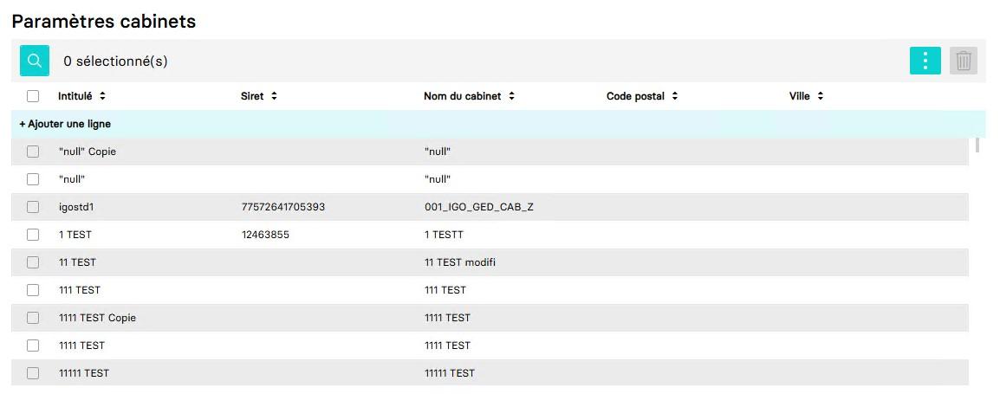

---
prev:
  text: 💃 Introduction
  link: MAD/introduction.md
next:
  text: Cabinet (Spec)
  link: MAD/specs/v1.0.0/accountingFirm.md
---

# Export des informations Cabinet

```bash
curl --location \
--request GET 'https://api.myunisoft.fr/api/v1/mad/accountingFirm?version=1.0.0' \
--header 'X-Third-Party-Secret: nompartenaire-L8vlKfjJ5y7zwFj2J49xo53V' \
--header 'Authorization: Bearer {{API_TOKEN}}' \
--header 'Content-Type: application/json'
```

## 🔧 Paramètres de la requête

Le paramétrage de la route se fait exclusivement par le biais des [querystrings](https://en.wikipedia.org/wiki/Query_string).

| nom | description | obligatoire |
| --- | --- | :---: |
| version | version du format | ✔️ |

> [!IMPORTANT]
> 🔹 Accès cabinet  
> L'accès cabinet nécessitera la présence de l'en-tête HTTP `society-id` avec l'id du dossier de production (la société concernée par la demande d'extraction).

## 🔬 Réponse

Retour d'API : `AccountingFirm`

Le JSON renvoyé correspondra à la [spécification suivante](../specs/v1.0.0/accountingFirm.md).

## 💬 Gérer les dossiers sur l'interface MyUnisoft

Un dossier de production (ou société) peut être configuré par le biais du CRM entreprise: `Paramètres` > `Écosystème` > `Cabinet`.


