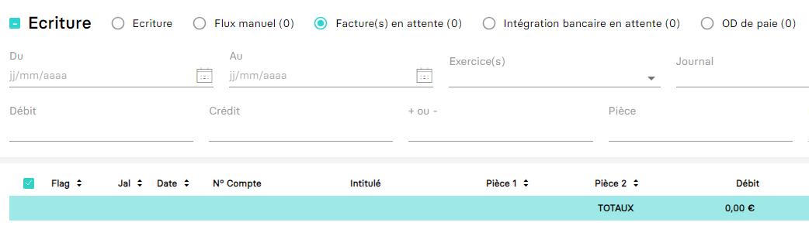

---
prev:
  text: 💃 Introduction
  link: MAD/introduction.md
next:
  text: Écriture et Mouvements (Spec)
  link: MAD/specs/v1.0.0/entries.md
---

> [!CAUTION]
> Cette API est encore en phase expérimentale, et certaines informations peuvent être manquantes. Les réponses peuvent également être très gourmandes en termes de sérialisation JSON. Par exemple, pour des exercices contenant plus de 500 000 mouvements, la taille des réponses peut varier entre **150** et **250** Mo.

# Export des mouvements

L'API d'export ci-dessous vous permettra de récupérer les mouvements par deux biais distincts;

- Avec un [exercice](./exercice.md)
- Sur une période donnée de maximum **12 mois**.

Il n'est pas possible de mélanger les deux.

```bash
curl --location \
--request GET 'https://api.myunisoft.fr/api/v1/mad/movements?idExercice=1&version=1.0.0' \
--header 'X-Third-Party-Secret: nompartenaire-L8vlKfjJ5y7zwFj2J49xo53V' \
--header 'Authorization: Bearer {{API_TOKEN}}' \
--header 'Content-Type: application/json'
```

## 🔧 Paramètres de la requête

Le paramétrage de cette route s'effectue uniquement via des [query strings](https://en.wikipedia.org/wiki/Query_string). 

| nom | description | obligatoire | valeurs multiples |
| --- | --- | :---: | :---: |
| version | version du format | ✔️ | ❌ |
| idExercice | Identifiant de l'exercice | ❌ | ❌ |
| startDate | Date de début d'extraction au format `YYYY-MM-DD` | ❌ | ❌ |
| endDate | Date de fin d'extraction au format `YYYY-MM-DD` | ❌ | ❌ |
| dateFilter | Modifie la colonne utilisée par les options `startDate` et `endDate`. Les valeurs possibles sont **document** (par défaut), **myunisoft** (horodatage MyUnisoft), et **accounting** (date de comptabilisation). | ❌ | ❌ |
| source | Permet de récupérer les écritures liées à une source spécifique. | ❌ |  ❌ |
| classAccount | Inclut uniquement les comptes commençant par la classe/catégorie spécifiée. Peut prendre une ou plusieurs racines. | ❌ | ✔️ |
| lettering | Filtre les mouvements selon l'état du lettrage : `none`, `partial`, ou `complete` | ❌ | ❌ |

> [!NOTE]
> L'écart entre la date de début et de fin doit être de maximum 12 mois.

> [!IMPORTANT]
> 🔹 Accès cabinet 
> L'accès cabinet nécessitera la présence de l'en-tête HTTP `society-id` avec l'id du dossier de production (la société concernée par la demande d'extraction).

### Source

Le paramètre `source` doit contenir le code correspondant à l'une des sources documentées [ici](../specs/v1.0.0/entries.md#source-d-une-ecriture)


## 🔬 Réponse

Le JSON renvoyé correspondra aux mouvements selon la [spécification suivante](../specs/v1.0.0/entries.md).

La différence majeure est que les informations liées à l'écriture sont présentes dans un sous-objet `entry`.

Voici un exemple :

```json
{
  "producerId": "148627082",
  "description": "MC DONALDS",
  "dueDate": null,
  "freeNumber": null,
  "invoiceNumber": "0210123784",
  "value": {
    "credit": 0,
    "debit": 264.44,
    "amount": -264.44
  },
  "entry": {
    "producerId": "49016246",
    "date": "2022-01-21",
    "dueDate": null,
    "currency": {
      "code": "EUR"
    },
    "journal": {
      "producerId": "178745",
      "customerReferenceCode": "AC",
      "name": "JOURNAL D'ACHATS",
      "type": "Achat"
    },
    "additionalProducerProperties": {
      "source": {
        "name": "FEC",
        "thirdParty": null
      },
      "partnerMetadata": null,
      "comment": null,
      "createdAt": 1642719600,
      "accountedAt": "2022-01-21"
    },
    "attachments": {}
  },
  "attachments": {},
  "account": {
    "producerId": "9267210",
    "number": "6226100000",
    "name": "HONORAIRES COMPTABLES"
  },
  "payment": null,
  "analytics": [
    {
      "producerId": "4412",
      "code": "AXE 1",
      "name": "Axe 1",
      "sections": [
        {
          "producerId": "499295",
          "amount": 264.44,
          "rate": 100,
          "code": "AXE1SEC3",
          "name": "Axe1Sec3"
        }
      ]
    },
    {
      "producerId": "4413",
      "code": "AXE 2",
      "name": "Axe 2",
      "sections": [
        {
          "producerId": "499296",
          "amount": 264.44,
          "rate": 100,
          "code": "ATTENTE",
          "name": "Section d'attente"
        }
      ]
    }
  ],
  "lettering": {
    "state": "none",
    "value": null
  }
}
```

## 💬 Consulter les mouvements sur l'interface MyUnisoft

Sur MyUnisoft, il existe plusieurs moyens de récupérer et/ou consulter les écritures:

- Par le biais de la saisie: `Tenue` > `Saisie/Consultation` > `Saisie`
- Par la **recherche rapide**: accessible via l'icône en forme de loupe en haut à droite.


L'avantage de la première option est qu'elle permet de consulter les factures en attente, ce qui est courant lors d'un import au format JSON nécessitant une étape de validation par le responsable de dossier.


