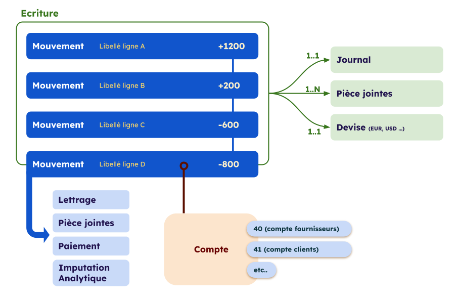

---
prev:
  text: 💃 Introduction
  link: MAD/introduction.md
next: false
---

<span id="readme-top"></span>

# Écriture et Mouvements

## Introduction

Sur MyUnisoft les mouvements sont groupés dans une abstraction que nous appelons "Écriture comptable".



> [!NOTE]
> Un mouvement est aussi communément appelé une "ligne d'écriture".

```json
{
  "producerId": "13524346",
  "attachments": {
    "document.pdf": {
      "type": "URL",
      "value": "https://app.prodcomptable.myunisoft.fr/api/ged/ged/document/1-xTt2Qx4LPABeb1Z/download"
    }
  },
  "date": "2023-02-01",
  "dueDate": null,
  "journal": {
    "producerId": "137145",
    "customerReferenceCode": "AC",
    "name": "ACHATS",
    "type": "Achat"
  },
  "currency": {
    "code": "EUR"
  },
  "movements": [
    {
      "producerId": "43221797",
      "description": "TEST",
      "value": {
        "credit": 1200,
        "debit": 0,
        "amount": 1200
      },
      "dueDate": null,
      "lettering": {
        "state": "none",
        "value": null
      },
      "freeNumber": null,
      "invoiceNumber": null,
      "attachments": {},
      "account": {
        "producerId": "1482937",
        "number": "6010000000",
        "name": "ACHATS MATIERES PREM"
      },
      "payment": null,
      "analytics": [
        {
          "producerId": "703",
          "code": "AXE1",
          "name": "LIBELLE AXE1",
          "sections": [
            {
              "producerId": "1694",
              "amount": 1200,
              "rate": 100,
              "code": "ATTENTE",
              "name": "Waiting section"
            }
          ]
        }
      ]
    },
    {
      "producerId": "43221798",
      "description": "TEST",
      "value": {
        "credit": 0,
        "debit": 1200,
        "amount": -1200
      },
      "dueDate": null,
      "lettering": {
        "state": "none",
        "value": null
      },
      "freeNumber": null,
      "invoiceNumber": null,
      "attachments": {},
      "account": {
        "producerId": "2567407",
        "number": "4551200000",
        "name": "COMPTE COURANT RACLE"
      },
      "payment": null,
      "analytics": []
    }
  ],
  "additionalProducerProperties": {
      "createdAt": 1709852400,
      "accountedAt": "2023-01-20",
      "source": {
          "name": "API",
          "thirdParty": {
              "name": "Evoliz",
              "code": "EVOL"
          }
      },
      "partnerMetadata": null,
      "comment": null
  }
}
```

<p align="right">(<a href="#readme-top">retour en haut de page</a>)</p>

## Interfaces

Liste des interfaces communes :

- [Currency (Devise)](./currency.md)
- [SimplifiedAccount](./simplifiedAccount.md)
- [Attachment (Pièce/documents joints)](./attachment.md)

---

Ci-dessous les définitions avec TypeScript et JSON Schema.

### Lettrage

Le lettrage permet de rapprocher une facture avec son paiement, il peut être partiel quand le paiement est fait en plusieurs fois. Une fois que la facture est payée en intégralité le lettrage sera complet.

<details class="details custom-block" open>
<summary>TypeScript</summary>

```ts
type Lettering = {
  state: "complete";
  value: string;
} | {
  state: "partial";
  value: `*${string}`;
} | {
  state: "none";
  value: null;
};
```

</details>

<details class="details custom-block">
<summary>JSON Schema</summary>

```json
{
  "$schema": "http://json-schema.org/draft-07/schema#",
  "type": "object",
  "additionalProperties": false,
  "required": [],
  "oneOf": [
    {
      "type": "object",
      "properties": {
        "state": {
          "const": "complete"
        },
        "value": {
          "type": "string"
        }
      },
      "required": [
        "state",
        "value"
      ],
      "additionalProperties": false
    },
    {
      "type": "object",
      "properties": {
        "state": {
          "const": "partial"
        },
        "value": {
          "type": "string",
          "pattern": "^\\*.*$"
        }
      },
      "required": [
        "state",
        "value"
      ],
      "additionalProperties": false
    },
    {
      "type": "object",
      "properties": {
        "state": {
          "const": "none"
        },
        "value": {
          "type": "null"
        }
      },
      "required": [
        "state",
        "value"
      ],
      "additionalProperties": false
    }
  ]
}
```

</details>

<p align="right">(<a href="#readme-top">retour en haut de page</a>)</p>

### Imputation analytique

<details class="details custom-block" open>
<summary>TypeScript</summary>

```ts
export interface MovementAnalytics {
  producerId: string;
  code: string;
  name: string;
  sections: {
    producerId: string;
    amount: number;
    rate: number;
    code: string;
    name: string;
  }[];
}
```

</details>

<p align="right">(<a href="#readme-top">retour en haut de page</a>)</p>

### Mouvement (ou ligne d'écriture)

<details class="details custom-block" open>
<summary>TypeScript</summary>

```ts
interface Movement {
  producerId: string;
  description: string;
  attachments: Record<string, Attachment>;
  value: {
    credit: number;
    debit: number;
    amount: number;
  }
  dueDate: string | null;
  lettering: Lettering;
  freeNumber: string | null;
  invoiceNumber: string | null;
  account: SimplifiedAccount | null;
  payment: {
    producerId: string;
    name: string | null;
    code: string | null;
  } | null;
  analytics: MovementAnalytics[];
}
```

</details>

<p align="right">(<a href="#readme-top">retour en haut de page</a>)</p>

### Ecriture

<details class="details custom-block" open>
<summary>TypeScript</summary>

```ts
interface EntryAdditionalProducerProps {
  source: {
    name: string,
    thirdParty: {
      name: string;
      code: string;
    } | null;
  };
  partnerMetadata: {
    partnerId: string;
    json: string | null;
  } | null;
  publishingDestination?: string;
  comment: string | null;
  comments?: SimplifiedComment[];
  validationDate?: string | null;
  createdAt?: number;
  accountedAt?: string;
}

interface Entry {
  producerId: string;
  attachments: Record<string, Attachment>;
  currency: Currency;
  date: string;
  dueDate: string | null;
  journal: {
    producerId: string;
    customerReferenceCode: string;
    name: string;
    type: string;
  };
  movements: Movement[];
  additionalProducerProperties: EntryAdditionalProducerProps;
}
```

</details>

#### Dates

Une écriture possède plusieurs propriétés de date distinctes. Voici la définition de chacune d'elles :

- `date` : représente la date officielle de l'écriture ou du document comptable.
- `dueDate` : correspond à la date d'échéance du paiement ou du règlement associé à l'écriture (si applicable). Utilisée principalement pour les écritures de créances ou de dettes, elle indique le délai de paiement.
- `additionalProducerProperties.createdAt` : indique l'horodatage (timestamp) du moment où l'écriture a été créée et enregistrée dans la base de données MyUnisoft.
- `additionalProducerProperties.accountedAt` : varie en fonction du contexte :
  - Si l'écriture est générée via l'application, cette date correspond à la validation de la saisie par l'utilisateur.
  - Si l'écriture est issue d'un import (lors d'une migration ou d'un chargement de données, comme via un fichier TRA), cette date reprend celle de l'écriture d'origine, reflétant la date effective de la transaction dans le journal comptable.

#### Source d'une écriture

Les sources à ce jour possible pour une écriture sont les suivantes;

| code | label |
| --- | --- |
| E | Saisie |
| M | Manuel |
| O | OCR |
| EXT | Extourne |
| L | Lettrage |
| IB | Integration bancaire |
| P | OD Paie |
| AN | A nouveau |
| OD_TVA | OD TVA |
| OD_CALC_IS | OD Calcul IS |
| OD_ECART | OD Ecart |
| REM_BQ | Remise en banque |
| RB_MANUEL | Fichier CFONB manuel |
| WORKSHEET | Worksheet (feuille de travail) |
| QUADRA | Import QUADRA |
| CEGID | Import CEGID |
| ACD | Import ACD |
| FEC | Import FEC |
| EXCEL | Import Excel |
| RB_JDC | JeDeclare |
| RB_QT | Qonto |
| RB_SB | SoBank |
| RB_FTP | FTP |
| RTVR | Retriever |
| QUICK | Quickbooks |
| ABO | Abonnement |
| PRLV_SEPA | Prélèvement SEPA |
| VIRT_SEPA | Virement SEPA |
| API | API |

La source `API` fournira en supplément un code permettant l'identification du partenaire.

<p align="right">(<a href="#readme-top">retour en haut de page</a>)</p>
