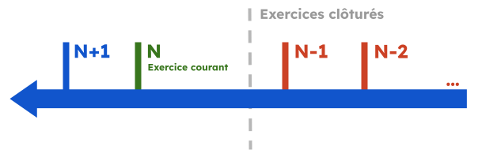

---
prev:
  text: 💃 Introduction
  link: MAD/introduction.md
next: false
---

<span id="readme-top"></span>

# Exercice

## Introduction

```json
{
  "producerId": "17957",
  "name": "N+1",
  "period": {
    "start": "2024-01-01",
    "end": "2024-12-31",
    "duration": 12,
    "closed": null
  },
  "state": "open",
  "additionalProducerProperties": {
    "lettering": "MULTI"
  }
}
```

Lorsqu'un exercice est clôturé, la propriété `closed` sera complété comme suit;
```json
{
  "at": "2023-11-10",
  "by": {
    "producerId": "622",
    "firstName": "BENOIT",
    "lastName": "GARIAZZO"
  }
}
```

La propriété `by` correspond à l'id, nom et prénom de l'utilisateur ayant clôturé l'exercice.

<p align="right">(<a href="#readme-top">retour en haut de page</a>)</p>

### Nommage

Les noms d'exercices sur MyUnisoft sont générés dynamiquement (N+1, N, N-1 ...). Le `N` étant l'exercice en cours.



### Lettrage des exercices

Les exercices MyUnisoft peuvent être ouverts avec l'une des deux méthodes de lettrage suivantes;

- <kbd>MONO</kbd> (En mono les à nouveaux sont détaillés et ils sont lettrables)
- <kbd>MULTI</kbd> (En multi les à nouveaux ne sont pas détaillés et ne sont pas lettrables, on lettre les écritures d'origine)

**MONO** est la valeur par défaut lors de la création d'un exercice.

<p align="right">(<a href="#readme-top">retour en haut de page</a>)</p>

## Interfaces

<details class="details custom-block" open>
<summary>TypeScript</summary>

```ts
interface Exercice {
  producerId: string;
  name: string;
  period: {
    start: string;
    end: string;
    duration: number | null;
    closed: null | {
      at: string;
      by: {
        producerId: string;
        firstName: string;
        lastName: string;
      }
    }
  }
  state: "closed" | "open";
  additionalProducerProperties: {
    lettering: "MONO" | "MULTI"
  }
}
```
</details>

<details class="details custom-block">
<summary>JSON Schema</summary>

```json
{
  "$schema": "http://json-schema.org/draft-07/schema#",
  "additionalProperties": false,
  "type": "object",
  "properties": {
    "producerId": {
      "type": "string"
    },
    "name": {
      "type": "string"
    },
    "period": {
      "type": "object",
      "properties": {
        "duration": {
          "type": "number",
          "description": "duration in months of the exercice",
          "nullable": true
        },
        "start": {
          "type": "string",
          "description": "Date with the format YYYY-MM-DD"
        },
        "end": {
          "type": "string",
          "description": "Date with the format YYYY-MM-DD"
        },
        "closed": {
          "type": "object",
          "properties": {
            "at": {
              "type": "string",
              "description": "Date with the format YYYY-MM-DD"
            },
            "by": {
              "type": "object",
              "properties": {
                "producerId": {
                  "type": "string"
                },
                "firstName": {
                  "type": "string"
                },
                "lastName": {
                  "type": "string"
                }
              },
              "required": [
                "firstName",
                "lastName",
                "producerId"
              ]
            }
          },
          "nullable": true,
          "required": [
            "at",
            "by"
          ]
        }
      },
      "required": [
        "start",
        "end"
      ]
    },
    "state": {
      "type": "string",
      "enum": [
        "closed",
        "open"
      ]
    },
    "additionalProducerProperties": {
      "type": "object",
      "properties": {
        "lettering": {
          "type": "string",
          "enum": [
            "MONO",
            "MULTI"
          ]
        }
      },
      "required": [
        "lettering"
      ]
    }
  },
  "required": [
    "name",
    "period",
    "state",
    "additionalProducerProperties",
    "producerId"
  ]
}
```
</details>

<p align="right">(<a href="#readme-top">retour en haut de page</a>)</p>

## Compatibilité TRA

Exercice (**EXO**). Page 16 de la spécification.

| nom de la colonne | position | chemin de la propriété MyUnisoft |
| --- | --- | --- | 
| FIXE | 1 | N/A |
| IDENTIFIANT | 4 | `EXO` |
| CODE | 7 | name |
| DATEDEBUT | 10 | period.start |
| DATEFIN | 18 | period.end |
| ETATCPTA | 26 | state |
| ETATANO | 67 | additionalProducerProperties.lettering |
| DATECREATION | 70 | period.start |

<p align="right">(<a href="#readme-top">retour en haut de page</a>)</p>

