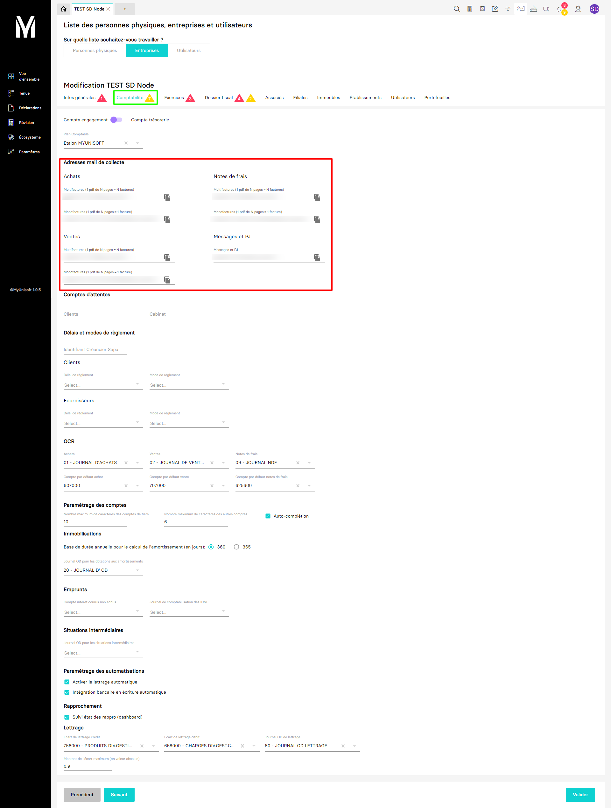

---
prev:
  text: 🐤 Introduction
  link: documentation.md
next: false
---

# Récupérer les paramètres de comptabilité d'un dossier (société)

Il est possible de récupérer les paramètres de comptabilité présent sur la page `CRM` > `Entreprises` > `Comptabilité` avec la route GET `https://api.myunisoft.fr/api/v1/society/accountingParameters` à l'exception des adresses mail de collecte (encadré en rouge).

> [!WARNING]
> Le header `society-id` est requis avec un accès 🔹Cabinet.

```bash
curl --location \
--request GET 'https://api.myunisoft.fr/api/v1/society/accountingParameters' \
--header 'Authorization: {{TOKEN}}' \
--header 'X-Third-Party-Secret: {{X-Third-Party-Secret}}'
```

<details class="details custom-block">
  <summary>Retour JSON de l'API</summary>

  ```json
  {
    "customer_waiting_account": "",
    "accounting_firm_waiting_account": "",
    "ics": "",
    "accounting_plan_id": -100,
    "max_car_third_p_account": 10,
    "max_car_general_account": 6,
    "auto_complete_account": true,
    "customer_payment_deadline_id": null,
    "provider_payment_deadline_id": null,
    "customer_reglement_type_id": null,
    "provider_reglement_type_id": null,
    "diary_purchases_id": 2424,
    "comptability_type_id": 1,
    "diary_sales_id": 2425,
    "expense_report_id": 2427,
    "enable_autolettering": true,
    "enable_RB_autoentries": true,
    "annual_depreciation_period": 360,
    "diary_dotation_id": 2430,
    "bank_reconciliation_state": true,
    "diary_interest_id": null,
    "account_interest_id": null,
    "maximum_difference_amount": 0.9,
    "comptability_type": {
      "id": 1,
      "label": "Engagement",
      "code": "ENGA"
    },
    "accounting_plan": {
      "id": -100,
      "label": "Etalon MYUNISOFT"
    },
    "customer_payment_deadline": null,
    "provider_payment_deadline": null,
    "customer_reglement_type": null,
    "provider_reglement_type": null,
    "diary_purchases": {
      "id": 2424,
      "label": "01 - JOURNAL D'ACHATS"
    },
    "diary_sales": {
      "id": 2425,
      "label": "02 - JOURNAL DE VENTES"
    },
    "diary_dotation": {
      "id": 2430,
      "label": "20 - JOURNAL D' OD"
    },
    "expense_report": {
      "id": 2427,
      "label": "09 - JOURNAL NDF"
    },
    "diary_interest": null,
    "diary_lettering": {
      "id": 2434,
      "label": "60 - JOURNAL OD LETTRAGE"
    },
    "diary_situation_id": null,
    "account_interest": null,
    "account_purchases": {
      "id": 89538,
      "label": "607000"
    },
    "account_sales": {
      "id": 89649,
      "label": "707000"
    },
    "account_expense_report": {
      "id": 89572,
      "label": "625600"
    },
    "account_income_lettering": {
      "id": 89679,
      "label": "758000 - PRODUITS DIV.GESTION"
    },
    "account_expense_lettering": {
      "id": 89604,
      "label": "658000 - CHARGES DIV.GEST.COU"
    },
    "wallets": [
      {
        "id": 1,
        "label": "TOUTES"
      }
    ]
  }
  ```
</details>


