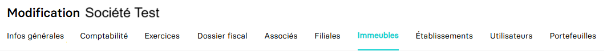

---
prev:
  text: 🐤 Introduction
  link: documentation.md
next: false
---

<span id="readme-top"></span>

# Récupérer les immeubles d'une entreprise

Ce guide a pour objectif de vous aider à récupérer la liste des immeubles d'un dossier.
Dans MyUnisoft, la gestion des immeubles s'effectue avec le module CRM : `Ecosystème` > `CRM` > `Entreprises` > `Immeubles`.



## API

La route <kbd>GET</kbd> https://api.myunisoft.fr/api/v1/building permet de récupérer la liste de l'ensemble des immeubles liés à une entreprise via l'API partenaire.

```bash
curl --location 'https://app.myunisoft.fr/api/v1/building' \
--header 'X-Third-Party-Secret: nompartenaire-L8vlKfjJ5y7zwFj2J49xo53V' \
--header 'society-id: 1;' \
--header 'Authorization: Bearer {{API_TOKEN}}'
```

<details class="details custom-block"><summary>Exemple de retour JSON de l'API</summary>

```json
[
    {
        "building_id": 95,
        "name": "IMMEUBLE 1",
        "order_number": {
            "id": null,
            "label": null,
            "value": null
        },
        "analytique_section": null,
        "local_number": 1,
        "acquisition_date": "2023-08-10",
        "completion_date": "2023-10-09",
        "cession_date": null,
        "bare_building": true,
        "road_type": {
            "id": 1,
            "label": "Allée",
            "value": "Allée"
        },
        "street_name": "DU TEMPS",
        "complement": "LE FAUBOURG",
        "address_bis": "B",
        "address_number": "1",
        "postal_code": "75000",
        "country": "FRANCE",
        "city": {
            "label": "PARIS",
            "value": "PARIS"
        },
        "full_address": "1 B Allée DU TEMPS LE FAUBOURG 75000 PARIS ",
        "land_system": {
            "id": 10,
            "label": "Dispositif du \"Robien classique ou recentré ZRR\"",
            "value": "10"
        },
        "construction_type": {
            "id": 1,
            "label": "Bâti",
            "value": "B"
        },
        "deduction_amort": {
            "id": 3,
            "label": "Dispositif \"Robien classique en zone de revitalisation rurale\"",
            "value": "3"
        },
        "building_type": [
            {
                "id": 6,
                "label": "Immeuble urbain",
                "value": "U"
            }
        ]
    }
]
```

</details>

<details class="details custom-block"><summary>Définition TypeScript Immeuble</summary>

```ts
interface Immeuble {
  building_id: number,
  name: string,
  order_number: {
      id: number,
      label: string,
      value: string
  },
  analytique_section: string,
  local_number: number,
  acquisition_date: string,
  completion_date: string,
  cession_date: string,
  bare_building: boolean,
  road_type: {
      id: number,
      label: string,
      value: string
  },
  street_name: string,
  complement: string,
  address_bis: string,
  address_number: string,
  postal_code: string,
  country: string,
  city: {
      label: string,
      value: string
  },
  full_address: string ,
  land_system: {
      id: number,
      label: string,
      value: string
  },
  construction_type: {
      id: number,
      label: string,
      value: string
  },
  deduction_amort: {
      id: number,
      label: string,
      value: string
  },
  building_type: [
      {
          id: number,
          label: string,
          value: string
      }
  ]
}
```

</details>

<p align="right">(<a href="#readme-top">retour en haut de page</a>)</p>
