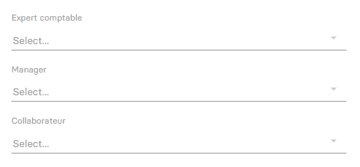

---
prev:
  text: 🐤 Introduction
  link: documentation.md
next: 
  text: ⚙️ Paramétrage avancé d'un dossier de production
  link: /accounting/firm/manage_society.md
---

<span id="readme-top"></span>

> [!IMPORTANT]
> Ce guide ne contient pas toutes les clés JSON (n'hésitez pas à utiliser la console chrome)

# Création et mise à jour d'un dossier de production (entreprise)

L'objectif de ce guide est de vous aider à créer et mettre à jour un dossier de production.

Dans MyUnisoft, la création d'un dossier s'effectue avec le module CRM: `Ecosystème` > `CRM` > `Entreprises`.

## API

```bash
curl --location \
--request POST 'https://api.myunisoft.fr/api/v1/society' \
--header 'X-Third-Party-Secret: xxx-L8vlKfjJ5y7zwFj2J49xo53V' \
--header 'Content-Type: application/json' \
--header 'Authorization: Bearer {{API_TOKEN}}'
```

> [!NOTE]
> Pour une mise à jour il vous suffira de changer le verbe HTTP pour `PUT`. La route ne nécessite pas un objet complet, elle fera une mise à jour partielle avec les propriétés présente dans le body.

Exemple "minimaliste" d'un BODY JSON:

```json
{
  "member_id": 1,
  "name": "Nom du dossier",
  "siret": "84014327500039",
  "id_type_company": 1,
  "date_engage_letter": "20210728",
  "folder_reference": "Reference",

  "address_number": "54",
  "road_type_id": 9,
  "street_name": "RUE DU LAPIN",
  "postal_code": "75000",
  "city": "PARIS",
  "country": "FRANCE",
  "ape_id": 550,
  "activity": "Programmation informatique",
  "registration_date": "20210728",
}
```

> [!IMPORTANT]
> Les propriétés du bas sont récupérables avec la route society/data_gouv_fields (attention quelques transformations sont parfois nécessaires)

### Recherche d'informations à partir du SIREN/SIRET

```bash
curl --location \
--request GET 'https://api.myunisoft.fr/api/v1/society/data_gouv_fields?siren={{SIRET}}&check=false' \
--header 'X-Third-Party-Secret: xxx-L8vlKfjJ5y7zwFj2J49xo53V' \
--header 'Content-Type: application/json' \
--header 'Authorization: Bearer {{API_TOKEN}}'
```

La route en question vous retournera un ensemble de propriétés qui pourront être injectées dans la création du dossier.

<details class="details custom-block">
<summary>Visualiser la réponse JSON</summary>

Exemple de réponse pour le SIRET `84014327500039` (MY UNISOFT).

```json
{
    "name": "MY UNISOFT",
    "address_number": "4",
    "address_bis": null,
    "street_name": "GALVANI",
    "postal_code": "91300",
    "city": {
        "label": "MASSY",
        "value": "MASSY"
    },
    "tva_intraco": "FR73840143275",
    "country": "FRANCE",
    "form": null,
    "registration_date": "2021-03-22",
    "road_type": {
        "id": 9,
        "label": "Rue",
        "value": "Rue"
    },
    "ape": {
        "id": 534,
        "label": "5829C",
        "value": "\u00c9dition de logiciels applicatifs"
    },
    "activity": "\u00c9dition de logiciels applicatifs"
}
```

</details>

### Cabinet d'appartenance

Le cabinet correspond à la propriété `member_id`.

```bash
curl --location \
--request GET 'https://api.myunisoft.fr/api/v1/member' \
--header 'X-Third-Party-Secret: xxx-L8vlKfjJ5y7zwFj2J49xo53V' \
--header 'Content-Type: application/json' \
--header 'Authorization: Bearer {{API_TOKEN}}'
```

Vous pouvez visualiser la réponse avec [la collection postman en ligne](https://docs.api.myunisoft.fr/#2f984650-1ec4-4842-8200-95b41d09c520)

### Type du dossier

Type du dossier qui correspond à la propriété  `id_type_company`.

| id | label |
| --- | --- |
| 1 | Client |
| 2 | Prospect |
| 3 | Suspect |
| 4 | Ancien client |
| 5 | Associé client |
| 6 | Filliale client |
| 7 | Partenaire |
| 8 | Prescripteur |
| 9 | Etablissement |
| 10 | Cabinet |

### Utilisateurs (Expert comptable, Manager et Collaborateur)

Cet affichage correspond à l'onglet `Utilisateurs` du **CRM**, permettant de configurer les responsables du dossier (personnes physiques).



Les trois champs doivent être mis à jour en utilisant les clés suivantes, chacune contenant l’ID de la personne physique (préalablement récupéré via l'API users_v2) :

- Expert-comptable : `id_accountant`
- Manager : `id_rm`
- Collaborateur : `id_collab`

Pour plus d'informations, consultez le guide : [Récupérer les utilisateurs et personne physiques d'un schéma (cabinet)](./users.md)

<p align="right">(<a href="#readme-top">retour en haut de page</a>)</p>
