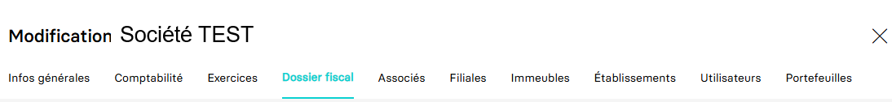

---
prev:
  text: 🐤 Introduction
  link: documentation.md
next: false
---

<span id="readme-top"></span>

# Création et mise à jour du dossier fiscal d'une société (dossier de production)

Avec ce guide, vous allez être accompagné afin de créer et/ou mettre à jour le dossier fiscal d'une société.

Dans MyUnisoft, la gestion du dossier fiscal s'effectue avec le module CRM : `Ecosystème` > `CRM` > `Entreprises`.


Sélectionnez le dossier de production sur lequel vous souhaitez intervenir (une option de recherche rapide est disponible).


Vous obtenez les différents onglets de l'entreprise interrogée. Cliquez sur `Dossier fiscal` pour accéder à celui-ci.



## API

La route <https://api.myunisoft.fr/api/v1/society/fiscal_file> permet d'ajouter et/ou mettre à jour des informations au dossier fiscal via l'API partenaire.

> [!IMPORTANT]
> 🔹 Accès cabinet : L'accès cabinet nécessitera la présence de l'en-tête HTTP `society-id` avec l'id du dossier de production.

```bash
curl --location 'https://api.myunisoft.fr/api/v1/society/fiscal_file' \
--header 'X-Third-Party-Secret: nompartenaire-L8vlKfjJ5y7zwFj2J49xo53V' \
--header 'Society-id: 1;' \
--header 'Authorization: Bearer {{API_TOKEN}}' \
--data '{
  "rof_tva": "TVA1",
  "rof_tdfc": "IS1",
  "rof_cfe": "CFE1",
  "rof_cvae": "CVAE1",
  "rof_rcm": "RCM1",
  ...
}'
```

En fonction des éléments que vous aurez renseigné dans le body de la requête, l'API vous retournera une réponse au format JSON :

<details class="details custom-block"><summary>Exemple de retour JSON de l'API</summary>

```json
{
  "rof_tva": "TVA1",
  "rof_tdfc": "IS1",
  "rof_cfe": "CFE1",
  "rof_cvae": "CVAE1",
  "rof_rcm": "RCM1",
  "rof_groupe": "",
  "acompte_pro_mens": false,
  "exercice_declaration": false,
  "tva_intraco": "FR45530514157",
  "due_date_tva": 21,
  "adherent_code": "",
  "mono_etab": false,
  "close_entries_VAT": false,
  "mail_liasse": "",
  "fiscal_integration": false,
  "head_group_if": false,
  "start_date_if": "",
  "end_date_if": "",
  "adv_legal_form_id": "SARL",
  "adv_name": "Groupe conseil",
  "adv_name_2": "",
  "adv_phone_number": "+33112134567",
  "adv_address_number": "10",
  "adv_street_name": "du Boulevard",
  "adv_postal_code": "75000",
  "adv_city": "PARIS",
  "adv_country": "FRANCE",
  "ecf_legal_form_id": "EURL",
  "ecf_siren": "",
  "ecf_name": "Prestataire",
  "ecf_name_2": "",
  "ecf_address_number": "",
  "ecf_street_name": "de la corniche",
  "ecf_postal_code": "75000",
  "ecf_city": "PARIS",
  "ecf_country": "FRANCE",
  "sie_address_number": "8",
  "sie_street_name": "de l'impasse",
  "sie_name": "SIE de Paris",
  "sie_postal_code": "75000",
  "sie_city": "PARIS",
  "sie_country": "FRANCE",
  "vis_name": "",
  "vis_agreement_number": "",
  "vis_viseur": true,
  "vis_address_number": "",
  "vis_street_name": "",
  "vis_postal_code": "",
  "vis_city": "",
  "vis_country": "",
  "id_pers_physique": null,
  "id_societe_signataire": null,
  "id_societe_comptable": null,
  "fiscal_decl_by_firm": true,
  "id_comptable": 0,
  "assujetti_unique": false,
  "siren_assujetti_unique": "",
  "rof_ts": "",
  "periodicity_ts": 0,
  "holding_name": "",
  "adv_forme_juridique": {
    "id": 1,
    "code": "SARL",
    "label": "Société à Responsabilité Limitée",
    "code_edi": "SRL"
  },
  "ecf_forme_juridique": {
    "id": 4,
    "code": "EURL",
    "label": "Entreprise Unipersonnelle à Responsabilité Limitée",
    "code_edi": "ERL"
  },
  "adv_road_type": {
    "id": 1,
    "label": "Allée",
    "value": "Allée"
  },
  "ecf_road_type": {
    "id": 3,
    "label": "Boulevard",
    "value": "Boulevard"
  },
  "sie_road_type": {
    "id": 2,
    "label": "Avenue",
    "value": "Avenue"
  },
  "sheet_group": {
    "id": 2,
    "label": "IS-BIC-Normal",
    "value": "ISBICN",
    "id_bilan": 1,
    "regime_impot": true,
    "id_regime_impot": 1
  },
  "vat_regime": {
    "id": 4,
    "label": "Réel Normal Mensuel",
    "value": "M"
  },
  "gestion_center": {
    "id": 7,
    "label": "CGA83",
    "value": "CGA83"
  },
  "info_bnc": {
    "info_bnc_id": 1982,
    "membership_year": null,
    "activity_code_pm": null
  },
  "society_status": {
    "id": 1,
    "label": "En activité",
    "value": "En activité",
    "effective_date": "2023-09-14"
  }
}
```

</details>

<br>
La route attend un body au format JSON composé de propriétés de l'interface suivante :

<details class="details custom-block"><summary>Interface TypeScript FiscalFile</summary>

```ts
export interface FiscalFile {
  rof_tva: string,
  rof_tdfc: string,
  rof_cfe: string,
  rof_cvae: string,
  rof_rcm: string,
  rof_groupe: string,
  acompte_pro_mens: boolean,
  exercice_declaration: boolean,
  tva_intraco: string,
  due_date_tva: number,
  adherent_code: string,
  mono_etab: boolean,
  close_entries_VAT: boolean,
  mail_liasse: string,
  fiscal_integration: boolean,
  head_group_if: boolean,
  start_date_if: string,
  end_date_if: string,
  adv_forme_juridique_id: number,
  adv_name: string,
  adv_name_2: string,
  adv_phone_number: string,
  adv_address_number: string,
  adv_street_name: string,
  adv_postal_code: string,
  adv_city: string,
  adv_country: string,
  ecf_forme_juridique_id: number,
  ecf_siren: string,
  ecf_name: string,
  ecf_name_2: string,
  ecf_address_number: string,
  ecf_street_name: string,
  ecf_postal_code: string,
  ecf_city: string,
  ecf_country: string,
  sie_address_number: string,
  sie_street_name: string,
  sie_name: string,
  sie_postal_code: string,
  sie_city: string,
  sie_country: string,
  vis_name: string,
  vis_agreement_number: string,
  vis_viseur: boolean,
  vis_address_number: string,
  vis_street_name: string,
  vis_postal_code: string,
  vis_city: string,
  vis_country: string,
  id_pers_physique: number,
  id_societe_signataire: number,
  id_societe_comptable: number,
  fiscal_decl_by_firm: boolean,
  id_comptable: number,
  assujetti_unique: boolean,
  siren_assujetti_unique: string,
  rof_ts: string,
  periodicity_ts: number,
  holding_name: string,
  adv_road_type_id: number,
  sie_road_type_id: number,
  ecf_road_type_id: number,
  vis_road_type_id: number,
  id_sheet_group: number,
  vat_regime_id: number,
  gestion_center_id: number,
  account_edi_id: number,
  info_bnc: {
    membership_year: string,
    activity_code_pm: string,
    comptability_held_id: number
  },
  society_status: {
    id: number,
    effective_date: string
  }
}
```

</details>

<br>
Voici quelques détails concernant certaines propriétés spécifiques et les moyens pour récupérer leurs valeurs applicables :

- `id_pers_physique` / `id_comptable` : dans le dossier fiscal la personne physique est nécessaire pour définir le signataire ou le comptable. Pour récupérer la liste des personnes physiques et leur id, vous pouvez consulter la section de la page [Récupérer les utilisateurs et personnes physiques d'un schema](./users.md).
- `id_societe_signataire` / `id_societe_comptable` : il s'agit des id du signataire et/ou comptable mais étant des personnes morales. Pour récupérer la liste des sociétés et leur id, vous pouvez consulter la page [Récupérer les dossiers de productions (entreprises)](../society.md).
- `gestion_center_id` : la liste des centres de gestion est récupérable via l'API sur la page [Récupérer la liste des centre de gestion](./gestion_center.md).
- `account_edi_id` : il est nécessaire de préciser l'id du compte d'envoi EDI. Pour récupérer cette liste, vous trouverez un guide sur cette [page](./compte_edi.md).
- `adv_road_type_id` / `sie_road_type_id` / `ecf_road_type_id` / `vis_road_type_id` : ces propriétés correspondent aux types de voies dans les adresses des "conseils", "SIE", "ECF" et "viseurs conventionnés". La liste des types de voies est consultable sur cette [page](../specs/road_types.md).
- `vat_regime_id` correspond à l'id d'un des régimes de tva applicables. La liste des régimes de tva est disponible sur cette [page](../specs/vat_regimes.md).
- `id_sheet_group` : il s'agit du régime fiscal d'imposition. La liste complète de ces régimes fiscaux est disponible sur cette [page](../specs/sheet_groups.md).
- `society_status` Il s'agit du statut d'activité de la société. Pour le paramétrer il est nécessaire de fournir une date `effective_date` (format YYYY-MM-DD) ainsi que l'id de l'un des différents statuts disponibles dont la liste est sur cette [page](../specs/society_status.md).
- `comptability_held_id` : pour certains régimes d'imposition (ex: BNC) il est nécessaire de spécifier l'id du type de tenue comptable. Leur liste est disponibles sur cette [page](../specs/comptability_held.md).
- `periodicity_ts` est la périodicité choisie pour la taxe sur les salaires lorsque la société est soumise. Il existe 3 valeurs applicables :

  | valeur | correspondance |
  | --- | --- |
  | `0` | "Non concerné" |
  | `1` | "Mensuel" |
  | `2` | "Trimestriel" |

<p align="right">(<a href="#readme-top">retour en haut de page</a>)</p>
