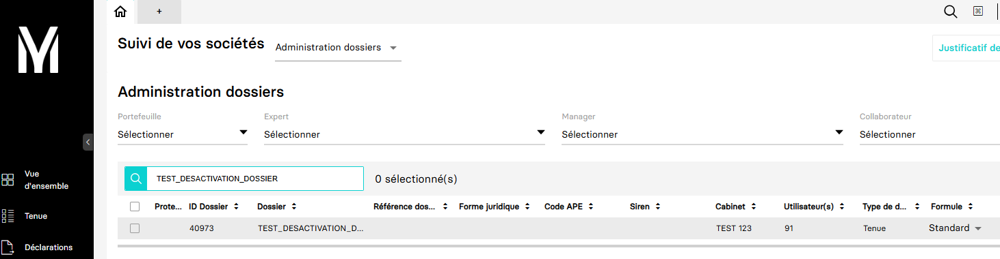
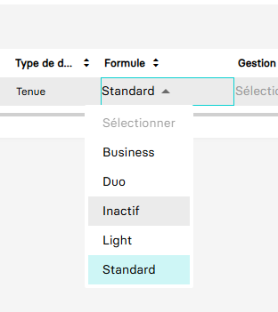

---
prev:
  text: 🐤 Introduction
  link: documentation.md
next: false
---

<span id="readme-top"></span>

# Désactiver un dossier de production

Cette page va vous accompagner dans l'opération de désactivation d'un dossier de production.

Dans MyUnisoft, pour désactiver un dossier de production vous devez utiliser : `Vue d'ensemble` > `Suivi des sociétés` > `Administration dossier`

Vous recherchez avec la barre de recherche rapide votre dossier.



Pour désactiver le dossier , il faut passer sa formule sur `inactif`.



> [!IMPORTANT]
> Le changement de formule vers `inactif` est unidirectionnel. Vous ne pourrez pas réactiver le dossier vous-même. Il vous faudra passer par le support technique si vous souhaitez réactiver le dossier.

# API

La route <https://api.myunisoft.fr/api/v1/disable_accounting_folder> permet de procéder à cet opération via l'API partenaire.

```bash
curl --location --request PUT 'https://api.myunisoft.fr/api/v1/disable_accounting_folder' \
--header 'X-Third-Party-Secret: nompartenaire-L8vlKfjJ5y7zwFj2J49xo53V' \
--header 'society-id: 1' \
--header 'Authorization: Bearer {{API_TOKEN}}'
```

> [!IMPORTANT]
> Pour pouvoir executer la requête, il est obligatoirement attendu dans les en-têtes le `society-id` (identifiant du dossier que vous souhaitez désactiver).

L'API se charge de passer la formule sur `inactif` une fois la requête lancée et retournera un statut code `200` avec une réponse au format JSON en cas de succès.

<details class="details custom-block"><summary>Exemple de retour JSON de l'API</summary>

```json
{ 
  "code":"Success",
  "message":""
}
```

</details>

<p align="right">(<a href="#readme-top">retour en haut de page</a>)</p>
