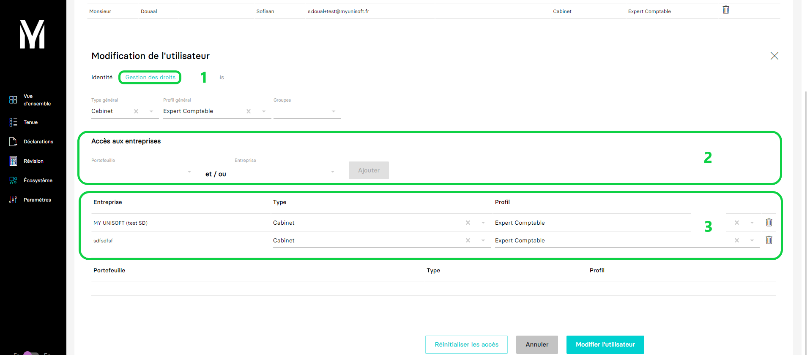

---
prev:
  text: 🐤 Introduction
  link: documentation.md
next: false
---

# Liste des dossiers accessibles pour un utilisateur.
Ce guide a pour but de vous aider dans la récupération des droits d'accès d'un utilisateur.

Dans MyUnisoft la gestion des utilisateurs s'effectue dans le CRM: `Ecosystème` > `CRM` > `Utilisateurs`.


> [!NOTE]
> Visitez la page [**Utilisateur**](./users.md) pour avoir des informations sur les différents rôles.

## Configurer la liste d'accès



1. Les dossiers accessibles pour un utilisateur sont configurés dans le menu `Gestion des droits`.
2. Dans la section **Accès aux entreprises**, cliquez sur le menu déroulant nommé **Entreprise** et sélectionnez l'entreprise dont vous voulez donner l'accès avant de cliquer sur **Ajouter**.
3. Vous retrouvez ici la liste des entreprises accessibles pour cet utilisateur.


## Récupérer la liste d'accès

La route `https://api.myunisoft.fr/api/v1/accounting/access?userMail=s.doual%2Btest@myunisoft.fr` permet de récupérer la liste des ID des dossiers accessibles pour l'utilisateur `s.doual+test@myunisoft.fr`.

| PARAMETER | DESCRIPTION |
| --- | --- |
| userMail | Adresse mail de l'utilisateur dont on veut récupérer la liste des dossiers qui lui sont accessibles |
| userId | Identifiant (ID MyUnisoft) de l'utilisateur dont on veut récupérer la liste des dossiers qui lui sont accessibles |

> [!NOTE]
> Un seul des deux paramètres est requis. Dans le cas où les deux paramètres sont renseignés, une erreur sera retourné.

```bash
curl --location \
--request GET 'https://api.myunisoft.fr/api/v1/accounting/access?userMail=s.doual%2Btest@myunisoft.fr' \
--header 'X-Third-Party-Secret: <SECRET KEY>' \
--header 'Authorization: Bearer <TOKEN>'
```

Retour JSON de l'API:
```json
[
  "5623",
  "56"
]
```
