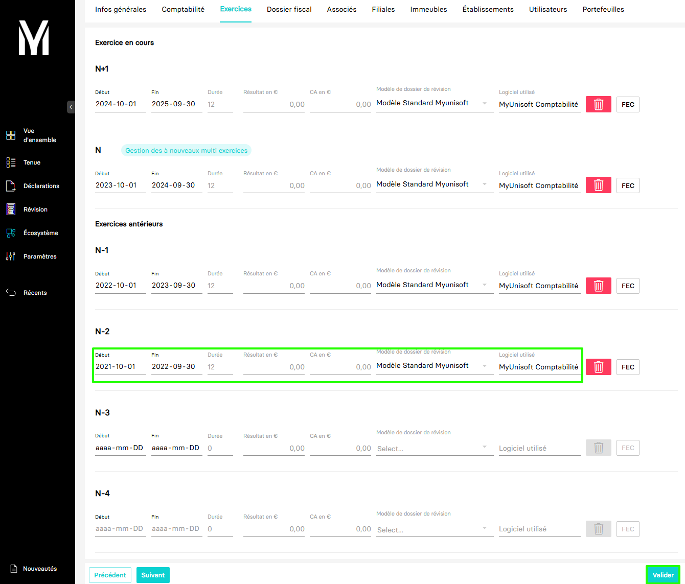

---
prev:
  text: 🐤 Introduction
  link: documentation.md
next: false
---

<span id="readme-top"></span>

# Création, mise à jour, clôture d'un exercice comptable

Ce guide a pour objectif de vous accompagner dans le processus de `création`, de `mise à jour` et de `clôture` d'un exercice comptable.

Dans MyUnisoft les exercices peuvent être gérés par le biais du CRM : `Ecosystème` > `CRM` > `Modifier l'entreprise`.


Choisir "Entreprises" à la question "Sur quelle liste souhaitez-vous travailler ?" :


Choisir l'onglet "Exercices":


## Création d'un exercice

Pour créer un exercice dans MyUnisoft, complétez les différents champs définisant celui-ci dans le formulaire (Dates de début et fin, modèles de dossiers de révision, logiciel utilisé ...) puis `valider`.



### API

La route https://app.myunisoft.fr/api/v1/society/exercice permet d'effectuer la même opération de création mais par le biais de l'API partenaires.

```bash
curl --location 'https://app.myunisoft.fr/api/v1/society/exercice' \
--header 'X-Third-Party-Secret: nompartenaire-L8vlKfjJ5y7zwFj2J49xo53V' \
--header 'society-id: 1' \
--header 'Authorization: Bearer {{API_TOKEN}}' \
--data '{
    "exercice": [
        {
            "start_date": "2025-01-01",
            "end_date": "2025-12-31",
            "label":"N+1",
            "id_review_model":1,
            "change_model":false,
            "used_software":"MyUnisoft Comptabilité"
        }
    ]
}'
```

> [!IMPORTANT]
> Penser à préciser l'en-tête **society-id** si vous utilisez un 🔹 Accès cabinet.

Dans le body (type `raw`) renseignez les valeurs des propriétés suivantes :

| propriété | type | format |
| --- | --- | --- |
| start_date | `string` | "YYYY-MM-DD" |
| end_date | `string` | "YYYY-MM-DD" |
| label | `string` | "N+1", "N", "N-1", "N-2", etc... |
| id_review_model | `integer` | |
| change_model | `boolean` | |
| used_software | `string` | |

Exemple :

```json
{
    "exercice": [
        {
            "start_date": "2025-01-01",
            "end_date": "2025-12-31",
            "label": "N+1",
            "id_review_model":1,
            "change_model":false,
            "used_software":"MyUnisoft Comptabilité"
        }
    ]
}
```

Lorsque la création est accomplie avec succès, vous recevez un `status code 200` et un JSON avec **une structure similaire à l'exemple ci-dessous**

<details class="details custom-block"><summary>Retour JSON de l'API</summary>

```json
[
    {
        "exercice_id": 420,
        "start_date": "20250101",
        "end_date": "20251231",
        "label": "N+1",
        "duration": 12,
        "closed": false,
        "ca": 0,
        "used_software": "MyUnisoft Comptabilité"
    }
]
```

</details>

### Définition Typescript

Le endpoint **society/exercice** retourne un tableau de structure Exercice.

<details class="details custom-block"><summary>Détails de l'interface Exercice</summary>

```ts
export interface Exercice {
  exercice_id: number;
  start_date: string;
  end_date: string;
  /**Label de l'exercice ( N-1, N, N+1 etc..). */
  label: string;
  /* Chiffre d'affaire sur l'exercice. */
  ca: number;
  closed: boolean;
  duration: number;
  used_software: string
}
```

</details>

## Mise à jour d'un exercice

Vous pouvez être amené à devoir modifier un exercice en cas d'erreur dans les dates de début et de fin lors de la création, lors d'un passage d'un exercice civil à un exercice décalé ou si sa durée est modifée (exemple : pour une fin d'activité).

Pour mettre à jour les propriétés d'un exercice dans MyUnisoft, Modifiez les différents champs définisant celui-ci dans le formulaire (Dates de début et fin, modèles de dossiers de révision, logiciel utilisé ...) puis `valider`.

### API

La route https://app.myunisoft.fr/api/v1/society/exercice permet de mettre à jour les propriétés d'un exercice par le biais de l'API partenaires.

```bash
curl --location --request PUT 'https://app.myunisoft.fr/api/v1/society/exercice' \
--header 'X-Third-Party-Secret: nompartenaire-L8vlKfjJ5y7zwFj2J49xo53V' \
--header 'society-id: 1' \
--header 'Authorization: Bearer {{API_TOKEN}}' \
--data '{
  "exercice": [
    {
      "start_date": "2025-01-01",
      "end_date": "2025-11-30",
      "label": "N+1",
      "id_review_model": 1,
      "change_model": false,
      "used_software": "MyUnisoft Comptabilité",
      "exercice_id": 420
    }
  ]
}'
```

> [!IMPORTANT]
> Penser à préciser l'en-tête **society-id** si vous utilisez un 🔹 Accès cabinet.

Dans le body (type `raw`) renseignez les valeurs des propriétés suivantes :

| propriété | type | format |
| --- | --- | --- |
| start_date | `string` | "YYYY-MM-DD" |
| end_date | `string` | "YYYY-MM-DD" |
| label | `string` | "N+1", "N", "N-1", "N-2", etc... |
| id_review_model | `integer` | |
| change_model | `boolean` | |
| used_software | `string` | |
| exercice_id | `integer` | |

Exemple :

```json
{
    "exercice": [
        {
            "start_date": "2025-01-01",
            "end_date": "2025-11-30",
            "label": "N+1",
            "id_review_model":1,
            "change_model":false,
            "used_software":"MyUnisoft Comptabilité",
            "exercice_id": 420
        }
    ]
}
```

Pour obtenir la liste des exercices existants sur un dossier et connaître leur id, vous pouvez consulter la page [Récupérer les exercices d'un dossier](../folder/exercices.md).

Lorsque la mise à jour est accomplie avec succès, vous recevez un `status code 200` et un JSON avec **une structure similaire à l'exemple ci-dessous**

<details class="details custom-block"><summary>Retour JSON de l'API</summary>

```json
[
    {
        "exercice_id": 420,
        "start_date": "20250101",
        "end_date": "20251130",
        "label": "N+1",
        "duration": 11,
        "closed": false,
        "ca": 0,
        "used_software": "MyUnisoft Comptabilité"
    }
]
```

</details>

### Définition Typescript

Le endpoint **society/exercice** retourne un tableau de structure Exercice.

<details class="details custom-block"><summary>Détails de l'interface Exercice</summary>

```ts
export interface Exercice {
  exercice_id: number;
  start_date: string;
  end_date: string;
  /**Label de l'exercice ( N-1, N, N+1 etc..). */
  label: string;
  /* Chiffre d'affaire sur l'exercice. */
  ca: number;
  closed: boolean;
  duration: number;
  used_software: string
}
```

</details>

## Clôture d'un exercice

La clôture d'un exercice comptable est l'opération qui consiste à valider, archiver et verrouiller les données pour empêcher leur modification ultérieure, et passer à l'exerccie suivant.

Dans MyUnisoft, vous pouvez effectuer cette opération par le biais du CRM ainsi : `Révision` > `Clôture` > `Clôturer un exercice`


### API

La route https://app.myunisoft.fr/api/v1/society/closeExercice permet de clôturer un exercice par le biais de l'API partenaires.

```bash
curl --location --request PUT 'https://app.dev.myunisoft.tech/api/v1/society/closeExercice?id_exercice=94312&lettering_method_id=2&id_review_model=1&carry_forward=true' \
--header 'X-Third-Party-Secret: nompartenaire-L8vlKfjJ5y7zwFj2J49xo53V' \
--header 'society-id: 1' \
--header 'Content-Type: application/json' \
--header 'Authorization: Bearer {{API_TOKEN}}'
```

> [!IMPORTANT]
> Penser à préciser l'en-tête **society-id** si vous utilisez un 🔹 Accès cabinet.

Pour être mise en oeuvre, la requête attend les paramètres (QuerryParams) devant être renseignés suivants :

| Paramètre | Description |
| --- | --- |
| id_exercice | L'id de l'exercice que vous souhaitez clôturer |
| lettering_method_id | L'id de la méthode de lettrage que vous souhaitez utiliser : `1` = "MONO" (Sur l'exercice courant), `2` = "MULTI" (Sur plusieurs exercices). **Attention** il est possible de passer de "MONO" à "MULTI" **une seule fois sans rétropédalege possible** |
| id_review_model | L'id du modèle de révision comptable avec valeur par defaut : `1` = "Modèle standard MyUnisoft" (Modifiable par la suite) |
| carry_forward | Génération automatique ou manuelle des "À nouveaux" : `true` pour automatique, `false` pour manuelle |

Pour obtenir la liste des exercices existants sur un dossier et connaître leur id, vous pouvez consulter la page [Récupérer les exercices d'un dossier](../folder/exercices.md).

Lorsque la clôture est accomplie avec succès, vous recevez un `status code 200` et un JSON avec **une structure similaire à l'exemple ci-dessous**

<details class="details custom-block"><summary>Retour JSON de l'API</summary>

```json
{
    "status": "success"
}
```

</details>

<p align="right">(<a href="#readme-top">retour en haut de page</a>)</p>
