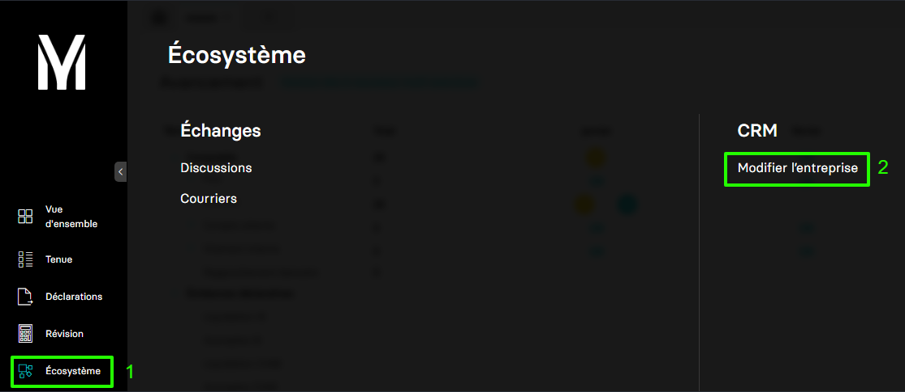
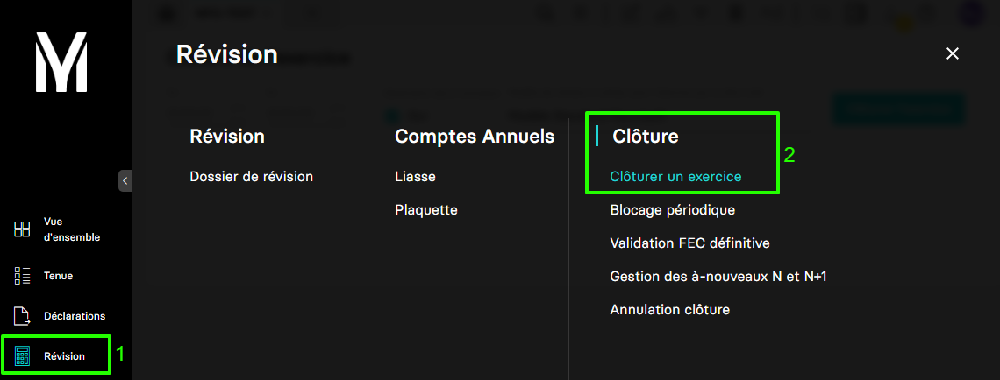

---
prev:
  text: 🐤 Introduction
  link: documentation.md
next: false
---

<span id="readme-top"></span>

# Création, mise à jour, clôture d'un exercice comptable

Ce guide a pour objectif de vous accompagner dans le processus de **création**, de **mise à jour** et de **clôture** d'un exercice comptable.

Dans MyUnisoft les exercices peuvent être gérés par le biais du CRM : `Ecosystème` > `CRM` > `Modifier l'entreprise`.



Assurez-vous de travailler sur les **Entreprises** :


Choisir l'onglet "Exercices" :


## Création d'un exercice

La route <https://api.myunisoft.fr/api/v1/society/exercice> permet de créer un exercice avec l'API partenaire.

```bash
curl --location 'https://api.myunisoft.fr/api/v1/society/exercice' \
--header 'X-Third-Party-Secret: nompartenaire-L8vlKfjJ5y7zwFj2J49xo53V' \
--header 'society-id: 1' \
--header 'Authorization: Bearer {{API_TOKEN}}' \
--data '{
    "exercice": [
        {
            "start_date": "2025-01-01",
            "end_date": "2025-12-31"
        }
    ]
}'
```

> [!IMPORTANT]
> Penser à préciser l'en-tête **society-id** si vous utilisez un 🔹 Accès cabinet.

Dans le body (type `raw`) renseignez les valeurs des propriétés suivantes :

| propriété | description | type & format |
| --- | --- | --- |
| start_date | date de début d'exercice | `string`, "YYYY-MM-DD" |
| end_date | date de fin d'exercice | `string`, "YYYY-MM-DD" |

<details class="details custom-block"><summary>Retour JSON de l'API</summary>

```json
[
    {
        "exercice_id": 420,
        "start_date": "20250101",
        "end_date": "20251231",
        "label": "N+1",
        "duration": 12,
        "closed": false,
        "ca": 0,
        "used_software": "MyUnisoft Comptabilité"
    }
]
```

</details>

<details class="details custom-block"><summary>Interface TypeScript Exercice</summary>

```ts
export interface Exercice {
  exercice_id: number;
  start_date: string;
  end_date: string;
  /**Label de l'exercice ( N-1, N, N+1 etc..). */
  label: string;
  /* Chiffre d'affaire sur l'exercice. */
  ca: number;
  closed: boolean;
  duration: number;
  used_software: string
}
```

</details>

## Mise à jour d'un exercice

La route <https://api.myunisoft.fr/api/v1/society/exercice> permet de mettre à jour un exercice avec l'API partenaires.

```bash
curl --location --request PUT 'https://api.myunisoft.fr/api/v1/society/exercice' \
--header 'X-Third-Party-Secret: nompartenaire-L8vlKfjJ5y7zwFj2J49xo53V' \
--header 'society-id: 1' \
--header 'Authorization: Bearer {{API_TOKEN}}' \
--data '{
  "exercice": [
    {
      "start_date": "2025-01-01",
      "end_date": "2025-11-30",
      "exercice_id": 420
    }
  ]
}'
```

> [!IMPORTANT]
> Penser à préciser l'en-tête **society-id** si vous utilisez un 🔹 Accès cabinet.

Dans le body (type `raw`) renseignez les valeurs des propriétés suivantes :

| propriété | description | type & format |
| --- | --- | --- |
| `start_date` | date de début d'exercice | `string`, "YYYY-MM-DD" |
| `end_date` | date de fin d'exercice | `string`, "YYYY-MM-DD" |
| `exercice_id` | l'id de l'exercice à modifier | `integer` |

Pour obtenir la liste des exercices : [Récupérer les exercices d'un dossier](../folder/exercices.md).

<details class="details custom-block"><summary>Retour JSON de l'API</summary>

```json
[
    {
        "exercice_id": 420,
        "start_date": "20250101",
        "end_date": "20251130",
        "label": "N+1",
        "duration": 11,
        "closed": false,
        "ca": 0,
        "used_software": "MyUnisoft Comptabilité"
    }
]
```

</details>

<details class="details custom-block"><summary>Interface TypeScript Exercice</summary>

```ts
export interface Exercice {
  exercice_id: number;
  start_date: string;
  end_date: string;
  /**Label de l'exercice ( N-1, N, N+1 etc..). */
  label: string;
  /* Chiffre d'affaire sur l'exercice. */
  ca: number;
  closed: boolean;
  duration: number;
  used_software: string
}
```

</details>

## Clôture d'un exercice

Dans MyUnisoft, les exercices peuvent être clôturés par : `Révision` > `Clôture` > `Clôturer un exercice`



### API

La route <https://api.myunisoft.fr/api/v1/society/closeExercice> permet de clôturer un exercice avec l'API partenaires.

```bash
curl --location --request PUT 'https://api.myunisoft.fr/api/v1/society/closeExercice?id_exercice=94312&lettering_method_id=2&id_review_model=1&carry_forward=true' \
--header 'X-Third-Party-Secret: nompartenaire-L8vlKfjJ5y7zwFj2J49xo53V' \
--header 'society-id: 1' \
--header 'Content-Type: application/json' \
--header 'Authorization: Bearer {{API_TOKEN}}'
```

> [!IMPORTANT]
> Penser à préciser l'en-tête **society-id** si vous utilisez un 🔹 Accès cabinet.

La requête attend les paramètres suivants :

| Paramètre | Description |
| --- | --- |
| `id_exercice` | L'id de l'exercice que vous souhaitez clôturer<br> [Récupérer les exercices d'un dossier](../folder/exercices.md) |
| `lettering_method_id` | L'id de la méthode de lettrage que vous souhaitez utiliser :<br> `1` = "MONO" (sur l'exercice courant)<br> `2` = "MULTI" (sur plusieurs exercices)<br> **Attention** il est possible de passer de "MONO" à "MULTI" **une seule fois sans rétropédalage possible** |
| `id_review_model` | L'id du modèle de révision comptable<br> [Récupération des modèles de dossier](../folder/dossiers_de_révision.md) |
| `carry_forward` | Génération automatique ou manuelle des "À nouveaux" :<br> `true` pour automatique<br> `false` pour manuelle |

<details class="details custom-block"><summary>Retour JSON de l'API</summary>

```json
{
    "status": "success"
}
```

</details>

<p align="right">(<a href="#readme-top">retour en haut de page</a>)</p>
