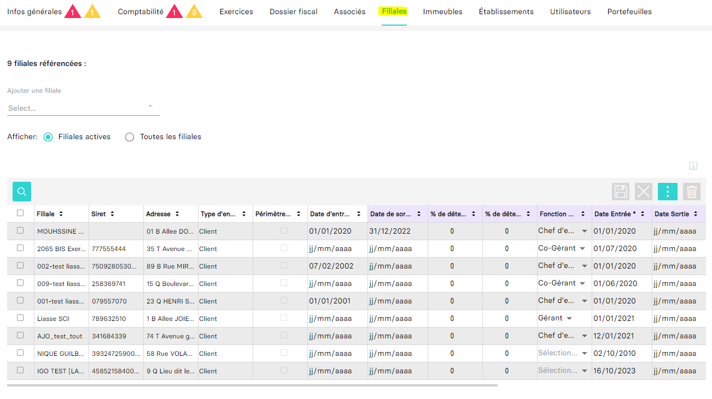

---
prev:
  text: 🐤 Introduction
  link: documentation.md
next: false
---

<span id="readme-top"></span>

# Récupérer les filiales associés à une entreprise

Ce guide a pour objectif de vous aider à récupérer les filiales associés à une entreprise. Dans MyUnisoft, la gestion des filiales s'effectue avec le module CRM: `Ecosystème` > `CRM` > `Entreprises` > `Filiales`.



## API

La route <kbd>GET</kbd> https://api.myunisoft.fr/api/v1/society/filiale_associate permet de récupérer les mêmes données que celle visible ci-dessus dans l'imprime écran:

<details class="details custom-block">
  <summary markdown="span">Retour JSON de l'API</summary>

```json
{
  "filiale_associate_list": [
    {
      "society_link_id": 78,
      "society": {
        "revenu_pro": false,
        "id": 372,
        "name": "SOCIETE DE TEST",
        "siret": "",
        "capital": 50000,
        "nb_part": 100,
        "date_capital": "20180101",
        "address": "01 B Allee DOUDEAUVILLE HELO 29730 TREFFIAGAT FRANCE",
        "account_id": 0,
        "start_date": "2020-01-01",
        "end_date": "",
        "id_type_company": 1,
        "head_group_if": true,
        "fiscal_integration": false,
        "assujetti_unique": false,
        "vat_start_date": "",
        "vat_end_date": "",
        "start_date_if": "20200101",
        "end_date_if": "20221231",
        "direct_holding_percentage": 0,
        "indirect_holding_percentage": 0,
        "tax_scope": false
      },
      "signatory_function": {
        "id": 3,
        "label": "Chef d'entreprise"
      },
      "social_part": {
        "PP": 1,
        "NP": 0,
        "US": 0,
        "percent": 1
      }
    },
    {
      "society_link_id": 100,
      "society": {
        "revenu_pro": false,
        "id": 370,
        "name": "2065 BIS Exercice d\u00e9cal\u00e9",
        "siret": "777555444",
        "capital": 100000,
        "nb_part": 100,
        "date_capital": "20200701",
        "address": "35 T Avenue Orange 91160 BALLAINVILLIERS FRANCE",
        "account_id": 0,
        "start_date": "2020-07-01",
        "end_date": "",
        "id_type_company": 1,
        "head_group_if": false,
        "fiscal_integration": false,
        "assujetti_unique": false,
        "vat_start_date": "",
        "vat_end_date": "",
        "start_date_if": "",
        "end_date_if": "",
        "direct_holding_percentage": 0,
        "indirect_holding_percentage": 0,
        "tax_scope": false
      },
      "signatory_function": {
        "id": 6,
        "label": "Co-G\u00e9rant"
      },
      "social_part": {
        "PP": 40,
        "NP": 0,
        "US": 0,
        "percent": 40
      }
    }
  ]
}
```

</details>

### Part social

La propriété `social_part` précise la part de la filiale avec les sous-clés suivantes:

- <kbd>PP</kbd> pour **pleine propriété**
- <kbd>NP</kbd> pour **nue propriété**
- <kbd>US</kbd> pour **usufruit**

### Type du dossier

Type du dossier qui correspond à la propriété  `id_type_company`.

| id | label |
| :---: | --- |
| 1 | Client |
| 2 | Prospect |
| 3 | Suspect |
| 4 | Ancien client |
| 5 | Associé client |
| 6 | Filliale client |
| 7 | Partenaire |
| 8 | Prescripteur |
| 9 | Etablissement |
| 10 | Cabinet |

### Fonction signataire

Type de la fonction signataire qui correspond à la propriété  `signatory_function`.

| id | label |
| :---: | --- |
| 1 | Gérant |
| 2 | Président |
| 3 | Chef d'entreprise |
| 4 | DG |
| 5 | PDG |
| 6 | Co-Gérant |
