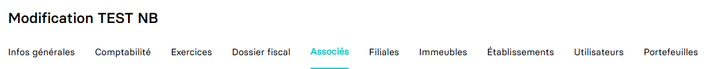

---
prev:
  text: 🐤 Introduction
  link: documentation.md
next: false
---

<span id="readme-top"></span>

# Récupérer le capital et les associés d'une société

Ce guide va vous permettre de récupérer la composition du capital et la liste des associés d'une société.

Dans MyUnisoft, pour accéder à l'onglet `Associés`, vous devez passer par le module CRM : `Ecosystème` > `CRM` > `Entreprises`.


Sélectionnez le dossier de production pour lequel vous souhaitez consulter la liste des associés et la composition du capital.


Vous obtenez les différents onglets de l'entreprise interrogée. Cliquez sur `Associés` pour accéder à celui-ci.



## API

La route <https://api.myunisoft.fr/api/v1/society/:id_society/associate> permet de procéder à cette même opération via l'API partenaire.

```bash
curl --location --globoff 'https://api.myunisoft.fr/api/v1/society/1/associate' \
--header 'X-Third-Party-Secret: nompartenaire-L8vlKfjJ5y7zwFj2J49xo53V' \
--header 'society-id: 1' \
--header 'Authorization: Bearer {{API_TOKEN}}'
```

<details class="details custom-block"><summary>Exemple de retour JSON de l'API</summary>

```json
{
  "capital": {
    "historical_id": 1525,
    "date": "2023-07-01",
    "capital": 30000,
    "social_part": 100,
    "social_part_value": 300
  },
  "associate_list": {
    "physical_person_list": [
      {
        "physical_person_link_id": 2586,
        "physical_person": {
          "id": 5861,
          "firstname": "Arnaud",
          "name": "Durant",
          "account_id": 18719593,
          "coord": [
            {
              "id": 12576,
              "type": {
                  "id": 1,
                  "label": "Mail",
                  "value": "Mail"
              },
              "label": null,
              "value": "arnaud.durant@fakemail.com"
            }
          ]
        },
        "signatory_function": {
          "id": 3,
          "label": "Chef d'entreprise"
        },
        "function": {
          "id": 10,
          "label": "Administrateur"
        },
        "start_date": "2023-08-10",
        "end_date": "",
        "social_part": {
          "PP": 50,
          "NP": 0,
          "US": 0,
          "percent": 50
        }
      }
      // ...
    ],
    "society_list": [
      {
        "society_link_id": 2003,
        "society": {
          "revenu_pro": false,
          "id": 5303,
          "name": "SCI Immo Invest",
          "siret": "45698732100045",
          "capital": 10000,
          "nb_part": 100,
          "date_capital": "20220221",
          "address": "10 T Avenue Granot 07800 BEAUCHASTEL FRANCE",
          "account_id": 18719588,
          "start_date": "2023-08-15",
          "end_date": "",
          "id_type_company": 1,
          "head_group_if": false,
          "fiscal_integration": false,
          "assujetti_unique": false,
          "vat_start_date": "",
          "vat_end_date": ""
        },
        "signatory_function": {
          "id": 6,
          "label": "Co-Gérant"
        },
        "social_part": {
          "PP": 50,
          "NP": 0,
          "US": 0,
          "percent": 50
        }
      }
      // ...
    ]
  }
}
```

</details>

<details class="details custom-block"><summary>Définition TypeScript Associates</summary>

```ts
interface Associates {
  capital: {
    historical_id: number,
    date: string,
    capital: number,
    social_part: number,
    social_part_value: number
  },
  associate_list: {
    physical_person_list: [
      {
        physical_person_link_id: number,
        physical_person: {
          id: number,
          firstname: string,
          name: string,
          account_id: number,
          coord: [
            {
              id: number,
              type: {
                  id: number,
                  label: string,
                  value: string
              },
              label: string,
              value: string
            }
          ]
        },
        signatory_function: {
          id: number,
          label: string
        },
        function: {
          id: number,
          label: string
        },
        start_date: string,
        end_date: string,
        social_part: {
          PP: number,
          NP: number,
          US: number,
          percent: number
        }
      }
    ],
    society_list: [
      {
        society_link_id: number,
        society: {
          revenu_pro: boolean,
          id: number,
          name: string,
          siret: string,
          capital: number,
          nb_part: number,
          date_capital: string,
          address: string,
          account_id: number,
          start_date: string,
          end_date: ,
          id_type_company: number,
          head_group_if: false,
          fiscal_integration: false,
          assujetti_unique: false,
          vat_start_date: ,
          vat_end_date: 
        },
        signatory_function: {
          id: number,
          label: string
        },
        social_part: {
          PP: number,
          NP: number,
          US: number,
          percent: number
        }
      }
    ]
  }
}
```

</details>

<p align="right">(<a href="#readme-top">retour en haut de page</a>)</p>
