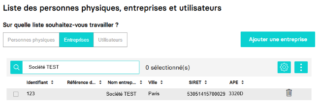
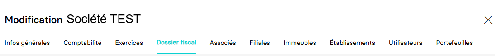

---
prev:
  text: 🐤 Introduction
  link: documentation.md
next: false
---

<span id="readme-top"></span>

# Récupérer le dossier fiscal d'une société

Ce guide va vous permettre de récupérer le dossier fiscal d'une société.

Dans MyUnisoft, pour accéder au dossier fiscal, vous devez passer par le module CRM : `Ecosystème` > `CRM` > `Entreprises`.


Sélectionnez le dossier de production pour lequel vous souhaitez consulter le dossier fiscal.



Vous obtenez les différents onglets de l'entreprise interrogée. Cliquez sur `Dossier fiscal` pour accéder à celui-ci.



## API

La route <https://api.myunisoft.fr/api/v1/society/fiscal_file> permet de récupérer le dossier fiscal d'une société.

```bash
curl --location 'https://api.myunisoft.fr/api/v1/society/fiscal_file' \
--header 'X-Third-Party-Secret: nompartenaire-L8vlKfjJ5y7zwFj2J49xo53V' \
--header 'society-id: 1;' \
--header 'Authorization: Bearer {{API_TOKEN}}'
```

<details class="details custom-block"><summary>Exemple de retour JSON de l'API</summary>

```json
{
    "rof_tva": "TVA1",
    "rof_tdfc": "IS1",
    "rof_cfe": "CFE1",
    "rof_cvae": "CVAE1",
    "rof_rcm": "RCM1",
    "rof_groupe": "",
    "acompte_pro_mens": false,
    "exercice_declaration": false,
    "tva_intraco": "FR45530514157",
    "due_date_tva": 21,
    "adherent_code": "",
    "mono_etab": false,
    "close_entries_VAT": false,
    "mail_liasse": "",
    "fiscal_integration": false,
    "head_group_if": false,
    "start_date_if": "",
    "end_date_if": "",
    "adv_legal_form_id": "SARL",
    "adv_name": "Groupe conseil",
    "adv_name_2": "",
    "adv_phone_number": "+33112134567",
    "adv_address_number": "10",
    "adv_street_name": "du Boulevard",
    "adv_postal_code": "75000",
    "adv_city": "PARIS",
    "adv_country": "FRANCE",
    "ecf_legal_form_id": "EURL",
    "ecf_siren": "",
    "ecf_name": "Prestataire",
    "ecf_name_2": "",
    "ecf_address_number": "",
    "ecf_street_name": "de la corniche",
    "ecf_postal_code": "75000",
    "ecf_city": "PARIS",
    "ecf_country": "FRANCE",
    "sie_address_number": "8",
    "sie_street_name": "de l'impasse",
    "sie_name": "SIE de Paris",
    "sie_postal_code": "75000",
    "sie_city": "PARIS",
    "sie_country": "FRANCE",
    "vis_name": "",
    "vis_agreement_number": "",
    "vis_viseur": true,
    "vis_address_number": "",
    "vis_street_name": "",
    "vis_postal_code": "",
    "vis_city": "",
    "vis_country": "",
    "id_pers_physique": null,
    "id_societe_signataire": null,
    "id_societe_comptable": null,
    "fiscal_decl_by_firm": true,
    "id_comptable": 0,
    "assujetti_unique": false,
    "siren_assujetti_unique": "",
    "rof_ts": "",
    "periodicity_ts": 0,
    "holding_name": "",
    "adv_forme_juridique": {
        "id": 1,
        "code": "SARL",
        "label": "Société à Responsabilité Limitée",
        "code_edi": "SRL"
    },
    "ecf_forme_juridique": {
        "id": 4,
        "code": "EURL",
        "label": "Entreprise Unipersonnelle à Responsabilité Limitée",
        "code_edi": "ERL"
    },
    "adv_road_type": {
        "id": 1,
        "label": "Allée",
        "value": "Allée"
    },
    "ecf_road_type": {
        "id": 3,
        "label": "Boulevard",
        "value": "Boulevard"
    },
    "sie_road_type": {
        "id": 2,
        "label": "Avenue",
        "value": "Avenue"
    },
    "sheet_group": {
        "id": 2,
        "label": "IS-BIC-Normal",
        "value": "ISBICN",
        "id_bilan": 1,
        "regime_impot": true,
        "id_regime_impot": 1
    },
    "vat_regime": {
        "id": 4,
        "label": "Réel Normal Mensuel",
        "value": "M"
    },
    "gestion_center": {
        "id": 7,
        "label": "CGA83",
        "value": "CGA83"
    },
    "info_bnc": {
        "info_bnc_id": 1982,
        "membership_year": null,
        "activity_code_pm": null
    },
    "society_status": {
        "id": 1,
        "label": "En activité",
        "value": "En activité",
        "effective_date": "2023-09-14"
    }
}
```

</details>

<details class="details custom-block"><summary>Définition TypeScript Fiscal file</summary>

```ts
interface FiscalFile {
    rof_tva: string,
    rof_tdfc: string,
    rof_cfe: string,
    rof_cvae: string,
    rof_rcm: string,
    rof_groupe: string,
    acompte_pro_mens: boolean,
    exercice_declaration: boolean,
    tva_intraco: string,
    due_date_tva: number,
    adherent_code: string,
    mono_etab: boolean,
    close_entries_VAT: boolean,
    mail_liasse: string,
    fiscal_integration: boolean,
    head_group_if: boolean,
    start_date_if: string,
    end_date_if: string,
    adv_legal_form_id: string,
    adv_name: string,
    adv_name_2: string,
    adv_phone_number: string,
    adv_address_number: string,
    adv_street_name: string,
    adv_postal_code: string,
    adv_city: string,
    adv_country: string,
    ecf_legal_form_id: string,
    ecf_siren: string,
    ecf_name: string,
    ecf_name_2: string,
    ecf_address_number: ,
    ecf_street_name: string,
    ecf_postal_code: string,
    ecf_city: string,
    ecf_country: string,
    sie_address_number: string,
    sie_street_name: string,
    sie_name: string,
    sie_postal_code: string,
    sie_city: string,
    sie_country: string,
    vis_name: string,
    vis_agreement_number: string,
    vis_viseur: boolean,
    vis_address_number: string,
    vis_street_name: string,
    vis_postal_code: string,
    vis_city: string,
    vis_country: string,
    id_pers_physique: number,
    id_societe_signataire: number,
    id_societe_comptable: number,
    fiscal_decl_by_firm: boolean,
    id_comptable: number,
    assujetti_unique: boolean,
    siren_assujetti_unique: string,
    rof_ts: string,
    periodicity_ts: number,
    holding_name: string,
    adv_forme_juridique: {
        id: number,
        code: string,
        label: string,
        code_edi: string
    },
    ecf_forme_juridique: {
        id: number,
        code: string,
        label: string,
        code_edi: string
    },
    adv_road_type: {
        id: number,
        label: string,
        value: string
    },
    ecf_road_type: {
        id: number,
        label: string,
        value: string
    },
    sie_road_type: {
        id: number,
        label: string,
        value: string
    },
    sheet_group: {
        id: number,
        label: string,
        value: string,
        id_bilan: number,
        regime_impot: boolean,
        id_regime_impot: number
    },
    vat_regime: {
        id: number,
        label: string,
        value: string
    },
    gestion_center: {
        id: number,
        label: string,
        value: string
    },
    info_bnc: {
        info_bnc_id: number,
        membership_year: string,
        activity_code_pm: string
    },
    society_status: {
        id: number,
        label: string,
        value: string,
        effective_date: string
    }
}
```

</details>

<p align="right">(<a href="#readme-top">retour en haut de page</a>)</p>
