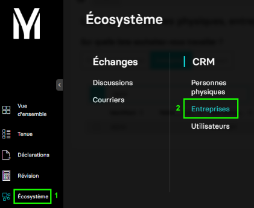
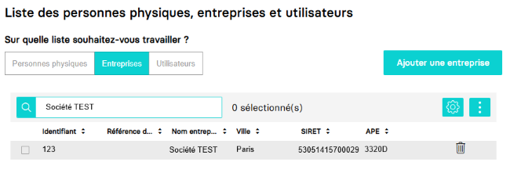
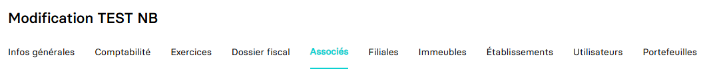

---
prev:
  text: 🐤 Introduction
  link: documentation.md
next: false
---

<span id="readme-top"></span>

# Création et mise à jour de la composition du capital et des associés d'une société (dossier de production)

Avec ce guide, vous allez être accompagné afin de créer et/ou mettre à jour la composition du capital et les associés  d'une société.

Dans MyUnisoft, pour gérer ces éléments vous devez accéder à l'onglet `Associés` par le module CRM : `Ecosystème` > `CRM` > `Entreprises`.



Sélectionnez le dossier de production pour lequel vous souhaitez gérer la liste des associés et la composition du capital.



Vous obtenez les différents onglets de l'entreprise interrogée. Cliquez sur `Associés` pour accéder à celui-ci et pouvoir compléter les éléments requis.



## API

Ce module est composé de trois thématiques sur lesquelles vous pouvez opérer séparément : Capital, personnes physiques, personnes morales

### Capital

La route https://app.myunisoft.fr/api/v1/society/capital permet d'ajouter et/ou mettre à jour les données du capital social via l'API partenaire.

> [!IMPORTANT]
> 🔹 Accès cabinet : L'accès cabinet nécessitera la présence de l'en-tête HTTP `society-id` avec l'id du dossier de production.

```bash
curl --location 'https://app.myunisoft.fr/api/v1/society/capital' \
--header 'X-Third-Party-Secret: nompartenaire-L8vlKfjJ5y7zwFj2J49xo53V' \
--header 'society-id: 1;' \
--header 'Content-Type: application/json' \
--header 'Authorization: Bearer {{API_TOKEN}}' \
--data '{
    "effective_date": "2023-07-15",
    "capital": 35000,
    "social_part": 100
}'
```

Une fois la requête exécutée l'API vous retournera une réponse au format JSON :

<details class="details custom-block"><summary>Exemple de retour JSON de l'API</summary>

```json
{
    "historical_id": 1526,
    "date": "2023-07-15",
    "capital": 35000,
    "social_part": 100,
    "social_part_value": 350
}
```

</details>

<br>
La route attend un body au format JSON composé de propriétés de l'interface suivante :

<details class="details custom-block"><summary>Interface TypeScript Capital</summary>

```ts
export interface Capital {
    effective_date: string,
    capital: number,
    social_part:  number
}
```

</details>

<br>

NB : Le format de de date de la propriété `effective_date` est le suivant : "YYYY-MM-DD".

### Personnes physiques

La route https://app.myunisoft.fr/api/v1/associate/natural_person permet d'ajouter et/ou mettre à jour les associés personnes physiques via l'API partenaire.

> [!IMPORTANT]
> 🔹 Accès cabinet : L'accès cabinet nécessitera la présence de l'en-tête HTTP `society-id` avec l'id du dossier de production.

```bash
curl --location 'https://app.myunisoft.fr/api/v1/associate/natural_person' \
--header 'X-Third-Party-Secret: nompartenaire-L8vlKfjJ5y7zwFj2J49xo53V' \
--header 'society-id: 1' \
--header 'Content-Type: application/json' \
--header 'Authorization: Bearer {{API_TOKEN}}' \
--data '{
    "physical_person_id": 5861,
    "signatory_function_id": 3,
    "function_id": 10,
    "start_date": "2023-08-10",
    "end_date": "",
    "social_part": {
        "PP": 50,
        "NP": 0,
        "US": 0
    },
    "account_id": 18719593,
    "effective_date": "2023-08-10"
}'
```

Une fois la requête exécutée avec succès, l'API vous retournera une réponse au format JSON :

<details class="details custom-block"><summary>Exemple de retour JSON de l'API</summary>

```json
{
    "physical_person_link_id": 2588,
    "physical_person": {
        "id": 5861,
        "firstname": "",
        "name": "",
        "account_id": 18719593
    },
    "effective_date": "2023-08-10",
    "start_date": "2023-08-10",
    "end_date": "",
    "signatory_function": {
        "id": 3,
        "label": ""
    },
    "function": {
        "id": 10,
        "label": ""
    },
    "social_part": {
        "PP": 50,
        "NP": 0,
        "US": 0,
        "percent": 50
    }
}
```

</details>

<br>
La route attend un body au format JSON composé de propriétés de l'interface suivante :

<details class="details custom-block"><summary>Interface TypeScript Personne Physique</summary>

```ts
export interface PersonnePhysique {
    physical_person_id: number,
    signatory_function_id: number,
    function_id: number,
    start_date: string,
    end_date: string,
    social_part: {
        PP: number,
        NP: number,
        US: number
    },
    account_id: number,
    effective_date: string
}
```

</details>

<br>
Voici quelques détails concernant certaines propriétés spécifiques et les moyens pour récupérer leurs valeurs applicables :

- `physical_person_id` : Pour récupérer la liste des personnes physiques et leur id, vous pouvez consulter la section de la page [Récupérer les utilisateurs et personnes physiques d'un schema](./users.md).
- `start_date` / `end_date` / `effective_date` : il s'agit des dates d'entrée, de sortie, et date de changement effectif d'un associé. La valeur attendue est une chaîne de caractère au format "YYYY-MM-DD".
- `account_id` : correspond à l'id des comptes courrants d'associés ou compte de débiteurs créditeurs divers. Pour récupérer la liste des comptes d'une société, vous pouvez consulter la page : // TODO: ajouter le lien vers la page.
- `signatory_function_id` : // TODO: ajouter la page vers les statiques.
- `function_id` : // TODO: ajouter la page vers les statiques.
- `social_part` : il s'agit de la composition du nombre de parts d'associés classé par catégories. Les différentes catégories de parts sociales sont détaillées dans le tableau ci-dessous.

  | clé | correspondance |
  | --- | --- |
  | `PP` | "Pleine propriété" |
  | `NP` | "Nue propriété" |
  | `US` | "Usufruit" |

### Personnes morales

La route  permet d'ajouter et/ou mettre à jour (...) via l'API partenaire.

> [!IMPORTANT]
> 🔹 Accès cabinet : L'accès cabinet nécessitera la présence de l'en-tête HTTP `society-id` avec l'id du dossier de production.

```bash

```

En fonction des éléments que vous aurez renseigné dans le body de la requête, l'API vous retournera une réponse au format JSON :

<details class="details custom-block"><summary>Exemple de retour JSON de l'API</summary>

```json

```

</details>

<br>
La route attend un body au format JSON composé de propriétés de l'interface suivante :

<details class="details custom-block"><summary>Interface TypeScript Personne Morale</summary>

```ts
export interface PersonneMorale {

}
```

</details>

<br>
Voici quelques détails concernant certaines propriétés spécifiques et les moyens pour récupérer leurs valeurs applicables :

<p align="right">(<a href="#readme-top">retour en haut de page</a>)</p>
