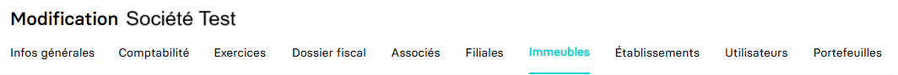

---
prev:
  text: 🐤 Introduction
  link: documentation.md
next: false
---

<span id="readme-top"></span>

# Ajouter, mettre à jour, supprimer les immeubles d'une entreprise

Ce guide a pour objectif de vous aider à Ajouter, mettre à jour et supprimer les immeubles d'un dossier.
Dans MyUnisoft, la gestion des immeubles s'effectue avec le module CRM : `Ecosystème` > `CRM` > `Entreprises` > `Immeubles`.



> [!IMPORTANT]
> 🔹 Accès cabinet : L'accès cabinet nécessitera la présence de l'en-tête HTTP `society-id` avec l'id du dossier de production.

## Ajouter un immeuble

La route <kbd>POST</kbd> <https://api.myunisoft.fr/api/v1/building> permet d'ajouter un immeuble à une entreprise via l'API partenaire.

```bash
curl --location 'https://api.myunisoft.fr/api/v1/building' \
--header 'X-Third-Party-Secret: nompartenaire-L8vlKfjJ5y7zwFj2J49xo53V' \
--header 'society-id: 1' \
--header 'Content-Type: application/json' \
--header 'Authorization: Bearer {{API_TOKEN}}' \
--data '{
    "acquisition_date": "2023-04-15",
    "address_bis": "T",
    "address_number": "4",
    "bare_building": false,
    "building_construction_type_id": 1,
    "building_deduction_amort_id": 2,
    "building_land_system_id": 10,
    "cession_date": "",
    "city": "BORDEAUX",
    "complement": "Le village",
    "completion_date": "2023-04-15",
    "country": "FRANCE",
    "list_building_type_id": [6],
    "local_number": "1",
    "name": "IMMEUBLE 2",
    "postal_code": "33200",
    "road_type_id": 9,
    "street_name": "Du développement"
}'
```

Une fois la requête exécutée, l'API vous retournera une réponse au format JSON accompagnée d'un `statusCode` 200 :

<details class="details custom-block"><summary>Exemple de retour JSON de l'API</summary>

```json
{
    "building_id": 96,
    "name": "IMMEUBLE 2",
    "order_number": {
        "id": null,
        "label": null,
        "value": null
    },
    "analytique_section": null,
    "local_number": 1,
    "acquisition_date": "2023-04-15",
    "completion_date": "2023-04-15",
    "cession_date": null,
    "bare_building": false,
    "road_type": {
        "id": 9,
        "label": "Rue",
        "value": "Rue"
    },
    "street_name": "Du développement",
    "complement": "Le village",
    "address_bis": "T",
    "address_number": "4",
    "postal_code": "33200",
    "country": "FRANCE",
    "city": {
        "label": "BORDEAUX",
        "value": "BORDEAUX"
    },
    "full_address": "4 T Rue Du développement Le village 33200 BORDEAUX ",
    "land_system": {
        "id": 10,
        "label": "Dispositif du \"Robien classique ou recentré ZRR\"",
        "value": "10"
    },
    "construction_type": {
        "id": 1,
        "label": "Bâti",
        "value": "B"
    },
    "deduction_amort": {
        "id": 2,
        "label": "Dispositif \"Robien classique\"",
        "value": "2"
    },
    "building_type": [
        {
            "id": 6,
            "label": "Immeuble urbain",
            "value": "U"
        }
    ]
}
```

</details>

<br>
La route attend un body au format JSON composé de propriétés de l'interface suivante :

<details class="details custom-block"><summary>Définition TypeScript Immeuble</summary>

```ts
interface Immeuble {
  acquisition_date: string,
  address_bis: string,
  address_number: string,
  bare_building: boolean,
  building_construction_type_id: number,
  building_deduction_amort_id: number,
  building_land_system_id: number,
  cession_date: string,
  city: string,
  complement: string,
  completion_date: string,
  country: string,
  list_building_type_id: number[],
  local_number: string,
  name: string,
  postal_code: string,
  road_type_id: number,
  street_name: string
}
```

</details>

## Mettre à jour un immeuble

La route <kbd>PUT</kbd> <https://api.myunisoft.fr/api/v1/building> permet de mettre à jour les informations d'un immeuble lié à une entreprise via l'API partenaire.

```bash
curl --location --request PUT 'https://api.myunisoft.fr/api/v1/building?building_id=96' \
--header 'X-Third-Party-Secret: nompartenaire-L8vlKfjJ5y7zwFj2J49xo53V' \
--header 'society-id: 1' \
--header 'Content-Type: application/json' \
--header 'Authorization: Bearer {{API_TOKEN}}' \
--data '{
    "acquisition_date": "2023-04-20",
    "address_bis": "T",
    "address_number": "4",
    "bare_building": false,
    "building_construction_type_id": 1,
    "building_deduction_amort_id": 2,
    "building_land_system_id": 10,
    "cession_date": "",
    "city": "BORDEAUX",
    "complement": "Le village",
    "completion_date": "2023-04-15",
    "country": "FRANCE",
    "list_building_type_id": [6],
    "local_number": "1",
    "name": "IMMEUBLE 2",
    "postal_code": "33200",
    "road_type_id": 9,
    "street_name": "Du développement"
}'
```

Le endpoint attend le paramètre (query string) `building_id`. Celui-ci est récupérable via la [récupération de la liste des immeubles d'une société](./buildings.md).

<details class="details custom-block"><summary>Exemple de retour JSON de l'API</summary>

```json
{
  "building_id": 96,
  "name": "IMMEUBLE 2",
  "order_number": {
    "id": null,
    "label": null,
    "value": null
  },
  "analytique_section": null,
  "local_number": 1,
  "acquisition_date": "2023-04-20",
  "completion_date": "2023-04-15",
  "cession_date": null,
  "bare_building": false,
  "road_type": {
    "id": 9,
    "label": "Rue",
    "value": "Rue"
  },
  "street_name": "Du développement",
  "complement": "Le village",
  "address_bis": "T",
  "address_number": "4",
  "postal_code": "33200",
  "country": "FRANCE",
  "city": {
    "label": "BORDEAUX",
    "value": "BORDEAUX"
  },
  "full_address": "4 T Rue Du développement Le village 33200 BORDEAUX ",
  "land_system": {
    "id": 10,
    "label": "Dispositif du \"Robien classique ou recentré ZRR\"",
    "value": "10"
  },
  "construction_type": {
    "id": 1,
    "label": "Bâti",
    "value": "B"
  },
  "deduction_amort": {
    "id": 2,
    "label": "Dispositif \"Robien classique\"",
    "value": "2"
  },
  "building_type": [
    {
      "id": 6,
      "label": "Immeuble urbain",
      "value": "U"
    }
  ]
}
```

</details>

<br>
La route attend un body au format JSON composé de propriétés de l'interface suivante :

<details class="details custom-block"><summary>Définition TypeScript Immeuble</summary>

```ts
interface Immeuble {
  acquisition_date: string,
  address_bis: string,
  address_number: string,
  bare_building: boolean,
  building_construction_type_id: number,
  building_deduction_amort_id: number,
  building_land_system_id: number,
  cession_date: string,
  city: string,
  complement: string,
  completion_date: string,
  country: string,
  list_building_type_id: number[],
  local_number: string,
  name: string,
  postal_code: string,
  road_type_id: number,
  street_name: string
}
```

</details>

## Supprimer un immeuble

La route <kbd>DELETE</kbd> <https://api.myunisoft.fr/api/v1/building> permet de supprimer un immeuble via l'API partenaire.

```bash
curl --location --request DELETE 'https://api.myunisoft.fr/api/v1/building' \
--header 'X-Third-Party-Secret: nompartenaire-L8vlKfjJ5y7zwFj2J49xo53V' \
--header 'society-id: 1' \
--header 'Content-Type: application/json' \
--header 'Authorization: Bearer {{API_TOKEN}}' \
--data '{
    "list_building_id": [
        93
    ]
}'
```

Dans le cas d'un succès d'exécution de la requête, l'API renverra un `statusCode` 200 ainsi que le tableau d'objet JSON de la liste des immeubles actualisés.

<br>
La route attend un body au format JSON composé des IDs d'immeubles que vous souhaitez supprimer relatifs à l'interface :

<details class="details custom-block"><summary>Définition TypeScript Immeuble</summary>

```ts
interface Immeuble {
  "list_building_id": number[]
}
```

</details>

## Informations complémentaires sur les propriétés du body pour la création et mise à jour d'un immeuble

- `acquisition_date`, `cession_date`, `completion_date` : la date (d'acquisition, de cession et d'achèvement) attendues au format YYYY-MM-DD.
- `building_construction_type_id` : il s'agit du type de construction dont les valeurs possibles sont les suivantes :

  | id | code | libellé |
  | --- | --- | --- |
  | `1` | "B" | "Bâti" |
  | `2` | "NB" | "Non bâti" |

- `building_land_system_id` : le dispositif d'acquisition spécial permettant une déduction spécifique. La liste des valeurs disponibles est consultable sur cette [page](../specs/building_land_system.md).
- `building_deduction_amort_id` : la déduction au titre de l'amortissement dans le cas de dispositifs spéciaux d'acquisition. La liste des valeurs disponibles est consultable sur cette [page](../specs/building_deduction_amort.md).
- `list_building_type_id` : La nature de l'immeuble. La liste des valeurs statiques disponibles est consultable sur cette [page](../specs/building_type.md).
- `road_type_id` : Le type de voie à préciser pour l'adresse. La liste des types de voies est consultable sur cette [page](../specs/road_types.md).

<p align="right">(<a href="#readme-top">retour en haut de page</a>)</p>
