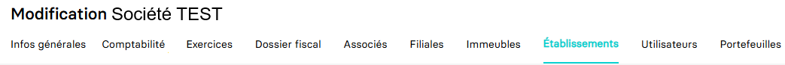

---
prev:
  text: 🐤 Introduction
  link: documentation.md
next: false
---

<span id="readme-top"></span>

# Ajouter, fermer des établissements


Avec ce guide, vous allez être accompagnés afin d'ajouter ou fermer des établlissements liés à votre dossier.

Dans MyUnisoft, vous devez consulter l'onglet `Etablissements` en passant par le module CRM : `Ecosystème` > `CRM` > `Entreprises`.


Sélectionnez le dossier de production pour lequel vous souhaitez consulter la liste des établissements.


Vous obtenez les différents onglets de l'entreprise interrogée. Cliquez sur `Etablissements` pour accéder à celui-ci.



## Ajouter un établissement

La route https://api.myunisoft.fr/api/v1/society/establishment permet **d'ajouter un établissement** à une société via l'API partenaire.

> [!IMPORTANT]
> 🔹 Accès cabinet : L'accès cabinet nécessitera la présence de l'en-tête HTTP `society-id` avec l'id du dossier de production.

```bash
curl --location 'https://api.myunisoft.fr/api/v1/society/establishment' \
--header 'X-Third-Party-Secret: nompartenaire-L8vlKfjJ5y7zwFj2J49xo53V' \
--header 'Society-id: 1' \
--header 'Content-Type: application/json' \
--header 'Authorization: Bearer {{API_TOKEN}}' \
--data '{
    "name": "nom_etab_test_1",
    "siret": "530514157",
    "address_number": "119",
    "road_type_id": 1,
    "street_name": "de l'\''essaie concluant",
    "postal_code": "83001",
    "city": {
      "label": "SAINT ZACHARIE"
    },
    "country": "FRANCE",
    "indice_repetition": "B"
}'
```

En cas de succès, la route retournera une réponse au format JSON accompagnée d'un status code `200`.

Exemple de retour JSON de l'API :

```json
{
  "name": "nom_etab_test_1",
  "siret": "530514157",
  "address_number": "119",
  "road_type_id": 1,
  "street_name": "de l'essaie concluant",
  "postal_code": "83001",
  "city": {
    "label": "SAINT ZACHARIE"
  },
  "country": "FRANCE",
  "indice_repetition": "B",
  "id_parent_society": 1,
  "id_society": 2
}
```

La route attend un body dont les spécificités sont résumées ci-dessous :

Définition TypeScript Etablissement :

```ts
interface Etablissement {
  name: string,
  siret: string,
  address_number: string,
  road_type_id: number,
  street_name: string,
  postal_code: string,
  city: {
      label: string
  },
  country: string,
  indice_repetition: string
}
```

Voici quelques détails concernant certaines propriétés attendues du body :

- `siret` : le siret doit être le même que celui du dossier comptable auquel vous désirez ajouter un établissement. Dans le cas contraire, une erreur vous sera retournée.
- `road_type_id` : Le type de voie à préciser pour l'adresse. La liste des types de voies est consultable sur cette [page](../specs/road_types.md).

## Fermer un établissement

La route https://api.myunisoft.fr/api/v1/society/establishment/close permet **de fermer un établissement** de société via l'API partenaire.

> [!IMPORTANT]
> 🔹 Accès cabinet : L'accès cabinet nécessitera la présence de l'en-tête HTTP `society-id` avec l'id du dossier de production.

```bash
curl --location --request PUT 'https://app.myunisoft.fr/api/v1/society/establishment/close?closing_date=20230910' \
--header 'X-Third-Party-Secret: nompartenaire-L8vlKfjJ5y7zwFj2J49xo53V' \
--header 'Society-id: 1' \
--header 'Content-Type: application/json' \
--header 'Authorization: Bearer {{API_TOKEN}}' \
--data '[
    {
        "id_society": 2
    }
]'
```

> [!IMPORTANT]
> La route attend un paramètre query string `closing_date` au format `YYYYMMDD`.

En cas de succès, la réponse sera un booléen `true` accompagnée d'un status code `200`.

Plusieurs établissements peuvent être fermés en une seule requête.
Pour cela le body attendu est un tableau d'objet s'inspirant de l'exemple ci-dessous :

```json
[
    {
        "id_society": 2
    }
]
```

> [!NOTE]
> L'`id_society` à fournir dans le body est celui l'établissement que vous souhaitez fermer.
