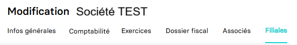

---
prev:
  text: 🐤 Introduction
  link: documentation.md
next: false
---

<span id="readme-top"></span>

# Ajouter, mettre à jour les filiales associées à une entreprise

Ce guide a pour objectif de vous aider à ajouter ou mettre à jour les filiales associées à une entreprise.
Dans MyUnisoft, la gestion des filiales s'effectue avec le module CRM: `Ecosystème` > `CRM` > `Entreprises` > `Filiales`.



## API

La route <https://api.myunisoft.fr/api/v1/society/filiale_associate> permet d'ajouter et/ou mettre à jour les données des filiales associées à une entreprise via l'API partenaire.

> [!IMPORTANT]
> 🔹 Accès cabinet : L'accès cabinet nécessitera la présence de l'en-tête HTTP `society-id` avec l'id du dossier de production.

```bash
curl --location 'https://app.myunisoft.fr/api/v1/society/filiale_associate' \
--header 'X-Third-Party-Secret: nompartenaire-L8vlKfjJ5y7zwFj2J49xo53V' \
--header 'society-id: 1' \
--header 'Content-Type: application/json' \
--header 'Authorization: Bearer {{API_TOKEN}}' \
--data '{
 "society_list" : [
  {
    "society": {
      "society_id": 2,
      "effective_date": "2023-08-10",
      "end_date": ""
    },
    "signatory_function_id": 2,
    "social_part": {
      "PP": 50,
      "NP": 0,
      "US": 0
    }
  }
 ]
}'
```

Une fois la requête exécutée, l'API vous retournera une réponse au format JSON :

<details class="details custom-block"><summary>Exemple de retour JSON de l'API</summary>

```json
{
  "filiale_associate_list": [
    {
      "society_link_id": 2013,
      "society": {
        "revenu_pro": false,
        "id": 2,
        "name": "NFG-TEST-2",
        "siret": "",
        "capital": 10000,
        "nb_part": 100,
        "date_capital": "20230101",
        "address": " FRANCE",
        "account_id": 0,
        "start_date": "2023-08-10",
        "end_date": "",
        "id_type_company": 1,
        "head_group_if": false,
        "fiscal_integration": false,
        "assujetti_unique": false,
        "vat_start_date": "",
        "vat_end_date": ""
      },
      "signatory_function": {
        "id": 2,
        "label": "Président"
      },
      "social_part": {
        "PP": 50,
        "NP": 0,
        "US": 0,
        "percent": 50
      }
    }
  ]
}
```

</details>

<br>
La route attend un body au format JSON composé de propriétés de l'interface suivante :

<details class="details custom-block"><summary>Interface TypeScript FilialeAssociate</summary>

```ts
export interface FilialeAssociate {
  society_list : [
    {
      society: {
        society_id: number,
        effective_date: string,
        end_date: string
      },
      signatory_function_id: number,
      social_part: {
        PP: number,
        NP: number,
        US: number
      }
    }
  ]
}
```

</details>

<br>

Voici quelques détails concernant les propriétés du body attendu par l'API :

- `society_id` : Il s'agit de l'id de la société filiale personne morale. Pour récupérer la liste des sociétés et leur id, vous pouvez consulter la page [Récupérer les dossiers de productions (entreprises)](../society.md).
- `effective_date` / `end_date` : Les dates d'entrée et de sortie attendues au format YYYY-MM-DD.
- `signatory_function_id` : l'id de la fonction de signataire que vous souhaitez appliquer à l'associé (personne physique ou personne morale). Vous pouvez consulter la liste des valeurs statiques utilisables sur cette [page](../specs/signatory_function.md).
- `social_part` : il s'agit de la composition du nombre de parts classé par catégories. Les différentes catégories de parts sociales sont détaillées dans le tableau ci-dessous.

  | clé | correspondance |
  | --- | --- |
  | `PP` | "Pleine propriété" |
  | `NP` | "Nue propriété" |
  | `US` | "Usufruit" |
