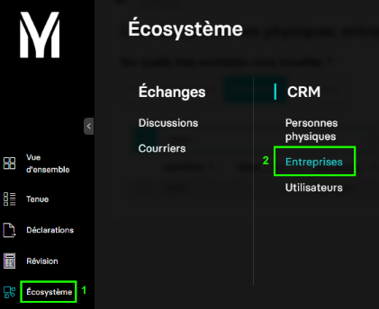
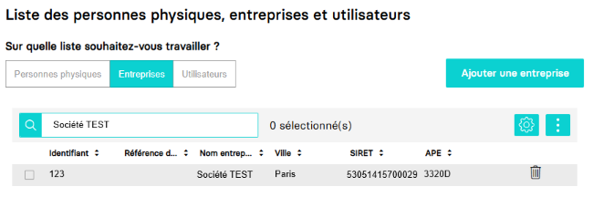

---
prev:
  text: 🐤 Introduction
  link: documentation.md
next: false
---

# Paramétrage avancé d'un dossier de production

L'objectif de ce guide est de centraliser l'ensemble des étapes de paramétrage avancé d'un dossier de production après avoir effectué le processus de création inital.

Dans MyUnisoft, ce paramétrage s'effectue en passant par le menu `Ecosystème` > `CRM` > `Entreprises`.

Sélectionnez le dossier de production sur lequel vous souhaitez intervenir.

Vous obtenez l'accès à la page de modification de l'entreprise interrogée.

Chacun des onglets consultables vous permettra de paramétrer de façon avancée la thématique sélectionnée.

## Guides de paramétrages avancés d'une société

### Comptabilité, archivage et désactivation

- [Récupérer le paramétrage comptable d'un dossier de production](./accounting_parameters.md)
- [Mise à jour des paramètres comptable d'un dossier de production](./society_accounting_parameters.md)
- [Archiver un dossier de production](./archive_society.md)
- [Désactiver un dossier de production](./disable_accounting_folder.md)

### Exercices

- [Créer, mettre à jour, clôturer un exercice comptable](./exercices.md)

### Dossier fiscal

- [Récupérer le dossier fiscal d'une société](./get_fiscal_file.md)
- [Créer, mettre à jour le dossier fiscal d'une société](./create_update_fiscal_file.md)

### Associés

- [Récupérer le capital et les associés d'une société](./get_associates.md)
- [Créer, mettre à jour le capital et les associés d'une société](./manage_associates.md)

### Filiales

- [Récupérer les filiales associées à une entreprise](./filiale_associate.md)
- [Ajouter, mettre à jour les filiales associées à une entreprise](./manage_filiales_associates.md)

### Immeubles

- [Récupérer les immeubles d'une entreprise](./buildings.md)
- [Ajouter, mettre à jour, supprimer les immeubles d'une entreprise](./manage_buildings.md)

### Etablissements

- [Récupérer les établissements secondaires d'une entreprise](./get_establishments.md)
- [Ajouter, fermer des établissements](./manage_establishments.md)

## Données statiques complémentaires exploitables

En fonction des api interrogées, vous pourrez être amené à renseigner un certain nombre d'informations via le body (données statiques dont les liens sont consultables ci-dessous ou directement depuis la page de la thématique abordée).

- [La liste des centre de gestion](./gestion_center.md)
- [Les types de tenue comptable](../specs/comptability_held.md)
- [Les types de routes](../specs/road_types.md)
- [Les régimes fiscaux d'imposition](../specs/sheet_groups.md)
- [Les régimes de taxation à la TVA](../specs/vat_regimes.md)
- [Les statuts d'activité du dossier](../specs/society_status.md)
- [Les fonctions exercées par les associés](../specs/function.md)
- [Les fonctions de signataires exercées exercées par les associcés](../specs/signatory_function.md)
