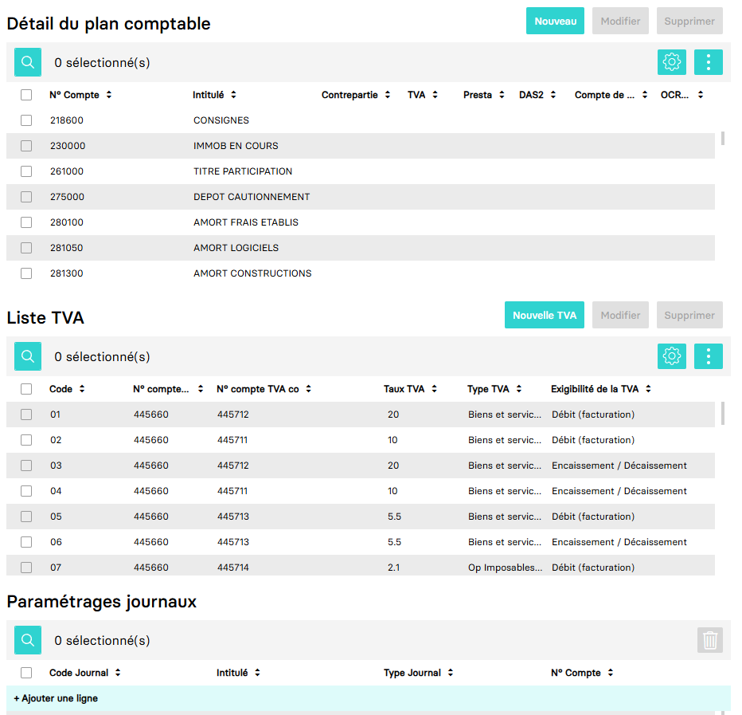

---
prev:
  text: 🐤 Introduction
  link: documentation.md
next: false
---

# Récupérer le paramétrage plans comptables étalons

Il est possible de récupérer le paramétrage plans comptables étalons `Paramètres` > `Plans comptables étalons` avec la route GET `https://api.myunisoft.fr/api/v1/model/account`.

```bash
curl --location \
--request GET 'https://api.myunisoft.fr/api/v1/model/account' \
--header 'Authorization: {{TOKEN}}' \
--header 'X-Third-Party-Secret: {{X-Third-Party-Secret}}'
```

Cette API retourne les différents plans comptables étalons disponibles, soit les modèles par défaut, soit ceux personnalisés par les cabinets.

## Exemple de réponse JSON

```json
{
  "list": [
    {
      "id": 4,
      "label": "Etalon Association MYUNISOFT",
      "description": "Plan comptable Association"
    },
    {
      "id": 2022,
      "label": "Etalon BIC MYUNISOFT 2025",
      "description": "Plan comptable BIC ANC 2022-06"
    },
    {
      "id": -100,
      "label": "Etalon MYUNISOFT",
      "description": "Plan comptable crée par défaut par MyUnisoft"
    }
  ]
}
```

À partir de l'id de chaque plan comptable (étalon), vous pouvez récupérer des informations supplémentaires, telles que les comptes, la TVA, et les journaux associés :

- Détail des comptes : `/model/account/:id/detail`
- Paramétrage de la TVA : `/model/account/:id/vat_param`
- Configuration des journaux `model/account/:id/diary`

Ces trois endpoints correspondent aux modules visibles dans l'interface lors de l'édition d'un plan comptable.



## Réponse JSON

Les exemples ci-dessous ne sont pas nécessairement "complet".

<details class="details custom-block">
<summary>Détail des comptes</summary>

```json
{
  "rows_number": 8,
  "pages_number": 1,
  "list": [
    {
      "id": 1,
      "account_number": "101000",
      "label": "CAPITAL",
      "das_2": false,
      "presta": false,
      "intraco": false,
      "param_vat_id": 0,
      "code_vat": "",
      "no_compte_contrepart": "",
      "id_info_compte_tiers": 0,
      "exoneration": false,
      "btp_autoliquidation": false,
      "correspondance_no_compte": "",
      "correspondance_label": "",
      "ocr_autovalidation": false,
      "ocr_threshold": 0
    },
    {
      "id": 2,
      "account_number": "106100",
      "label": "RESERVE LEGALE",
      "das_2": false,
      "presta": false,
      "intraco": false,
      "param_vat_id": 0,
      "code_vat": "",
      "no_compte_contrepart": "",
      "id_info_compte_tiers": 0,
      "exoneration": false,
      "btp_autoliquidation": false,
      "correspondance_no_compte": "",
      "correspondance_label": "",
      "ocr_autovalidation": false,
      "ocr_threshold": 0
    },
    {
      "id": 3,
      "account_number": "106800",
      "label": "AUTRES RESERVES",
      "das_2": false,
      "presta": false,
      "intraco": false,
      "param_vat_id": 0,
      "code_vat": "",
      "no_compte_contrepart": "",
      "id_info_compte_tiers": 0,
      "exoneration": false,
      "btp_autoliquidation": false,
      "correspondance_no_compte": "",
      "correspondance_label": "",
      "ocr_autovalidation": false,
      "ocr_threshold": 0
    },
    {
      "id": 4,
      "account_number": "108000",
      "label": "CPTE EXPLOITANT",
      "das_2": false,
      "presta": false,
      "intraco": false,
      "param_vat_id": 0,
      "code_vat": "",
      "no_compte_contrepart": "",
      "id_info_compte_tiers": 0,
      "exoneration": false,
      "btp_autoliquidation": false,
      "correspondance_no_compte": "",
      "correspondance_label": "",
      "ocr_autovalidation": false,
      "ocr_threshold": 0
    },
    {
      "id": 5,
      "account_number": "110000",
      "label": "REPORT A NOUVEAU CR",
      "das_2": false,
      "presta": false,
      "intraco": false,
      "param_vat_id": 0,
      "code_vat": "",
      "no_compte_contrepart": "",
      "id_info_compte_tiers": 0,
      "exoneration": false,
      "btp_autoliquidation": false,
      "correspondance_no_compte": "",
      "correspondance_label": "",
      "ocr_autovalidation": false,
      "ocr_threshold": 0
    },
    {
      "id": 6,
      "account_number": "119000",
      "label": "REPORT A NOUVEAU DE",
      "das_2": false,
      "presta": false,
      "intraco": false,
      "param_vat_id": 0,
      "code_vat": "",
      "no_compte_contrepart": "",
      "id_info_compte_tiers": 0,
      "exoneration": false,
      "btp_autoliquidation": false,
      "correspondance_no_compte": "",
      "correspondance_label": "",
      "ocr_autovalidation": false,
      "ocr_threshold": 0
    },
    {
      "id": 7,
      "account_number": "120000",
      "label": "RESULTAT EX. BENEF.",
      "das_2": false,
      "presta": false,
      "intraco": false,
      "param_vat_id": 0,
      "code_vat": "",
      "no_compte_contrepart": "",
      "id_info_compte_tiers": 0,
      "exoneration": false,
      "btp_autoliquidation": false,
      "correspondance_no_compte": "",
      "correspondance_label": "",
      "ocr_autovalidation": false,
      "ocr_threshold": 0
    },
    {
      "id": 8,
      "account_number": "129000",
      "label": "RESULTAT EX. PERTES",
      "das_2": false,
      "presta": false,
      "intraco": false,
      "param_vat_id": 0,
      "code_vat": "",
      "no_compte_contrepart": "",
      "id_info_compte_tiers": 0,
      "exoneration": false,
      "btp_autoliquidation": false,
      "correspondance_no_compte": "",
      "correspondance_label": "",
      "ocr_autovalidation": false,
      "ocr_threshold": 0
    }
  ]
}
```

</details>

<details class="details custom-block">
<summary>Paramétrage de la TVA</summary>

```json
[
  {
    "vat": {
      "id": 4,
      "rate": 20
    },
    "code": "01",
    "model_id": 1,
    "vat_type": {
      "id": 1,
      "code": "BIEN",
      "label": "Biens et services"
    },
    "account_ded": "445660",
    "account_coll": "445712",
    "vat_exigility": {
      "id": 1,
      "code": "DEB",
      "label": "Débit (facturation)"
    },
    "param_vat_etalon_id": 1
  },
  {
    "vat": {
      "id": 3,
      "rate": 10
    },
    "code": "02",
    "model_id": 1,
    "vat_type": {
      "id": 1,
      "code": "BIEN",
      "label": "Biens et services"
    },
    "account_ded": "445660",
    "account_coll": "445711",
    "vat_exigility": {
      "id": 1,
      "code": "DEB",
      "label": "Débit (facturation)"
    },
    "param_vat_etalon_id": 2
  },
  {
    "vat": {
      "id": 4,
      "rate": 20
    },
    "code": "03",
    "model_id": 1,
    "vat_type": {
      "id": 1,
      "code": "BIEN",
      "label": "Biens et services"
    },
    "account_ded": "445660",
    "account_coll": "445712",
    "vat_exigility": {
      "id": 2,
      "code": "ENC",
      "label": "Encaissement / Décaissement"
    },
    "param_vat_etalon_id": 3
  },
  {
    "vat": {
      "id": 3,
      "rate": 10
    },
    "code": "04",
    "model_id": 1,
    "vat_type": {
      "id": 1,
      "code": "BIEN",
      "label": "Biens et services"
    },
    "account_ded": "445660",
    "account_coll": "445711",
    "vat_exigility": {
      "id": 2,
      "code": "ENC",
      "label": "Encaissement / Décaissement"
    },
    "param_vat_etalon_id": 4
  },
  {
    "vat": {
      "id": 2,
      "rate": 5.5
    },
    "code": "05",
    "model_id": 1,
    "vat_type": {
      "id": 1,
      "code": "BIEN",
      "label": "Biens et services"
    },
    "account_ded": "445660",
    "account_coll": "445713",
    "vat_exigility": {
      "id": 1,
      "code": "DEB",
      "label": "Débit (facturation)"
    },
    "param_vat_etalon_id": 5
  },
  {
    "vat": {
      "id": 2,
      "rate": 5.5
    },
    "code": "06",
    "model_id": 1,
    "vat_type": {
      "id": 1,
      "code": "BIEN",
      "label": "Biens et services"
    },
    "account_ded": "445660",
    "account_coll": "445713",
    "vat_exigility": {
      "id": 2,
      "code": "ENC",
      "label": "Encaissement / Décaissement"
    },
    "param_vat_etalon_id": 6
  },
  {
    "vat": {
      "id": 1,
      "rate": 2.10
    },
    "code": "07",
    "model_id": 1,
    "vat_type": {
      "id": 32,
      "code": "OPOIMDOM",
      "label": "Op Imposables DOM "
    },
    "account_ded": "445660",
    "account_coll": "445714",
    "vat_exigility": {
      "id": 1,
      "code": "DEB",
      "label": "Débit (facturation)"
    },
    "param_vat_etalon_id": 7
  },
  {
    "vat": {
      "id": 1,
      "rate": 2.10
    },
    "code": "08",
    "model_id": 1,
    "vat_type": {
      "id": 32,
      "code": "OPOIMDOM",
      "label": "Op Imposables DOM "
    },
    "account_ded": "445660",
    "account_coll": "445714",
    "vat_exigility": {
      "id": 2,
      "code": "ENC",
      "label": "Encaissement / Décaissement"
    },
    "param_vat_etalon_id": 8
  }
]
```

</details>

<details class="details custom-block">
<summary>Configuration des journaux</summary>

```json
[
  {
    "id_diary_standard": 15,
    "code": "01",
    "label": "JOURNAL D'ACHATS",
    "type_diary": {
      "id": 1,
      "label": "Achat"
    },
    "detail_account_standard": {}
  },
  {
    "id_diary_standard": 16,
    "code": "02",
    "label": "JOURNAL DE VENTES",
    "type_diary": {
      "id": 2,
      "label": "Vente"
    },
    "detail_account_standard": {}
  },
  {
    "id_diary_standard": 17,
    "code": "03",
    "label": "JOURNAL D'ACHATS BIS",
    "type_diary": {
      "id": 1,
      "label": "Achat"
    },
    "detail_account_standard": {}
  },
  {
    "id_diary_standard": 18,
    "code": "09",
    "label": "JOURNAL NDF",
    "type_diary": {
      "id": 13,
      "label": "Note de frais"
    },
    "detail_account_standard": {}
  },
  {
    "id_diary_standard": 19,
    "code": "15",
    "label": "JOURNAL BANQUE",
    "type_diary": {
      "id": 3,
      "label": "Banque"
    },
    "detail_account_standard": {
      "id": 70,
      "num_account": "512000",
      "label": "BANQUE"
    }
  },
  {
    "id_diary_standard": 20,
    "code": "18",
    "label": "JOURNAL DE CAISSE",
    "type_diary": {
      "id": 4,
      "label": "Caisse"
    },
    "detail_account_standard": {}
  },
  {
    "id_diary_standard": 21,
    "code": "20",
    "label": "JOURNAL D' OD",
    "type_diary": {
      "id": 5,
      "label": "OD"
    },
    "detail_account_standard": {}
  },
  {
    "id_diary_standard": 22,
    "code": "30",
    "label": "JOURNAL DE PAIE",
    "type_diary": {
      "id": 11,
      "label": "OD Paie"
    },
    "detail_account_standard": {}
  },
  {
    "id_diary_standard": 23,
    "code": "40",
    "label": "JOURNAL AN",
    "type_diary": {
      "id": 10,
      "label": "À Nouveaux"
    },
    "detail_account_standard": {}
  },
  {
    "id_diary_standard": 24,
    "code": "50",
    "label": "JOURNAL OD DECL FISCALE",
    "type_diary": {
      "id": 14,
      "label": "OD TVA"
    },
    "detail_account_standard": {}
  },
  {
    "id_diary_standard": 25,
    "code": "60",
    "label": "JOURNAL OD LETTRAGE",
    "type_diary": {
      "id": 12,
      "label": "OD Lettrage"
    },
    "detail_account_standard": {}
  },
  {
    "id_diary_standard": 26,
    "code": "98",
    "label": "JOURNAL A EXTOURNER",
    "type_diary": {
      "id": 8,
      "label": "À extourner"
    },
    "detail_account_standard": {}
  },
  {
    "id_diary_standard": 27,
    "code": "99",
    "label": "JOURNAL EXTOURNE",
    "type_diary": {
      "id": 9,
      "label": "Extourne"
    },
    "detail_account_standard": {}
  },
  {
    "id_diary_standard": 28,
    "code": "ECS",
    "label": "EXTRA COMPTABLE DE SITUATION",
    "type_diary": {
      "id": 15,
      "label": "OD Extracomptable"
    },
    "detail_account_standard": {}
  },
  {
    "id_diary_standard": 30,
    "code": "RBAL",
    "label": "JOURNAL REPRISE BALANCE",
    "type_diary": {
      "id": 16,
      "label": "Reprise Balance"
    },
    "detail_account_standard": {}
  }
]
```

</details>
