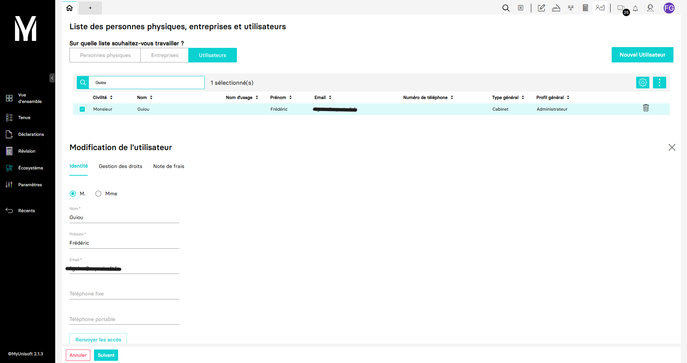

---
prev:
  text: 🐤 Introduction
  link: documentation.md
next: false
---

<span id="readme-top"></span>

# Gestion des utilisateurs d'un schéma (cabinet)

Ce guide a pour objectif de vous aider dans la gestion des utilisateurs.

Dans MyUnisoft les utilisateurs et personnes physiques peuvent être gérés par le biais du CRM: `Ecosystème` > `CRM` > `Personne physique`.



À savoir qu'à un utilisateur sont associés un profil, un profil type et des portefeuilles :

- profil type : "Cabinet" (un client direct MyUnisoft), "Client" (Le client du cabinet)
- profil : dans le cas profil type "Cabinet", définit la responsabilité de l'utilsateur au sein de celui-ci, dans le cas d'un profil type "Client" définit les rôles applicables à ses derniers.
- portefeuille : vous trouverez toutes les informations concernant les portefeuilles sur la [page](./wallets.md) suivante.

> [!IMPORTANT]
> Tout utilisateur sera aussi une personne physique.

## API

### Récupération d'un profil type

La route `https://api.myunisoft.fr/api/v1/profils/type` permet de récupérer tous les types de profils associables à l'utilisateur.

```bash
$ curl --location 'https://api.myunisoft.fr/api/v1/profils/type' \
--header 'X-Third-Party-Secret: nompartenaire-L8vlKfjJ5y7zwFj2J49xo53V' \
--header 'Authorization: Bearer {{API_TOKEN}}'
```

<details class="details custom-block"><summary>Retour JSON de l'API</summary>

```json
[
  {
    "id": 1,
    "libelle": "Client"
  },
  {
    "id": 2,
    "libelle": "Cabinet"
  }
]
```

</details>

### Récupération des profils

La route `https://api.myunisoft.fr/api/v1/profils?profil_type_id` permet de récupérer tous les profils utilisateurs en fonction du type de profil.

Elle attend donc un paramètre de requête 'profil_type_id'.

```bash
$ curl --location 'https://api.myunisoft.fr/api/v1/profils?profil_type_id=2' \
--header 'X-Third-Party-Secret: nompartenaire-L8vlKfjJ5y7zwFj2J49xo53V' \
--header 'Authorization: Bearer {{API_TOKEN}}'
```

<details class="details custom-block"><summary>Retour JSON de l'API</summary>

```json
[
  {
    "id_profil": 1,
    "id_type_profil": 2,
    "ordre_hierarchique": 1,
    "libelle": "Administrateur"
  },
  {
    "id_profil": 2,
    "id_type_profil": 2,
    "ordre_hierarchique": 2,
    "libelle": "Expert Comptable"
  },
  {
    "id_profil": 3,
    "id_type_profil": 2,
    "ordre_hierarchique": 3,
    "libelle": "Associé"
  },
  {
    "id_profil": 4,
    "id_type_profil": 2,
    "ordre_hierarchique": 4,
      "libelle": "Responsable de mission"
  },
  {
    "id_profil": 5,
    "id_type_profil": 2,
    "ordre_hierarchique": 5,
    "libelle": "Collaborateur compta"
  },
  {
    "id_profil": 6,
    "id_type_profil": 2,
    "ordre_hierarchique": 6,
    "libelle": "Collab juridique"
  },
  {
    "id_profil": 7,
    "id_type_profil": 2,
    "ordre_hierarchique": 7,
    "libelle": "Collab social"
  },
  {
    "id_profil": 8,
    "id_type_profil": 2,
    "ordre_hierarchique": 8,
    "libelle": "Collab standard"
  },
  {
    "id_profil": 9,
    "id_type_profil": 2,
    "ordre_hierarchique": 9,
    "libelle": "Collab back office"
  }
]
```

</details>

### Récupération des portefeuilles

La route `https://api.myunisoft.fr/api/v1/wallet` permet de récupérer le(s) portefeuille(s) associé(s) au cabinet.

```bash
$ curl --location 'https://api.myunisoft.fr/api/v1/wallet' \
--header 'X-Third-Party-Secret: nompartenaire-L8vlKfjJ5y7zwFj2J49xo53V' \
--header 'Authorization: Bearer {{API_TOKEN}}'
```

<details class="details custom-block"><summary>Retour JSON de l'API</summary>

```json
[
  {
    "id_wallet": 1,
    "main_wallet": true,
    "libelle": "TOUTES",
    "nb_society": 4,
    "list_society": [
      {
        "name": "TEST",
        "id_society": 149
      },
      {
        "name": "TEST_2",
        "id_society": 148
      },
      {
        "name": "TEST_3",
        "id_society": 220
      },
      {
        "name": "TEST_4",
        "id_society": 205
      }
    ]
  }
]
```

</details>

### Création d'un utilisateur

La route `https://api.myunisoft.fr/api/v1/user` permet de créer un compte utilisateur associé au schéma ayant accès à la solution.

```bash
$ curl --location 'https://api.myunisoft.fr/api/v1/user' \
--header 'X-Third-Party-Secret: nompartenaire-L8vlKfjJ5y7zwFj2J49xo53V' \
--header 'Content-Type: application/json' \
--header 'Authorization: Bearer {{API_TOKEN}}' \
--data-raw '{
  "civility_code": "Mr",
  "name": "user_name",
  "firstname": "user_firstname",
  "mail": "user@emailexemple.fr",
  "delete_list": [],
  "access_list": [
    {
      "acces_id": "227",
      "wallet_id": 1,
      "wallet_label": "TOUTES",
      "society_id": 0,
      "profil_id": 1,
      "type_id": 2
    }
  ],
  "id_profil": 1
}' 
```

<details class="details custom-block"><summary>Retour JSON de l'API</summary>

```json
{
  "civility_code": "Mr",
  "name": "user_name",
  "firstname": "user_firstname",
  "mail": "user@emailexemple.fr",
  "delete_list": [
  ],
  "access_list": [
    {
      "acces_id": 227,
      "wallet_id": 1,
      "wallet_label": "TOUTES",
      "society_id": 0,
      "profil_id": 1,
      "type_id": 2
    }
  ],
  "id_profil": 1,
  "user_id": 356
}
```

</details>

Définition TypeScript d'un utilisateur

> [!IMPORTANT]
> [Cliquer ici pour accéder à l'interface TypeScript d'un utilisateur](./users.md)

---

MyUnisoft possède deux types de profil distincts :

- [id: 1] Client
- [id: 2] Cabinet (ce sont les collaborateurs comptables du cabinet).

Pour récupérer les ids de ces deux profils, vous pouvez utiliser cet endpoint `https://api.myunisoft.fr/api/v1/profils/type`.

```bash
curl --location 'https://api.myunisoft.fr/api/v1/profils/type' \
--header 'X-Third-Party-Secret: nompartenaire-L8vlKfjJ5y7zwFj2J49xo53V' \
--header 'Authorization: Bearer {{API_TOKEN}}'
```

### Mise à jour d'un utilisateur

La route `https://api.myunisoft.fr/api/v1/user` permet de mettre à jour un compte utilisateur associé au schéma ayant accès à la solution.

```bash
$ curl --location --request PUT 'https://api.myunisoft.fr/api/v1/user' \
--header 'X-Third-Party-Secret: nompartenaire-L8vlKfjJ5y7zwFj2J49xo53V' \
--header 'Content-Type: application/json' \
--header 'Authorization: Bearer {{API_TOKEN}}' \
--data-raw '{
  "tel": null,
  "mail": {
    "coordonnee": "user@emailexemple.fr",
    "id": 0
  },
  "name": "user_name",
  "badmin": false,
  "tel_fix": "",
  "user_id": 190,
  "firstname": "user_firstname",
  "groupslst": [],
  "id_profil": 5,
  "created_at": "2022-10-28T16:15:44",
  "access_list": [
    {
      "label": null,
      "siret": null,
      "acces_id": 390,
      "profil_id": 1,
      "wallet_id": 2,
      "society_id": null,
      "profil_name": "Administrateur",
      "wallet_label": "Portefeuille GL",
      "id_type_profil": 2,
      "libelle_type_profil": "Cabinet"
    }
  ],
  "civility_id": 1,
  "maiden_name": "",
  "tel_portable": "",
  "id_type_profil": 2,
  "ndf_ocr_account": null,
  "is_collaborative_user": false,
  "civility_code": "Mr"
}'
```

<details class="details custom-block"><summary>Retour JSON de l'API</summary>

```json
{
  "user_id": 190,
  "civility_id": 1,
  "civility": "Monsieur",
  "name": "user_name",
  "firstname": "user_firstname",
  "maiden_name": null,
  "id_profil": 1,
  "ndf_ocr_account": "",
  "libelle_profil": "Administrateur",
  "id_type_profil": 2,
  "libelle_type_profil": "Cabinet",
  "badmin": true,
  "mail": {
    "id": 0,
    "coordonnee": "user@emailexemple.fr"
  },
  "tel_fix": null,
  "tel_portable": null,
  "tel": null,
  "acces_list": [
    {
      "acces_id": 390,
      "society_id": null,
      "wallet_label": "TOUTES",
      "wallet_id": 2,
      "label": null,
      "siret": null,
      "profil_id": 1,
      "profil_name": "Administrateur",
      "id_type_profil": 2,
      "libelle_type_profil": "Cabinet"
    }
  ],
  "groupslst": [
  ]
}
```

</details>

### Désactivation d'un utilisateur

La route `https://api.myunisoft.fr/api/v1/user` permet de désactiver un compte utilisateur associé au schéma ayant accès à la solution.

```bash
curl --location --request DELETE 'https://api.myunisoft.fr/api/v1/user?user_id=123' \
--header 'X-Third-Party-Secret: nompartenaire-L8vlKfjJ5y7zwFj2J49xo53V' \
--header 'Authorization: {{API_TOKEN}}'
```

> [!IMPORTANT]
> Cette route n'est accessible qu'aux accès de type `cabinet`.

La route attend le paramètre (query string) suivant :

| paramètres | decriptions |
| --- | --- |
| `user_id` | l'id de l'utilisateur que vous souhaitez désactiver.<br> Pour récupérer cette donnée, vous pouvez consulter cette [page](./users.md). |

<details class="details custom-block"><summary>Retour JSON de l'API</summary>

```json
{
  code: "Success",
  message: ""
}
```

</details>

<p align="right">(<a href="#readme-top">retour en haut de page</a>)</p>
