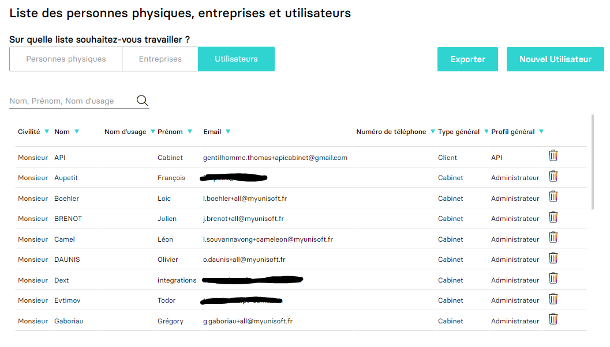
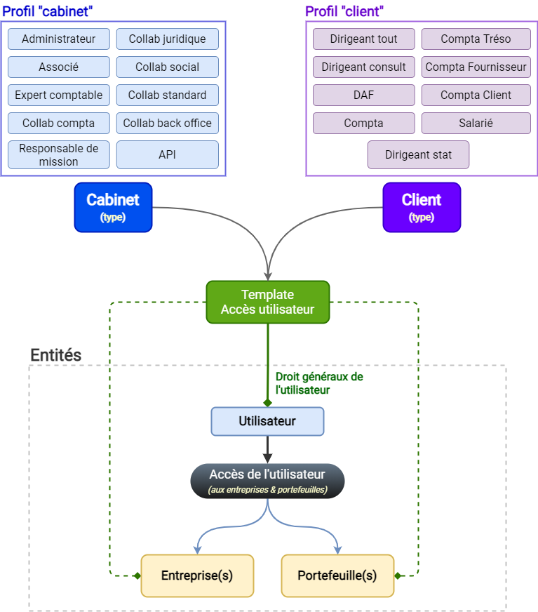

---
prev:
  text: 🐤 Introduction
  link: documentation.md
next: false
---

<span id="readme-top"></span>

# Récupérer les utilisateurs et personne physiques d'un schéma (cabinet)
Ce guide a pour objectif de vous aider dans la récupération des utilisateurs.

Dans MyUnisoft les utilisateurs et personne physiques peuvent être gérés par le biais du CRM: `Ecosystème` > `CRM` > `Utilisateurs`.



## API

### Utilisateurs

La route https://api.myunisoft.fr/api/v1/users_v2 permet de récupérer la liste des comptes utilisateurs du schéma ayant accès à la solution (les clients et collaborateurs du cabinet).

> [!IMPORTANT]
> Tout utilisateur sera aussi une personne physique.

```bash
$ curl --location --request GET 'https://api.myunisoft.fr/api/v1/users_v2' \
--header 'X-Third-Party-Secret: nompartenaire-L8vlKfjJ5y7zwFj2J49xo53V' \
--header 'Authorization: Bearer {{API_TOKEN}}'
```

<details class="details custom-block"><summary>Retour JSON de l'API</summary>

```json
{
  "bdelete": 1,
  "user_array": [
    {
      "tel": null,
      "mail": {
        "id": 11789,
        "coordonnee": "xxx@myunisoft.fr"
      },
      "name": "Greg",
      "badmin": true,
      "tel_fix": null,
      "user_id": 5349,
      "civility": "Monsieur",
      "firstname": "xxx",
      "groupslst": [],
      "id_profil": 1,
      "access_list": [],
      "civility_id": 1,
      "maiden_name": null,
      "safe_status": false,
      "tel_portable": null,
      "id_type_profil": 2,
      "libelle_profil": "Administrateur",
      "display_safe_choice": false,
      "libelle_type_profil": "Cabinet"
    },
    {
      "tel": null,
      "mail": {
        "id": 11788,
        "coordonnee": "xxx@gmail.com"
      },
      "name": "API",
      "badmin": true,
      "tel_fix": null,
      "user_id": 5348,
      "civility": "Monsieur",
      "firstname": "CABINET",
      "groupslst": [],
      "id_profil": 20,
      "access_list": [],
      "civility_id": 1,
      "maiden_name": null,
      "safe_status": false,
      "tel_portable": null,
      "id_type_profil": 1,
      "libelle_profil": "API",
      "display_safe_choice": false,
      "libelle_type_profil": "Client"
    }
  ]
}
```
</details>

<details class="details custom-block"><summary>Définition TypeScript d'un utilisateur</summary>

```ts
interface User {
  tel: string | null;
  mail: UserPersonalDetail | null;
  name: string;
  badmin: boolean;
  tel_fix: UserPersonalDetail | null;
  user_id: number;
  civility: string | null;
  firstname: string;
  groupslst: Group[];
  id_profil: number;
  access_list: AccessList[];
  civility_id: number | null;
  maiden_name: string | null;
  safe_status: boolean;
  tel_portable: UserPersonalDetail | null;
  id_type_profil: number;
  libelle_profil: string;
  display_safe_choice: boolean;
  libelle_type_profil: string;
}

interface AccessList {
  label: string | null;
  siret: string | null;
  acces_id: number;
  profil_id: number;
  wallet_id: number | null;
  society_id: number | null;
  profil_name: string;
  wallet_label: string | null;
  id_type_profil: number;
  libelle_type_profil: string;
}

interface Group {
  fonctions: string;
  id_fonction: number;
  id_l_users_groups_pers_physique: number;
}

interface UserPersonalDetail {
  id: number;
  coordonnee: string;
}
```
</details>

<p align="right">(<a href="#readme-top">retour en haut de page</a>)</p>

---

MyUnisoft possède deux types de profil distincts;
- [id: 1] Client 
- [id: 2] Cabinet (ce sont les collaborateurs comptables du cabinet).

Il existent plusieurs droits au sein de chaque types.



<p align="right">(<a href="#readme-top">retour en haut de page</a>)</p>

### Personne physiques

La route https://api.myunisoft.fr/api/v1/pers_physique permet de récupérer la liste des personne physiques.

```bash
$ curl --location --request GET 'https://api.myunisoft.fr/api/v1/pers_physique' \
--header 'X-Third-Party-Secret: nompartenaire-L8vlKfjJ5y7zwFj2J49xo53V' \
--header 'Authorization: Bearer {{API_TOKEN}}'
```

<details class="details custom-block"><summary>Retour JSON de l'API</summary>

```json
{
  "array_pers_physique": [
    {
      "name": "123",
      "actif": true,
      "civility": {
        "id": 1,
        "label": "Monsieur",
        "value": "Mr"
      },
      "firstname": "123123",
      "coordonnee": [
        {
          "id": 11725,
          "type": {
            "id": 2,
            "label": "Tel. fixe",
            "value": "Tel. fixe"
          },
          "value": "123"
        },
        {
          "id": 11724,
          "type": {
            "id": 1,
            "label": "Mail",
            "value": "Mail"
          },
          "value": "xxx@gmail.com"
        }
      ],
      "company_number": 0,
      "pers_physique_id": 5299,
      "physical_person_type": {
        "id": 2,
        "label": "Interne",
        "value": "Interne"
      }
    }
  ]
}
```
</details>

<details class="details custom-block"><summary>Définition TypeScript d'une personne physique</summary>

```ts
interface PhysicalPerson {
  name: string;
  actif: boolean;
  civility: GenericField;
  firstname: string;
  coordonnee?: PhysicalPersonDetail[];
  company_number: number;
  pers_physique_id: number;
  physical_person_type?: GenericField;
  city?: string;
  address?: string;
  comment?: string;
  company?: Company[];
  road_type?: GenericField;
  city_birth?: string;
  maiden_name?: string;
  postal_code?: string;
  country_birth?: string;
  address_number?: string;
  country_address?: string;
  department_birth?: string;
  address_complement?: string;
  address_repetition?: string;
  social_security_number?: string;
  marital_situation?: GenericField;
  organism?: string;
  date_birth?: string;
  matrimonial_regime?: GenericField;
}

interface GenericField {
  id?: number;
  label?: string;
  value?: string;
}

interface PhysicalPersonDetail {
  id: number;
  type: GenericField;
  value: string;
  label?: string;
}

interface Company {
  society_id: number;
  society_name: string;
}
```
</details>

<p align="right">(<a href="#readme-top">retour en haut de page</a>)</p>
