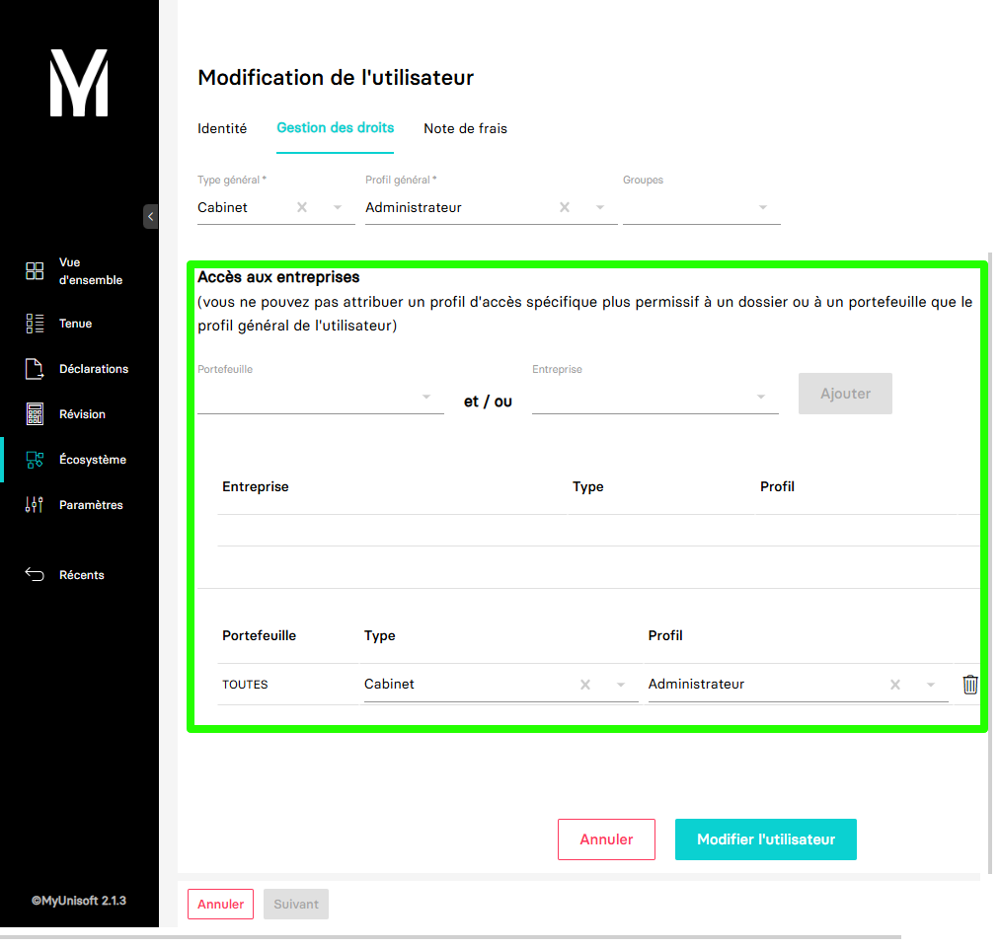

---
prev:
  text: 🐤 Introduction
  link: documentation.md
next: false
---

<span id="readme-top"></span>

# Portefeuilles

Ce guide va vous accompagner pour la récupération des portefeuilles.

Dans MyUnisoft, des portefeuilles sont associés aux utilisateurs et entreprises.
Ils correspondent à un groupe de dossiers comptables prédéfinis en amont par un membre du cabinet dans l'application MyUnisoft ou à une sélection de dossiers comptables auquel l'utilisateur à accès.



## API

### Récupération des portefeuilles

La route <https://api.myunisoft.fr/api/v1/wallet> permet de récupérer la liste des portefeuilles du schéma.

```bash
$ curl --location 'https://api.myunisoft.fr/api/v1/wallet' \
--header 'X-Third-Party-Secret: nompartenaire-L8vlKfjJ5y7zwFj2J49xo53V' \
--header 'Authorization: Bearer {{API_TOKEN}}'
```

<details class="details custom-block"><summary>Retour JSON de l'API</summary>

```json
[
  {
    "id_wallet": 1,
    "main_wallet": true,
    "libelle": "TOUTES",
    "nb_society": 4,
    "list_society": [
      {
        "name": "TEST",
        "id_society": 149
      },
      {
        "name": "TEST_2",
        "id_society": 148
      },
      {
        "name": "TEST_3",
        "id_society": 220
      },
      {
        "name": "TEST_4",
        "id_society": 205
      }
    ]
  }
]
```

</details>

<p align="right">(<a href="#readme-top">retour en haut de page</a>)</p>
