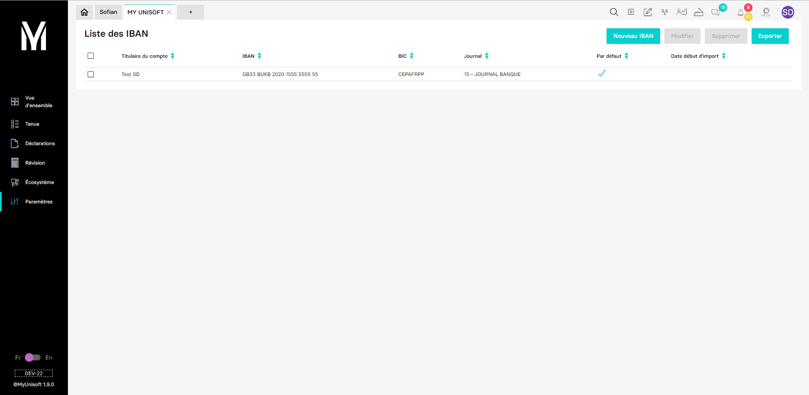

---
prev:
  text: 🐤 Introduction
  link: documentation.md
next: false
---

# Récupération des RIB/IBAN d'une société

Ce guide a pour but de vous aider dans la récupération des RIB/IBAN d'une société.

Dans MyUnisoft, la configuration des RIB/IBAN s'effectue à partir de: `Paramètres` > `Banques`.



> [!NOTE]
> Si vous disposez d'un accès cabinet, vous devez renseigner l'ID de la société ciblée dans le header.

## API

```bash
curl --location --request GET 'https://api.myunisoft.fr/api/v1/rib' \
--header 'X-Third-Party-Secret: X-Third-Party-Secret' \
--header 'society-id: 19' \
--header 'Authorization: Bearer Authorization'
```

<details class="details custom-block">
  <summary>Retour JSON de l'API</summary>

```json
[
  {
    "rib_id": 1,
    "diary_id": 10,
    "diary_label": "Banques",
    "society_id": 19,
    "start_date": "",
    "owner": "Test SD",
    "iban": "FR7612548029989876543210917",
    "bic": "CEPAFRPP751",
    "is_default": true
  }
]
```

</details>
