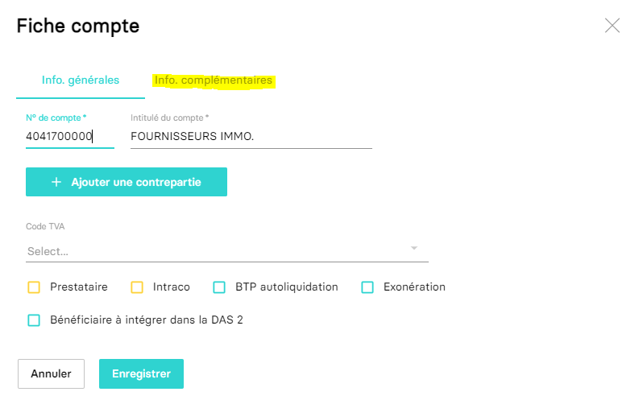
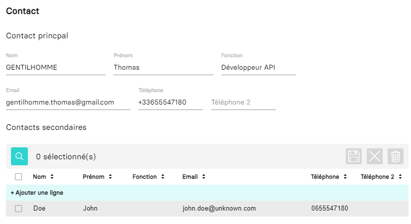
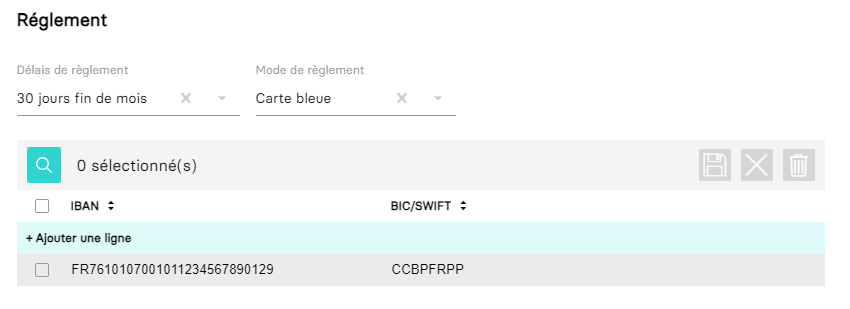

<span id="readme-top"></span>

# Comprendre les informations complémentaires d'un compte client ou fournisseur

> [!IMPORTANT]
> Nous vous invitons préalablement à lire le guide [Récupérer et travailler avec le plan comptable.](./plan_comptable.md)

Ce guide a pour objectif de vous aider dans la récupération et la compréhension des informations complémentaires attachées aux comptes du plan comptable (principalement les comptes clients et fournisseurs).

Dans MyUnisoft le plan comptable est accessible à partir du menu: `Paramètres` > `Tenue` > `Plan comptable`.


Sélectionner par exemple un compte fournisseur et éditez-le (un pop-up devrait apparaitre).



Vous n'avez plus qu'à accéder au second onglet "Info. complémentaires".


<p align="right">(<a href="#readme-top">retour en haut de page</a>)</p>

## API

Ces informations pourront être récupérées au sein de la clé **complementary_informations** retournée par la route `https://api.myunisoft.fr/api/v1/account/v2?details=true&account_id={{id}}`.


```json
{
  "das_2": false,
  "label": "FOURNISSEURS IMMO.",
  "closed": false,
  "id_tva": null,
  "presta": false,
  "comment": null,
  "intraco": false,
  "analytics": false,
  "account_id": 990,
  "society_id": 3,
  "exoneration": false,
  "param_vat_id": null,
  "ocr_threshold": 0,
  "account_number": "4041700000",
  "ocr_autovalidation": false,
  "btp_autoliquidation": false,
  "correspondance_label": null,
  "id_compte_contrepart": null,
  "correspondance_no_compte": null,
  "complementary_informations": {
      "ape": {
          "id": 534,
          "info": "Édition de logiciels applicatifs",
          "label": "5829C-Édition de logiciels applicatifs",
          "value": "5829C"
      },
      "tel": "+33655547180",
      "city": "SAINTE GENEVIEVE DES BOIS",
      "name": "MY UNISOFT",
      "tel2": null,
      "email": "gentilhomme.thomas@gmail.com",
      "siren": "840143275",
      "address": "GAI SEJOUR",
      "comment": null,
      "function": "Développeur API",
      "lastname": null,
      "typevoie": {
          "lib": "Rue",
          "id_type_voie": 9
      },
      "firstname": null,
      "iban_list": [
          {
              "bic": "",
              "rum": "",
              "iban": "",
              "document": null,
              "first_prlv": false,
              "etablissement": "",
              "rum_date_signature": null,
              "id_iban_compte_tiers": 11
          }
      ],
      "id_country": null,
      "is_foreign": false,
      "misc_group": null,
      "profession": null,
      "postal_code": "91700",
      "contact_list": [
        {
            "tel1": "",
            "tel2": "",
            "email": "user@myunisoft.fr",
            "ordre": 1,
            "lastname": "random",
            "firstname": "name",
            "id_contact_compte_tiers": 1
        }
      ],
      "payment_type": {
          "code": "CB",
          "label": "Carte bleue",
          "payment_type_id": 13
      },
      "misc_archived": false,
      "misc_referent": null,
      "address_number": "3",
      "payment_type_id": 13,
      "amount_type_paid": null,
      "contact_lastname": "GENTILHOMME",
      "misc_doubtful_id": null,
      "misc_language_id": 1,
      "payment_deadline": {
          "label": "30 jours fin de mois",
          "end_month": true,
          "day_number": null,
          "number_of_days": 30,
          "id_payment_deadline": 3
      },
      "person_in_charge": "Cyril MANDRILLY",
      "contact_firstname": "Thomas",
      "indice_repetition": null,
      "address_complement": null,
      "id_payment_deadline": 3,
      "id_info_compte_tiers": 10,
      "type_info_compte_tiers": null
  }
}
```

> 

<details><summary>interface TypeScript pour la clé complementary_informations</summary>

```ts
export interface ComplementaryInformations {
  ape?: Ape;
  tel?: string;
  city?: string;
  name?: string;
  tel2: null | string;
  email?: string;
  siren: string;
  address?: string;
  comment: null | string;
  function?: string;
  lastname: null | string;
  typevoie?: Typevoie;
  firstname: null | string;
  iban_list: IbanList[];
  id_country?: number;
  is_foreign: boolean;
  misc_group: any;
  profession?: string;
  postal_code?: string;
  contact_list: ContactList[];
  payment_type: PaymentType;
  misc_archived: boolean;
  misc_referent: any;
  address_number?: string;
  payment_type_id?: number;
  amount_type_paid: any;
  contact_lastname?: string;
  misc_doubtful_id: any;
  misc_language_id: number;
  payment_deadline: PaymentDeadline;
  person_in_charge?: string;
  contact_firstname?: string;
  indice_repetition?: string;
  address_complement?: string;
  id_payment_deadline?: number;
  id_info_compte_tiers: number;
  type_info_compte_tiers: any;
}

export interface ContactList {
  tel1: string;
  tel2: string;
  email: string;
  ordre: number;
  lastname: string;
  firstname: string;
  id_contact_compte_tiers: number;
  function?: string;
}

export interface Ape {
  id: number;
  info: string;
  label: string;
  value: string;
}

export interface Typevoie {
  lib: string;
  id_type_voie: number;
}

export interface IbanList {
  bic: string;
  rum: string;
  iban: string;
  first_prlv: boolean;
  etablissement: string;
  rum_date_signature: null | string;
  id_iban_compte_tiers: number;
  document: any;
}

export interface PaymentType {
  code?: string;
  label?: string;
  payment_type_id?: number;
}

export interface PaymentDeadline {
  label?: string;
  end_month?: boolean;
  day_number: null | number;
  number_of_days?: number;
  id_payment_deadline?: number;
}
```

</details>

### Contacts



Le contact principal est représenté par les champs suivants:

```json
{
  "tel": "+33655547180",
  "tel2": null,
  "email": "gentilhomme.thomas@gmail.com",
  "function": "Développeur API",
  "contact_firstname": "Thomas",
  "contact_lastname": "GENTILHOMME"
}
```

Les contacts secondaires sont injectés dans le tableau `contact_list`

```json
{
  "contact_list": [
    {
      "tel1": "0655547180",
      "tel2": "",
      "email": "john.doe@unknown.com",
      "ordre": 1,
      "function": "CEO",
      "lastname": "Doe",
      "firstname": "John",
      "id_contact_compte_tiers": 3
    }
  ],
}
```

> [!NOTE]
> Le tableau est trié avec la clé `ordre`!

Pour la mise à jour des contacts, merci de suivre le [guide suivant](./update_contact.md).

### Réglements



Le délai de paiement peut être retrouvé avec la clé `payment_deadline`

```json
{
  "payment_deadline": {
    "label": "30 jours fin de mois",
    "end_month": true,
    "day_number": null,
    "number_of_days": 30,
    "id_payment_deadline": 3
  },
}
```

Les méthodes de réglements avec IBAN avec le tableau `iban_list`

```json
{
  "iban_list": [
    {
      "bic": "CCBPFRPP",
      "rum": "",
      "iban": "FR7610107001011234567890129",
      "document": null,
      "first_prlv": false,
      "etablissement": "",
      "rum_date_signature": null,
      "id_iban_compte_tiers": 17
    }
  ],
}
```

<p align="right">(<a href="#readme-top">retour en haut de page</a>)</p>

---

⬅️ [README](../../../../README.md)
