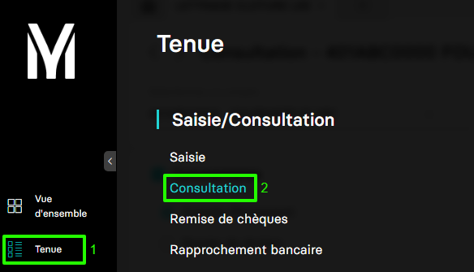
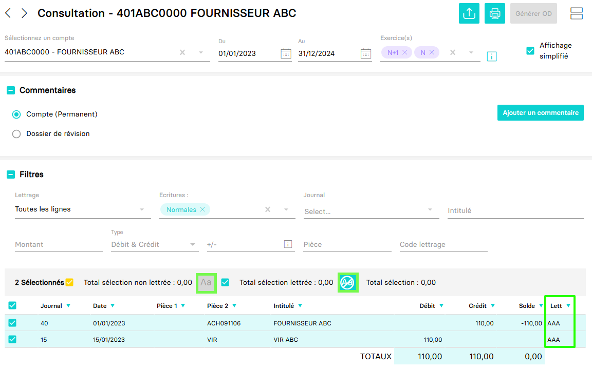

---
prev:
  text: 🐤 Introduction
  link: documentation.md
next: false
---

# Lettrer les mouvements d'un compte

Ce guide va acompagner dans l'opération de lettrage des mouvements d'un compte.

Dans MyUnisoft, vous pouvez lettrer les mouvements d'un compte afin de déterminer l'origine de son solde depuis : `Tenue` > `Saisie/Consultation` >`Consultation`.



Vous obtenez la page de consultation du compte avec les boutons d'actions permettant de lettrer ou délettrer des écritures.



## API

La route https://api.myunisoft.fr/api/v1/lentry/lettering permet de lettrer des mouvements avec l'API partenaires.

```bash
curl --location --request PUT 'https://api.myunisoft.fr/api/v1/entry/lettering' \
--header 'X-Third-Party-Secret: nompartenaire-L8vlKfjJ5y7zwFj2J49xo53V' \
--header 'Society-id: 1' \
--header 'Content-Type: application/json' \
--header 'Authorization: Bearer {{API_TOKEN}}' \
--data '{
    "lettering": "AAA",
    "line_entry_list": [
        {
            "line_entry_id": 123456789
        },
        {
            "line_entry_id": 987654321
        }
    ]
}'
```

> [!IMPORTANT]
> Penser à préciser l'en-tête **society-id** si vous utilisez un 🔹 Accès cabinet.

Il sera de renseigner dans le body les paramètres de requête suivants :

| paramètre | decription |
| --- | --- |
| `lettering` | le code lettrage à appliquer aux lignes que vous souhaiter lettrer.<br> Pour déterminer la valeur vous pouvez consulter [Récupérer la prochaine valeur de lettrage](./next_lettering_value.md) |
| `line_entry_list` | Un tableau composé des `entry_line_id` des écritures que vous souhaitez lettrer<br> Pour récupérer les id des écritures vous pouvez consulter []() |
