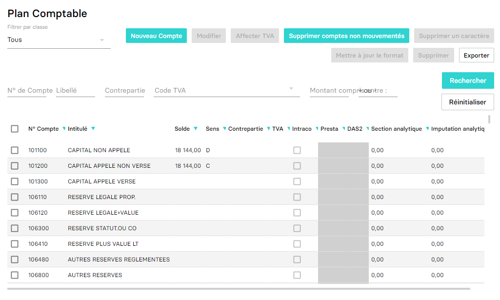

---
prev:
  text: 🐤 Introduction
  link: documentation.md
next: false
---

<span id="readme-top"></span>

# Récupérer et travailler avec le plan comptable

Ce guide a pour objectif de vous aider dans la gestion du plan comptable.

Dans MyUnisoft le plan comptable peut être édité: `Paramètres` > `Dossier` > `Plan comptable`.



## API

La route <https://api.myunisoft.fr/api/v1/account?mode=2> permet de récupérer la même liste mais par le biais de l'API partenaires.

```bash
$ curl --location --request GET 'https://api.myunisoft.fr/api/v1/account?mode=2' \
--header 'X-Third-Party-Secret: nompartenaire-L8vlKfjJ5y7zwFj2J49xo53V' \
--header 'Authorization: Bearer {{API_TOKEN}}'
```

> [!IMPORTANT]
> Penser à préciser l'en-tête **society-id** si vous utilisez un 🔹 Accès cabinet.

Noter la présence du paramètre `mode` égal à **2**. Ce mode permet de récupérer toutes les informations en lien avec les comptes alors que le mode 1 ne retournera que l'id, numéro et label de chaque compte.

Si tout va bien vous devriez recevoir un JSON avec **une structure similaire à l'exemple ci-dessous**

```json
{
  "rows_number": 394,
  "pages_number": 1,
  "account_array": [
    {
      "row_number": 1,
      "account_id": 1157868,
      "account_number": "101100",
      "label": "CAPITAL NON APPELE",
      "solde": 0,
      "sens": "",
      "comment": "",
      "intraco": false,
      "btp_autoliquidation": false,
      "presta": false,
      "das_2": false,
      "blocked": false,
      "vat_param": null,
      "counterpart_account": null,
      "complementary_informations": null
    },
    {
      "row_number": 2,
      "account_id": 1157869,
      "account_number": "101200",
      "label": "CAPITAL APPELE NON VERSE",
      "solde": 0,
      "sens": "",
      "comment": "",
      "intraco": false,
      "btp_autoliquidation": false,
      "presta": false,
      "das_2": false,
      "blocked": false,
      "vat_param": null,
      "counterpart_account": null,
      "complementary_informations": null
    }
  ]
}
```

<details class="details custom-block"><summary>Définition TypeScript AccountDetails</summary>

```ts
interface AccountDetails {
  solde: number;
  sens: string;
  comment: string;
  intraco: boolean;
  btp_autoliquidation: boolean;
  presta: boolean;
  exoneration: boolean;
  das_2: boolean;
  blocked: boolean;
  vat_param: VatParam; // voir le guide sur la TVA
  array_counterpart_account: CounterpartAccountLine[];
  complementary_informations: ComplementaryInformations;
  society_id: number;
  closed: boolean;
}

interface ComplementaryInformations {
  id_info_compte_tiers: number;
  person_in_charge: string;
  address_number: string;
  indice_repetition: string;
  address: string;
  address_complement: string;
  postal_code: string;
  city: string;
  siren: string;
  name: string;
  contact_lastname: string;
  contact_firstname: string;
  function: string;
  tel: string;
  email: string;
  comment: string;
  profession: string;
  firstname: string;
  lastname: string;
  type_info_compte_tiers: number;
  iban_list: Iban[];
  way_type: WayType;
  amount_type_paid: AmountTypePaid;
  ape: Ape;
  id_payment_deadline: number;
  payment_deadline: PaymentDeadline;
  payment_type_id: number;
  payment_type: PaymentType;
}

interface CounterpartAccountLine extends Account {
  num_ordre: string;
  vat_param: VatParam | null;
}

interface Iban {
  id_iban_compte_tiers: number;
  iban: string;
  bic: string;
  etablissement: string;
  rum_date_signature?: string;
}

interface PaymentType {
  payment_type_id: number;
  label: string;
  code: string;
}

interface PaymentDeadline {
  id_payment_deadline: number;
  label: string;
  number_of_days: number;
  end_month: boolean;
  day_number: number | null;
}

interface Ape {
  id: number;
  value: string;
  label: string;
  info: string;
}

interface WayType {
  way_type_id: number;
  label: string;
}

interface AmountTypePaid {
  id_amount_type_paid: number;
  label: string;
}
```

</details>

---

Si vous avez choisi le mode 1 le retour sera plutôt similaire à celui-ci:

```json
[
  {
    "account_id": 11660,
    "account_number": "101000",
    "label": "CAPITAL"
  },
  {
    "account_id": 11661,
    "account_number": "106100",
    "label": "RESERVE LEGALE"
  }
]
```

<p align="right">(<a href="#readme-top">retour en haut de page</a>)</p>

### Récupération des entrées comptables en lien avec un compte

Il est possible de récupérer les entrées en lien avec un compte (par id ou numéro).

```bash
$ curl --location --request GET 'https://api.myunisoft.fr/api/v1/account/entries?limit=100&account_no=401NAME' \
--header 'X-Third-Party-Secret: nompartenaire-L8vlKfjJ5y7zwFj2J49xo53V' \
--header 'Authorization: Bearer {{API_TOKEN}}'
```

Le paramètre `account_id` si l'id du compte est connu ou bien `account_no` si vous voulez faire une recherche par le numéro. L'ensemble des paramètres possibles sont disponibles sur le [postman en ligne](https://docs.api.myunisoft.fr/#intro).

Si tout va bien vous devriez recevoir un JSON avec **une structure similaire à l'exemple ci-dessous**

```json
{
  "rows_number": 255,
  "pages_number": 3,
  "total_debit": 3777.89,
  "total_credit": 3737.48,
  "list_entries_line": [
    {
      "diary_id": 6007,
      "diary_code": "AD",
      "is_an": true,
      "entry_id": 1034259,
      "entry_line_id": 4030899,
      "account_id": 1,
      "date": "2001-04-30",
      "piece": null,
      "piece2": null,
      "label": "Reprise",
      "debit": null,
      "credit": 1497.8,
      "solde": -1497.8,
      "lettrage": "AAA",
      "comment": false,
      "pj_list": [],
      "payment_type": null,
      "deadline": null,
      "added_date": "2001-04-30",
      "period_from": null,
      "period_to": null,
      "closed": false,
      "dotted": false,
      "flags": null
    }
  ]
}
```

<details class="details custom-block"><summary>Définition TypeScript AccountEntryLine</summary>

```ts
interface AccountEntryLine {
  diary_id: number;
  diary_code: string;
  entry_id: number;
  entry_line_id: number;
  date: string;
  piece: null | string;
  piece2: string;
  label: string;
  debit: null | number;
  credit: null | number;
  solde: number;
  lettrage: string;
  comment: boolean;
  pj_list: CloudDocument[];
  payment_type: null | {
    id_type_reglement: number;
    nom: string;
  };
  deadline: null | string;
  added_date: string;
  closed: boolean;
  flags: any | null;
  dotted: boolean;
  is_an: boolean;
  creator: {
    id: number;
    firstname: string;
    name: string;
  }
}

interface CloudDocument {
  document_id: number;
  name: string;

  /** Token de partage du document. */
  token: string;

  /** Adresse du serveur. */
  baseUrl: string;

  /** Miniature. */
  thumbnail: string;

  /** URL du document */
  link: string;

  /** URL de téléchargement du document */
  download: string;
}

```

</details>

### Récupération et/ou création d'un compte

[Lire le guide suivant](./create.md)

<p align="right">(<a href="#readme-top">retour en haut de page</a>)</p>
