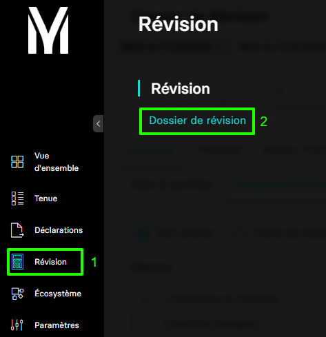
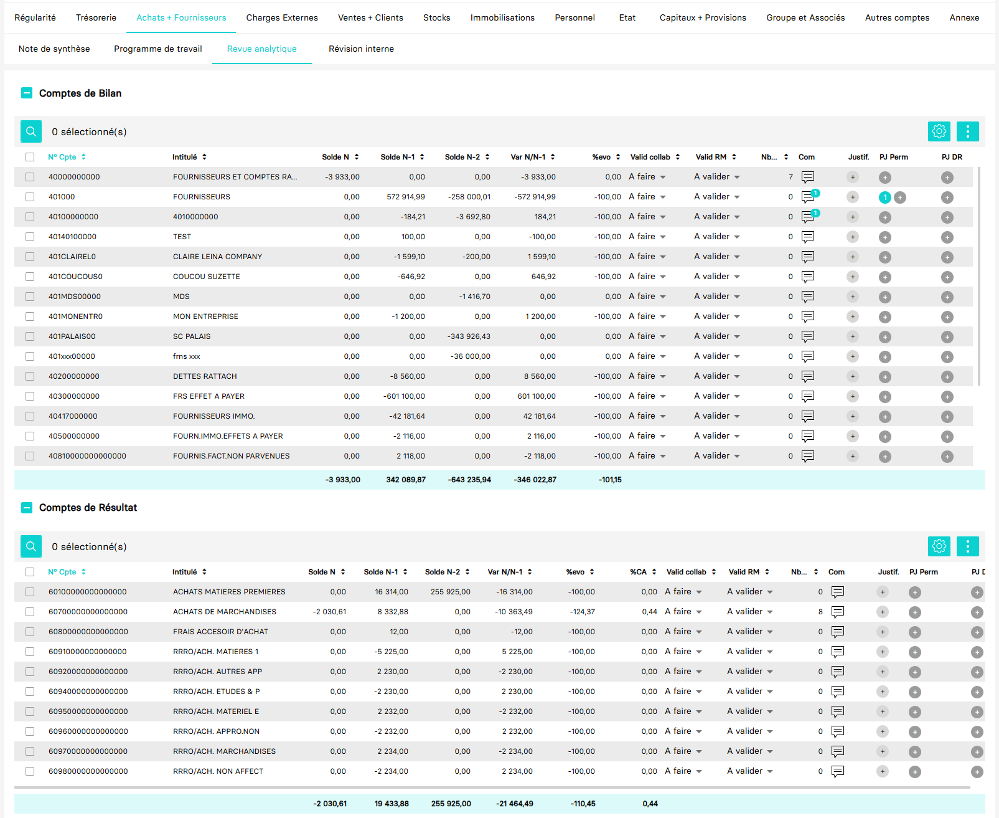

---
prev:
  text: 🐤 Introduction
  link: documentation.md
next: false
---

<span id="readme-top"></span>

# Récupérer la revue analytique d'un dossier de révision

Ce guide va vous accompagner dans l'opération de récupération de la revue analytique d'un dossier de révision.

Dans MyUnisoft le dossier de révision est utilisable depuis : `Révision` > `Dossier de révision`.



Vous obtenez ainsi l'ensemble des cycles de révision comptable du dossier.



## API

La route <https://api.myunisoft.fr/api/v1/dadp/analytic_review> permet de récupérer chaque revue par cycle avec l'API partenaires.

```bash
curl --location 'https://api.myunisoft.fr/api/v1/dadp/analytic_review?review_id=138404&cycle_id=3' \
--header 'X-Third-Party-Secret: nodejs-G0D2VEsH4uQf1erFpfVRYsgc' \
--header 'society-id: 1' \
--header 'Authorization: Bearer {{API_TOKEN}}'
```

> [!IMPORTANT]
> Penser à l'en-tête **society-id** pour préciser le dossier que vous souhaitez interroger (Obligatoire pour l'accès cabinet).

L'endpoint attend les paramètres (Querry strings) suivants pour pouvoir être exécuté :

| paramètre | decription |
| --- | --- |
| `review_id` | l'id du dossier de révision pour lequel vous souhaitez récupérer la revue analytique. Celui-ci est récupérable avec l'aide de ce [guide](./dossiers_de_révision.md). |
| `cycle_id` | l'id du cycle de révision que vous souhaitez récupérer. (valeurs dans le tableau ci-dessous) |

Voici les valeurs statiques des IDs des cycles de révision :

| id | label du cycle |
| --- | --- |
| `1` | Régularité |
| `2` | Trésorerie |
| `3` | Achats + Fournisseurs |
| `4` | Charges externes |
| `5` | Ventes + Clients |
| `6` | Stocks |
| `7` | Immobilisations |
| `8` | Personnel |
| `9` | Etat |
| `10` | Capitaux + Provisions |
| `11` | Groupes et associés |
| `12` | Autres comptes |
| `13` | Annexe |

En cas de succès la route retournera une réponse dont vous trouverez un exemple ci-dessous :

<details class="details custom-block"><summary>Retour JSON de l'API</summary>

```json
{
  "balance_sheet": {
    "solde_n_total": 0,
    "solde_n_1_total": 0,
    "solde_n_2_total": 0,
    "variation_n_n_1_total": 0,
    "evo_total": 0,
    "va_total": 0,
    "data": [
        {
          "account_id": 25587189,
          "account_number": "40000000000",
          "label": "FOURNISSEURS ET COMPTES RATTACHES",
          "solde_n": -3933.00,
          "solde_n_1": 0.00,
          "solde_n_2": 0.00,
          "variation_n_n_1": -3933.00,
          "evo": "NA",
          "va": "0.85",
          "id_l_dossier_revision_compte": null,
          "nb_line_entries": 7,
          "nb_docs": 2,
          "nb_acc_docs": 0,
          "nb_da_acc_docs": 0,
          "valid_collab": {
            "status": "to_do",
            "trigram": "",
            "name": "",
            "validation_date": ""
          },
          "valid_rm": {
            "status": "to_validate",
            "trigram": "",
            "name": "",
            "validation_date": ""
          },
          "nb_comments": 0,
          "nb_comments_permanent": 0,
          "hasJustification": false
        },
        {
          "account_id": 11788097,
          "account_number": "401000",
          "label": "FOURNISSEURS",
          "solde_n": 0.00,
          "solde_n_1": 572914.99,
          "solde_n_2": -258000.01,
          "variation_n_n_1": -572914.99,
          "evo": "-100.00",
          "va": "0.00",
          "id_l_dossier_revision_compte": 61816,
          "nb_line_entries": 0,
          "nb_docs": null,
          "nb_acc_docs": 1,
          "nb_da_acc_docs": 0,
          "valid_collab": {
            "status": "to_do",
            "trigram": "B.GA",
            "name": "GARIAZZO Benoit",
            "validation_date": "2025-05-06T12:40:52.407764"
          },
          "valid_rm": {
            "status": "to_validate",
            "trigram": "B.GA",
            "name": "GARIAZZO Benoit",
            "validation_date": "2025-05-06T12:40:52.407764"
          },
          "nb_comments": 0,
          "nb_comments_permanent": 1,
          "hasJustification": false
        }
      // (...)
    ]
  },
  "accounts_results": {
    "solde_n_total": 0,
    "solde_n_1_total": 0,
    "solde_n_2_total": 0,
    "variation_n_n_1_total": 0,
    "evo_total": 0,
    "va_total": 0,
    "data": [
      {
        "account_id": 11788191,
        "account_number": "60100000000000000",
        "label": "ACHATS MATIERES PREMIERES",
        "solde_n": 0.00,
        "solde_n_1": 16314.00,
        "solde_n_2": 255925.00,
        "variation_n_n_1": -16314.00,
        "evo": "-100.00",
        "va": "0.00",
        "id_l_dossier_revision_compte": null,
        "nb_line_entries": 0,
        "nb_docs": null,
        "nb_acc_docs": 0,
        "nb_da_acc_docs": 0,
        "valid_collab": {
          "status": "to_do",
          "trigram": "",
          "name": "",
          "validation_date": ""
        },
        "valid_rm": {
          "status": "to_validate",
          "trigram": "",
          "name": "",
          "validation_date": ""
        },
        "nb_comments": 0,
        "nb_comments_permanent": 0,
        "hasJustification": false
      },
      {
          "account_id": 11788205,
          "account_number": "60700000000000000",
          "label": "ACHATS DE MARCHANDISES",
          "solde_n": -2030.61,
          "solde_n_1": 8332.88,
          "solde_n_2": 0.00,
          "variation_n_n_1": -10363.49,
          "evo": "-124.37",
          "va": "0.44",
          "id_l_dossier_revision_compte": null,
          "nb_line_entries": 8,
          "nb_docs": 0,
          "nb_acc_docs": 0,
          "nb_da_acc_docs": 0,
          "valid_collab": {
            "status": "to_do",
            "trigram": "",
            "name": "",
            "validation_date": ""
          },
          "valid_rm": {
            "status": "to_validate",
            "trigram": "",
            "name": "",
            "validation_date": ""
          },
          "nb_comments": 0,
          "nb_comments_permanent": 0,
          "hasJustification": false
      },
      // (...)
    ]
  }
}
```

</details>

Voici les spécifications des propriétés de la réponse retournée :

<details class="details custom-block"><summary>Interface TypeScript de la revue analytique</summary>

```ts
export interface RevueAnalytique {
  balance_sheet: {
    solde_n_total: number,
    solde_n_1_total: number,
    solde_n_2_total: number,
    variation_n_n_1_total: number,
    evo_total: number,
    va_total: number,
    data: [
      {
        account_id: number,
        account_number: string,
        label: string,
        solde_n: number,
        solde_n_1: number,
        solde_n_2: number,
        variation_n_n_1: number,
        evo: string,
        va: string,
        id_l_dossier_revision_compte: number,
        nb_line_entries: number,
        nb_docs: number,
        nb_acc_docs: number,
        nb_da_acc_docs: number,
        valid_collab: {
          status: string,
          trigram: string,
          name: string,
          validation_date: string
        },
        valid_rm: {
          status: string,
          trigram: string,
          name: string,
          validation_date: string
        },
        nb_comments: number,
        nb_comments_permanent: number,
        hasJustification: boolean
      }
    ]
  },
  accounts_results: {
    solde_n_total: number,
    solde_n_1_total: number,
    solde_n_2_total: number,
    variation_n_n_1_total: number,
    evo_total: number,
    va_total: number,
    data: [
      {
        account_id: number,
        account_number: string,
        label: string,
        solde_n: number,
        solde_n_1: number,
        solde_n_2: number,
        variation_n_n_1: number,
        evo: string,
        va: string,
        id_l_dossier_revision_compte: number,
        nb_line_entries: number,
        nb_docs: number,
        nb_acc_docs: number,
        nb_da_acc_docs: number,
        valid_collab: {
          status: string,
          trigram: string,
          name: string,
          validation_date: string
        },
        valid_rm: {
          status: string,
          trigram: string,
          name: string,
          validation_date: string
        },
        nb_comments: number,
        nb_comments_permanent: number,
        hasJustification: boolean
      }
    ]
  }
}
```

</details>

<p align="right">(<a href="#readme-top">retour en haut de page</a>)</p>
