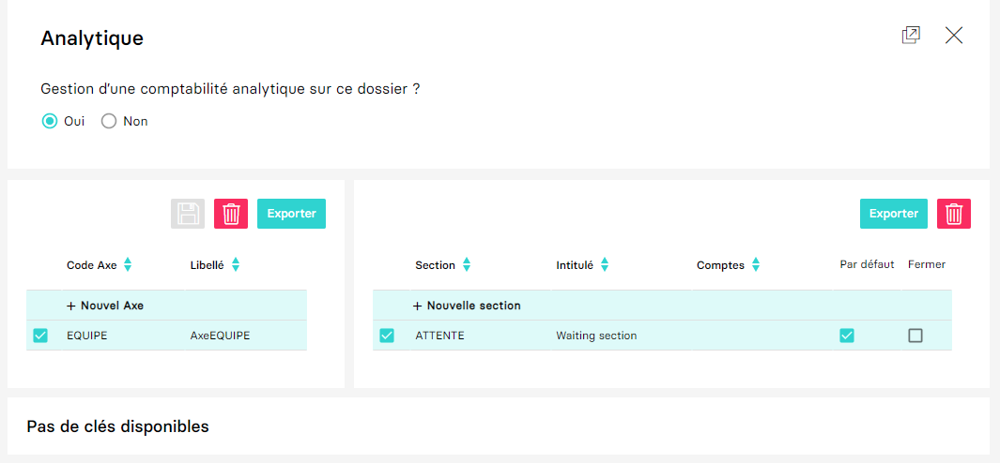
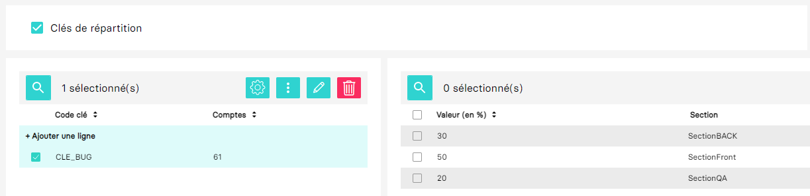

---
prev:
  text: 🐤 Introduction
  link: documentation.md
next: false
---

<span id="readme-top"></span>

# Gérer l'analytique d'une société (dossier)

Ce guide a pour objectif de vous aider à gérer l'analytique d'un dossier MyUnisoft par API.

Dans MyUnisoft la configuration de l'analytique s'effectue à partir de: `Paramètres` > `Tenue` > `Analytique`.

> [!WARNING]
> Par défaut l'analytique n'est pas activée.



L'intégralité des routes présentées dans ce guide est disponible sur le postman en ligne (dossier **Analytic**). Les interfaces TypeScript peuvent être consultées en ligne [ici](https://myunisoft.github.io/tsd/modules/Windev.Analytique.html).

## Ubiquitous language

| Terme | Description |
| --- | --- |
| Axe | Un axe est une **analyse spécifique** de la comptabilité. L’axe est proposé en général sur les comptes 6 et 7 (voire 2).<br>Ils permettent de catégoriser les écritures afin de pouvoir les suivre et les analyser. Ils peuvent par exemple indiquer de quel projet, département, établissement provient une écriture. <br> Chaque axe possède au minimum une section “**ATTENTE**” qui sera la valeur sélectionnée/assignée par défaut. |
| Section | Les **sections** correspondent à un sous-élément de l’axe. C’est sur les sections que les répartitions sont faites.<br> Chaque section est affiliée à un compte (ou plus précisément à une classe de comptes). |
| Clé de répartition | Permets de spécifier les règles de répartition (**ventilation**) pour les sections d’un **Axe**. Ces règles seront utilisées par le back-end pour automatiquement ventiler les écritures. |
| Ventilation | La ventilation comptable est une technique utilisée en comptabilité, permettant de répartir les entrées ou les sorties de fonds sur un nombre de sections donné. <br> La ventilation comptable permet la `répartition` de **charges** et de **produits**.<br>[Qu’est-ce que la ventilation comptable ?](https://debitoor.fr/termes-comptables/ventilation-comptable) |
| Charges & Produits | Corresponds aux comptes de classe **6** et **7** du plan comptable général. |

Lien bonus: [Comptabilité analytique : définition, rôle et exemple de calculs de coûts](https://www.compta-facile.com/comptabilite-analytique-definition-utilite-calcul-de-couts/)

## Activer l'analytique sur une société (dossier)

La route `https://api.myunisoft.fr/api/v1/society/:id_society` permet de modifier les paramètres d'une société (dossier).

```bash
$ curl --location --request PUT 'https://api.myunisoft.fr/api/v1/society/3' \
--header 'X-Third-Party-Secret: nompartenaire-L8vlKfjJ5y7zwFj2J49xo53V' \
--header 'Authorization: Bearer {{API_TOKEN}}'
--data-raw '{
	"analytics": true
}'
```
<details class="details custom-block">
  <summary markdown="span">Retour JSON de l'API</summary>

  ```json
  { 
    "ape":{
      "id": 534,
      "label": "5829C",
      "value": "Édition de logiciels applicatifs"
    }, 
    "register": {  },
    "legal_form": {  }, 
    "road_type": {
      "id": 9,
      "label": "Rue",
      "value": "Rue"
    }, 
    "owner_company":{ 
      "id": 1, 
      "label": "CABINET TEST", 
      "value": "CABINET TEST" 
    }, 
    "bilan": null, 
    "impot": null, 
    "vat_regime": null, 
    "axe": null, 
    "coordonnee": null, 
    "footer": null, 
    "comment": "", 
    "society_id": 3, 
    "name": "MY UNISOFT", 
    "siret": "84014327500039", 
    "activity": "", 
    "rof_tva": "", 
    "rof_tdfc": "", 
    "rof_cfe": "", 
    "rof_cvae": "", 
    "address_number": "4", 
    "id_accountant": 1, 
    "id_rm": 9, 
    "id_collab": null, 
    "accountant": {
      "id_ex": 1,
      "prenom": "THOMAS",
      "nom": "GENTILHOMME"
    },
    "rm": {
      "id_ex": 9,
      "prenom": "Tony",
      "nom": "Gorez"
    }, 
    "collab": null, 
    "secured": false, 
    "analytics": true, 
    "enable_quantity": false, 
    "folder_reference": "", 
    "adherent_code": "", 
    "formule_code": "STAN", 
    "safe_status": true, 
    "logo": null, 
    "address_bis": null, 
    "street_name": "GALVANI", 
    "complement": "", 
    "postal_code": "91300", 
    "country": "FRANCE", 
    "address": "4 Rue GALVANI 91300 MASSY FRANCE", 
    "id_centre_gestion": 0, 
    "code_sheet_group": "", 
    "registration_date": "2022-02-02", 
    "close_entries_VAT": false, 
    "id_type_company": 1, 
    "id_parent_society": 0, 
    "secondary_establishments": null
  }
  ```
</details>
<br>

<p align="right">(<a href="#readme-top">retour en haut de page</a>)</p>

## Axes

La route `https://api.myunisoft.fr/api/v1/analytics/axes` permet de récupérer l'intégralité des axes pour un dossier.

> [!NOTE]
> Il est possible de récupérer un axe précis par l'id, exemple avec l'id 41: https://api.myunisoft.fr/api/v1/analytics/axes/41

```bash
$ curl --location --request GET 'https://api.myunisoft.fr/api/v1/analytics/axes' \
--header 'X-Third-Party-Secret: nompartenaire-L8vlKfjJ5y7zwFj2J49xo53V' \
--header 'Authorization: Bearer {{API_TOKEN}}'
```

<details class="details custom-block">
  <summary markdown="span">Retour JSON de l'API</summary>

  ```json
  [
    {
      "id_axe": 41,
      "code": "ANA002",
      "label": "REGIONS",
      "id_societe": 3,
      "id_section_default": 66
    },
    {
      "id_axe": 39,
      "code": "ANA001",
      "label": "PAYS",
      "id_societe": 3,
      "id_section_default": 72
    },
    {
      "id_axe": 45,
      "code": "code001",
      "label": "EQUIPE",
      "id_societe": 3,
      "id_section_default": 74
    },
    {
      "id_axe": 47,
      "code": "code0023",
      "label": "RACE",
      "id_societe": 3,
      "id_section_default": 82
    }
  ]
  ```
</details>
<br>

<p align="right">(<a href="#readme-top">retour en haut de page</a>)</p>

### Création d'un axe

La route `https://api.myunisoft.fr/api/v1/analytics/axes` permet de créer un axe.

```bash
$ curl --location --request POST 'https://api.myunisoft.fr/api/v1/analytics/axes' \
--header 'X-Third-Party-Secret: nompartenaire-L8vlKfjJ5y7zwFj2J49xo53V' \
--header 'Authorization: Bearer {{API_TOKEN}}'
--data-raw '{
  "code": "EQUIPE",
	"label": "AxeEquipe"
}'
```

<details class="details custom-block">
  <summary markdown="span">Retour JSON de l'API</summary>

  ```json
  {
    "id_axe": 48,
    "code": "EQUIPE",
    "label": "AxeEquipe",
    "id_societe": 3,
    "id_section_default": null
  }
  ```
</details>
<br>

<p align="right">(<a href="#readme-top">retour en haut de page</a>)</p>

### Modification d'un axe

La route `https://api.myunisoft.fr/api/v1/analytics/axes/:id_axe` permet de modifier un axe en renseignant les paramètres que l'on souhaite modifier ainsi que les nouvelles valeurs comme dans l'exemple ci-dessous.

Voici la liste des paramètres modifiables d'un axe:
  - code
  - label
  - id_section_default

<details class="details custom-block">
  <summary markdown="span">Voici le JSON Schema définissant le body de la requête.</summary>

  ```json
  {
    "$schema": "http://json-schema.org/draft-07/schema",
    "type": "object",
    "description": "Liste des propriétées de l'axe que l'on veut modifier",
    "required": [],
    "properties": {
      "code": {
        "type": "string",
        "description": "Code de l'axe"
      },
      "label": {
        "type": "string",
        "description": "Libellé de l'axe"
      },
      "id_section_default": {
        "type": "integer",
        "description": "Identifiant de la section par défaut"
      }
    }
  }
  ```
</details>
<br>

```bash
$ curl --location --request PUT 'https://api.myunisoft.fr/api/v1/analytics/axes/48' \
--header 'X-Third-Party-Secret: nompartenaire-L8vlKfjJ5y7zwFj2J49xo53V' \
--header 'Authorization: Bearer {{API_TOKEN}}'
--data-raw '{
  "code": "TEAM",
}'
```

<details class="details custom-block">
  <summary markdown="span">Retour JSON de l'API</summary>

  ```json
  {
    "id_axe": 48,
    "code": "TEAM",
    "label": "AxeEquipe",
    "id_societe": 3,
    "id_section_default": null
  }
  ```
</details>
<br>

<p align="right">(<a href="#readme-top">retour en haut de page</a>)</p>

### Suppression d'un axe

La route `https://api.myunisoft.fr/api/v1/analytics/axes/:id_axe` permet de supprimer un axe.

```bash
$ curl --location --request DELETE 'https://api.myunisoft.fr/api/v1/analytics/axes/48' \
--header 'X-Third-Party-Secret: nompartenaire-L8vlKfjJ5y7zwFj2J49xo53V' \
--header 'Authorization: Bearer {{API_TOKEN}}'
```

<details class="details custom-block">
  <summary markdown="span">Retour JSON de l'API</summary>

  ```json
  {
    "success": true,
    "message": "Suppression effectuée avec succès"
  }
  ```
</details>
<br>

<p align="right">(<a href="#readme-top">retour en haut de page</a>)</p>

## Sections

La route `https://api.myunisoft.fr/api/v1/analytics/axes/:id_axe/sections` permet de récupérer l'intégralité des sections pour un axe identifié.

```bash
$ curl --location --request GET 'https://api.myunisoft.fr/api/v1/analytics/axes/{{id_axe}}/sections' \
--header 'X-Third-Party-Secret: nompartenaire-L8vlKfjJ5y7zwFj2J49xo53V' \
--header 'Authorization: Bearer {{API_TOKEN}}'
```

<details class="details custom-block">
  <summary markdown="span">Retour JSON de l'API</summary>

  ```json
  [
    {
      "id_section_analytique": 1,
      "code": "TEAM",
      "label": "Section TEAM",
      "id_axe": 41,
      "account": "601000",
      "closed": false,
      "isdefault": false
    }
  ]
  ```
</details>
<br>

<details class="details custom-block">
  <summary markdown="span">Définition TypeScript d'une section.</summary>

  ```ts
  export interface Section {
    id_section_analytique: number;
    code: string;
    label: string;
    id_axe: number;
    account: string;
    closed: boolean;
    isdefault: boolean;
  }
  ```
</details>
<br>

Il est possible de récupérer une section par son id (mais aussi de récupérer la section par défaut).

- `https://api.myunisoft.fr/api/v1/analytics/sections/:id_section`
- `https://api.myunisoft.fr/api/v1/analytics/axes/:id_axe/defaultsection`

<p align="right">(<a href="#readme-top">retour en haut de page</a>)</p>

### Création d'une section

La route `https://api.myunisoft.fr/api/v1/analytics/axes/:id_axe/sections` permet de créer une section.

> [!NOTE]
> Dans le cas de la création de la section par défaut, le paramètre `by_default` doit être renseigné dans le payload de la requête comme dans l'exemple ci-dessous.

```bash
$ curl --location --request POST 'https://api.myunisoft.fr/api/v1/analytics/axes/48/sections' \
--header 'X-Third-Party-Secret: nompartenaire-L8vlKfjJ5y7zwFj2J49xo53V' \
--header 'Authorization: Bearer {{API_TOKEN}}'
--data-raw '{
  "code": "ATTENTE",
	"label": "Waiting section",
  "by_default": true
}'
```

<details class="details custom-block">
  <summary markdown="span">Retour JSON de l'API</summary>

  ```json
  {
    "id_section_analytique": 10,
    "code": "ATTENTE",
    "label": "Waiting section",
    "id_axe": 48,
    "account": null,
    "closed": false
  }
  ```
</details>
<br>

<p align="right">(<a href="#readme-top">retour en haut de page</a>)</p>

### Modification d'une section

La route `https://api.myunisoft.fr/api/v1/analytics/sections/:id_section` permet de modifier une section.

<details class="details custom-block">
  <summary markdown="span">Voici le JSON Schema définissant le body de la requête.</summary>

  ```json
  {
    "$schema": "http://json-schema.org/draft-07/schema",
    "type": "object",
    "description": "Proriétés modifiables d'une section",
    "required": [],
    "properties": {
      "code": {
        "type": "string",
        "description": "code de la section"
      },
      "label": {
        "type": "string",
        "description": "label de la section"
      },
      "account": {
        "type": "string",
        "description": "chaine qui permet de savoir si oui ou non on doit utiliser cette section",
        "example":"601;602;-601A;-601B"
      },
      "closed": {
        "type": "boolean",
        "description": "clos ou ouvre une section afin de la rendre active ou inactive"
      }
    }
  }
  ```

</details>
<br>

```bash
$ curl --location --request PUT 'https://api.myunisoft.fr/api/v1/analytics/sections/58' \
--header 'X-Third-Party-Secret: nompartenaire-L8vlKfjJ5y7zwFj2J49xo53V' \
--header 'Authorization: Bearer {{API_TOKEN}}'
--data-raw '{
  "closed": true
}'
```

<details class="details custom-block">
  <summary markdown="span">Retour JSON de l'API</summary>

  ```json
  {
    "id_section_analytique": 58,
    "code": "BACK",
    "label": "SectionBACK",
    "id_axe": 48,
    "account": "601",
    "closed": true
  }
  ```
</details>
<br>

### Suppression d'une section

La route `https://api.myunisoft.fr/api/v1/analytics/sections/:id_section` permet de supprimer une section.

> [!NOTE]
> Il est impossible de supprimer la section par défaut.

```bash
$ curl --location --request DELETE 'https://api.myunisoft.fr/api/v1/analytics/sections/58' \
--header 'X-Third-Party-Secret: nompartenaire-L8vlKfjJ5y7zwFj2J49xo53V' \
--header 'Authorization: Bearer {{API_TOKEN}}'
```

<p align="right">(<a href="#readme-top">retour en haut de page</a>)</p>

## Clés de répartition
Par défaut sans configuration le back-end utilisera le numéro du compte pour effectuer la répartition correctement (ou sur la section "en attente" si le compte ne correspond à aucune section).

Néanmoins il est possible de configurer la répartition directement au sein de l'interface MyUnisoft:


La route `https://api.myunisoft.fr/api/v1/analytics/axes/:id_axe/repartition_keys` permet de récupérer l'intégralité des clés de répartitions pour un axe identifié.

> [!NOTE]
> Il est possible de récupérer une clé de répartition avec l'id de l'axe + l'id de clé: `https://api.myunisoft.fr/api/v1/analytics/axes/:id_axe/repartition_keys/:id_repartition_key`

```bash
$ curl --location --request GET 'https://api.myunisoft.fr/api/v1/analytics/axes/{{id_axe}}/repartition_keys' \
--header 'X-Third-Party-Secret: nompartenaire-L8vlKfjJ5y7zwFj2J49xo53V' \
--header 'Authorization: Bearer {{API_TOKEN}}'
```

<details class="details custom-block">
  <summary markdown="span">Retour JSON de l'API</summary>

  ```json
  [
    {
      "id_axe": 3744,
      "id_repartion_key": 50,
      "condition": "61",
      "key": "CLE_BUG"
    }
  ]
  ```
</details>
<br>

<p align="right">(<a href="#readme-top">retour en haut de page</a>)</p>

### Création d'une clé de répartition

La route `https://api.myunisoft.fr/api/v1/analytics/axes/:id_axe/repartition_keys` permet de créer une clé de répartition à laquelle sera associée des répartitions

<details class="details custom-block">
  <summary markdown="span">Voici le JSON Schema définissant le body de la requête.</summary>

  ```json
  {
    "$schema": "http://json-schema.org/draft-07/schema",
    "type": "object",
    "description": "Nouvelle clé de réparition.",
    "required": [],
    "properties": {
      "key": {
        "type": "string",
        "description": "Clé/Code de la ressource"
      },
      "condition": {
        "type": "string",
        "description": "Condition sur les numéros de comptes permettant l'execution ou non de la clé de répartiton",
        "examples": [
          "6;-607,-606"
        ]
      }
    }
  }
  ```
</details>

```bash
$ curl --location --request POST 'https://api.myunisoft.fr/api/v1/analytics/axes/48/repartition_keys' \
--header 'X-Third-Party-Secret: nompartenaire-L8vlKfjJ5y7zwFj2J49xo53V' \
--header 'Authorization: Bearer {{API_TOKEN}}'
--data-raw '{
  "key": "PAYS",
  "condition": "6"
}'
```

<details class="details custom-block">
  <summary markdown="span">Retour JSON de l'API</summary>

  ```json
  {
    "condition": "6",
    "id_axe": 48,
    "id_repartition_key": 5,
    "key": "PAYS"
  }
  ```
</details>
<br>

<p align="right">(<a href="#readme-top">retour en haut de page</a>)</p>

### Modification d'une clé de répartition

La route `https://api.myunisoft.fr/api/v1/analytics/axes/:id_axe/repartition_keys/:id_repartition_key` permet de modifier une clé de répartition.

<details class="details custom-block">
  <summary markdown="span">Voici le JSON Schema définissant le body de la requête.</summary>

  ```json
  {
    "$schema": "http://json-schema.org/draft-07/schema",
    "type": "object",
    "description": "Nouvelle valeur de la clé de réparition.",
    "required": [],
    "properties": {
      "key": {
        "type": "string",
        "description": "Clé/Code de la ressource "
      },
      "condition": {
        "type": "string",
        "description": "Condition sur les numéros de comptes permettant l'execution ou non de la clé de répartiton",
        "examples": [
          "6;-607,-606"
        ]
      }
    }
  }
  ```

</details>
<br>

```bash
$ curl --location --request PUT 'https://api.myunisoft.fr/api/v1/analytics/axes/48/repartition_keys/5' \
--header 'X-Third-Party-Secret: nompartenaire-L8vlKfjJ5y7zwFj2J49xo53V' \
--header 'Authorization: Bearer {{API_TOKEN}}'
--data-raw '{
  "key": "COUNTRY"
}'
```

<details class="details custom-block">
  <summary markdown="span">Retour JSON de l'API</summary>

  ```json
  {
    "condition": "6",
    "id_axe": 48,
    "id_repartition_key": 5,
    "key": "COUNTRY"
  }
  ```
</details>
<br>

<p align="right">(<a href="#readme-top">retour en haut de page</a>)</p>

### Suppression d'une clé de répartition

La route `https://api.myunisoft.fr/api/v1/analytics/axes/:id_axe/repartition_keys/:id_repartition_key` permet de supprimer une clé de répartition.

```bash
$ curl --location --request DELETE 'https://api.myunisoft.fr/api/v1/analytics/axes/48/repartition_keys/5' \
--header 'X-Third-Party-Secret: nompartenaire-L8vlKfjJ5y7zwFj2J49xo53V' \
--header 'Authorization: Bearer {{API_TOKEN}}'
```

<p align="right">(<a href="#readme-top">retour en haut de page</a>)</p>

## Taux de répartitions par section

L'API vous permet de récupérer les taux des répartitions par section à l'aide de l'id de la clé de répartition.

```bash
$ curl --location --request GET 'https://api.myunisoft.fr/api/v1/analytics/repartition_keys/{{id_repartition_key}}/repartition' \
--header 'X-Third-Party-Secret: nompartenaire-L8vlKfjJ5y7zwFj2J49xo53V' \
--header 'Authorization: Bearer {{API_TOKEN}}'
```
La route retournera un tableau défini par l'interface TypeScript `RateOfRepartitionKey`
<details class="details custom-block">
  <summary markdown="span">Définition TypeScript `RateOfRepartitionKey`.</summary>

  ```ts
  interface RateOfRepartitionKey {
    id_section_from_key: number;
    id_section: number;
    id_repartition_key: number;
    rate: number;
  }
  ```
</details>
<br>


> [!IMPORTANT]
> 📢 Cela correspond à la partie droite de l'image.

<p align="right">(<a href="#readme-top">retour en haut de page</a>)</p>

### Appliquer des taux de répartitions par section

La route `https://api.myunisoft.fr/api/v1/analytics/repartition_keys/:id_repartition_key/repartition` permet de définir des taux de répartitions par section.

> [!NOTE]
> La somme des taux de répartitions doit obligatoirement être égale à 100.

<details class="details custom-block">
  <summary markdown="span">Voici le JSON Schema définissant le body de la requête.</summary>

  ```json
  {
    "$schema": "http://json-schema.org/draft-07/schema",
    "type": "array",
    "description": "Liste des sections qui vont etre utilisé pour la répartition",
    "items": {
      "type": "object",
      "description": "valeur de la répartition de la section",
      "required": [
        "id_section",
        "rate"
      ],
      "properties": {
        "id_section": {
          "type": "integer",
          "description": "identifiant interne de la section"
        },
        "rate": {
          "type": "integer",
          "description": "Taux de la répartition"
        }
      }
    }
  }
  ```
</details>

```bash
$ curl --location --request POST 'https://api.myunisoft.fr/api/v1/analytics/repartition_keys/5/repartition' \
--header 'X-Third-Party-Secret: nompartenaire-L8vlKfjJ5y7zwFj2J49xo53V' \
--header 'Authorization: Bearer {{API_TOKEN}}'
--data-raw '[
    {
      "id_section": 219,
      "rate": 10
    },
    {
      "id_section": 249,
      "rate": 10
    },
    {
      "id_section": 454,
      "rate": 80
    }
]'
```

<details class="details custom-block">
  <summary markdown="span">Retour JSON de l'API</summary>

  ```json
  true
  ```
</details>
<br>

<p align="right">(<a href="#readme-top">retour en haut de page</a>)</p>

---

## Import d'écritures avec analytique
Les formats supportant l'analytique chez MyUnisoft sont:
- TRA + PJ
- JSON (voir la clé `analytique` sur chaque ligne de l'écriture).

À noter que pour le format JSON il est possible de récupérer la répartition directement par API:

```bash
$ curl --location --request GET 'https://api.myunisoft.fr/api/v1/analytics/repartitions?account=601000&value=1000' \
--header 'X-Third-Party-Secret: nompartenaire-L8vlKfjJ5y7zwFj2J49xo53V' \
--header 'Authorization: Bearer {{API_TOKEN}}'
```

L'API prend le numéro du compte (**account**) ainsi que la valeur (le **montant**) a ventilé. Si vous voulez mieux comprendre comment l'endpoint fonctionne nous vous invitons à lire le chapitre sur la gestion des clés de répartitions.

La route retournera un tableau défini par l'interface TypeScript `AnalyticRepartition`.
<details class="details custom-block">
  <summary markdown="span">Définition TypeScript `AnalyticRepartition`.</summary>

  ```ts
  interface AnalyticRepartition {
    id_axe: number;
    code: string;
    label: string;
    repartition: RepartitionInfo[];
  }

  interface RepartitionInfo {
    id_section: number;
    code: string;
    label: string;
    rate: number;
    amount: number;
  }
  ```
</details>
<br>

Le JSON retourné sera à utiliser pour la création d'une écriture au format JSON. Voir le guide [Création d'une entrée comptable avec le format JSON](./export/ecritures.md) pour plus d'informations.

## Export des écritures avec analytique
À ce jour nous n'avons pas encore d'endpoint qui supporte un export de toutes les écritures + les répartitions analytique. Nos équipes travaillent à l'ajout des répartitions sur POST /entries.

Il est néanmoins possible (mais **fortement déconseillé** ⚠️) de récupérer la répartition à l'aide de l'id de la ligne d'écriture (le mouvement).

```bash
$ curl --location --request GET 'https://api.myunisoft.fr/api/v1/analytics/line_entries/{{id_line_entry}}/repartitions' \
--header 'X-Third-Party-Secret: nompartenaire-L8vlKfjJ5y7zwFj2J49xo53V' \
--header 'Authorization: Bearer {{API_TOKEN}}'
```

Le retour sera là aussi identique à la définition `AnalyticRepartition` présent dans le chapitre précédent.

<p align="right">(<a href="#readme-top">retour en haut de page</a>)</p>
