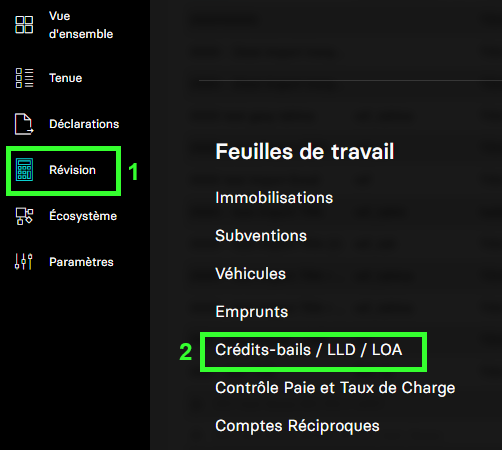
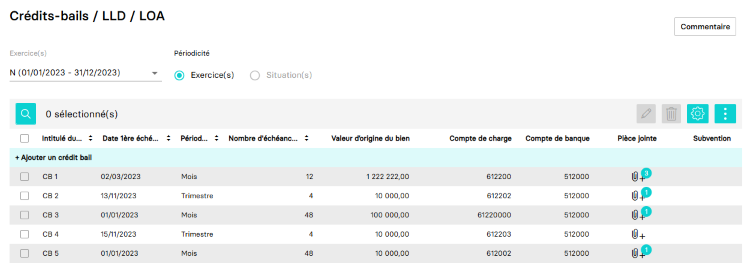

---
prev:
  text: 🐤 Introduction
  link: documentation.md
next: false
---

<span id="readme-top"></span>

# Récupérer la liste des crédits-bails d'une société

Ce guide va vous accompagner pour vous permettre de récupérer l'ensemble des crédits-bails d'une société (dossier).

Dans MyUnisoft les crédits-bails sont gérés depuis : `Révision` > `Feuille de travail` > `Crédits-bails / LLD / LOA`.



Vous obtenez ainsi la liste des crédits-bails.



## API

La route <https://api.myunisoft.fr/api/v1/leasings> permet de récupérer cette liste avec l'API partenaires.

```bash
curl --location 'https://api.myunisoft.fr/api/v1/leasings' \
--header 'X-Third-Party-Secret: nompartenaire-L8vlKfjJ5y7zwFj2J49xo53V' \
--header 'Society-id: 1;' \
--header 'Content-Type: application/json' \
--header 'Authorization: Bearer {{API_TOKEN}}'
```

> [!IMPORTANT]
> Penser à préciser l'en-tête **society-id** pour fournir le dossier comptable vous souhaitez interroger.

Le endpoint aura besoin des paramètres (Querry stings) suivants :

| paramètre | decription | format |
| --- | --- | --- |
| `from` | La date de début à partir de laquelle vous souhaitez récupérer les crédits-bails | YYYY-MM-DD |
| `to` | La date de fin jusqu'à laquelle vous souhaitez récupérer les crédits-bails | YYYY-MM-DD |

<details class="details custom-block"><summary>Retour JSON de l'API</summary>

```json
[
  {
    "id": 1548,
    "companyId": 177,
    "rentTypeId": 2,
    "contractTypeId": 1,
    "title": "CB 1",
    "isDeductibleVat": false,
    "periodId": 1,
    "typeId": 3,
    "idSociete": 1,
    "lineEntryOriginId": null,
    "taxDeductionValue": 0,
    "comment": "",
    "isExpired": false,
    "contractNumber": "1234-ABCDEF",
    "isClosed": false,
    "isPaymentDue": true,
    "surrenderCost": 122222,
    "originalCost": 1222222,
    "nbOfDeadlines": 12,
    "nbOfDocs": 3,
    "firstDeadlineDate": "2023-03-02",
    "bankAccount": {
      "idCompte": 18719612,
      "noCompte": "512000",
      "intituleCo": "BANQUES"
    },
    "personalAccount": {
      "idCompte": 18719644,
      "noCompte": "612200",
      "intituleCo": "CREDIT-BAIL MOBILIER"
    },
    "subvention": {
      "subventionId": 872,
      "label": "Subvention crédit bail",
      "number": "9876-ABCD"
    }
  },
  // ...
  {
    "id": 1442,
    "companyId": 187,
    "rentTypeId": 2,
    "contractTypeId": 1,
    "title": "CB 5",
    "isDeductibleVat": false,
    "periodId": 1,
    "typeId": 3,
    "idSociete": 30210,
    "lineEntryOriginId": null,
    "taxDeductionValue": 0,
    "comment": "",
    "isExpired": false,
    "contractNumber": "5678-ABCDEF",
    "isClosed": false,
    "isPaymentDue": true,
    "surrenderCost": 100,
    "originalCost": 10000,
    "nbOfDeadlines": 48,
    "nbOfDocs": 1,
    "firstDeadlineDate": "2023-01-01",
    "bankAccount": {
      "idCompte": 18719612,
      "noCompte": "512000",
      "intituleCo": "BANQUES"
    },
    "personalAccount": {
      "idCompte": 18720229,
      "noCompte": "612002",
      "intituleCo": "Crédit Bail Divers"
    },
    "subvention": null
  }
]
```

</details>

<details class="details custom-block"><summary>Interface TypeScript Leasing</summary>

```ts
export interface Leasing {
  id: number,
  companyId: number,
  rentTypeId: number,
  contractTypeId: number,
  title: string,
  isDeductibleVat: boolean,
  periodId: number,
  typeId: number,
  idSociete: number,
  lineEntryOriginId: number,
  taxDeductionValue: number,
  comment: string,
  isExpired: boolean,
  contractNumber: string,
  isClosed: boolean,
  isPaymentDue: boolean,
  surrenderCost: number,
  originalCost: number,
  nbOfDeadlines: number,
  nbOfDocs: number,
  firstDeadlineDate: string,
  bankAccount: {
    idCompte: number,
    noCompte: string,
    intituleCo: string
  },
  personalAccount: {
    idCompte: number,
    noCompte: string,
    intituleCo: string
  },
  subvention: {
    subventionId: number,
    label: string,
    number: string
  }
}
```

</details>

<p align="right">(<a href="#readme-top">retour en haut de page</a>)</p>
