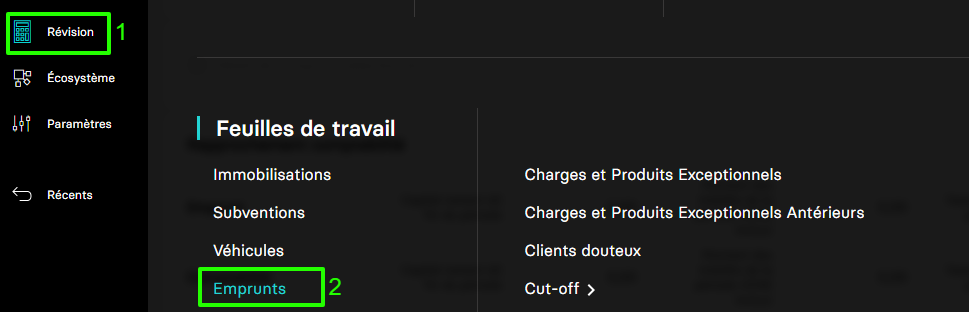

---
prev:
  text: 🐤 Introduction
  link: documentation.md
next: false
---

<span id="readme-top"></span>

# Récupérer la liste des emprunts d'une société (dossier)

Ce guide a pour objectif de vous accompagner dans l'opération de récupération de la liste des emprunts d'une société (dossier).

Dans MyUnisoft les emprunts sont gérés depuis : `Révision` > `Feuilles de travail` > `Emprunts`.



Vous obtenez la liste des comptes d'immobilisations et le détails de chacun.


## API

La route https://api.myunisoft.fr/api/v1/loans permet de récupérer la même liste mais par le biais de l'API partenaires.

```bash
curl --location 'https://app.dev.myunisoft.tech/api/v1/loans?dossier_revision_id=12345' \
--header 'X-Third-Party-Secret: nompartenaire-L8vlKfjJ5y7zwFj2J49xo53V' \
--header 'Society-id: 1' \
--header 'Authorization: Bearer {{API_TOKEN}}'
```

> [!IMPORTANT]
> Penser à préciser l'en-tête **society-id** si vous utilisez un 🔹 Accès cabinet.

L'endpoint attend un paramètre de requête (QuerryParams) `dossier_revision_id` pour pouvoir être exécuté.

| paramètre | decription |
| --- | --- |
| dossier_revision_id | L'id dossier de révision de l'exercice pour lequel vous souhaitez récupérer le tableau des immibilisations |

Pour obtenir la liste des dossiers de révision d'une société et récupérer leur id, vous pouvez consulter la page [](./dossiers_de_révision.md).

L'exécution accomplie, vous recevrez une réponse avec un `status code 200` un JSON avec **une structure similaire à l'exemple ci-dessous**

<details class="details custom-block"><summary>Retour JSON de l'API</summary>

```json
[
  {
    "id": 8113,
    "motif": "RENEGO",
    "imported": false,
    "amount": 14687.73,
    "subscriptionDate": "2022-12-01",
    "firstDeadline": "2028-01-01",
    "lendingAgency": 1,
    "loanOrganization": "BNP",
    "repaymentType": 1,
    "rhythmOfRepayment": 1,
    "duration": 108,
    "rates": 1.5,
    "insurance": 1,
    "amountInsurance": 50,
    "rateInsurance": 0,
    "monthlyPaymentsWithInsurance": 50,
    "monthlyPayments": 0,
    "repayment_capital_from_all_fund_released": false,
    "releases": [],
    "variableRateLines": [],
    "many_release": false,
    "noCompteRbt": {
      "account_id": 19549848,
      "account_number": "164004",
      "label": "RENEGO",
      "balanceStart": 0,
      "balanceEnd": 0
    },
    "noCompteInterest": {
      "account_id": 19544387,
      "account_number": "661160",
      "label": "INTERETS EMPRUNTS &DIVERS",
      "balance": 0
    },
    "noCompteInsurance": {
      "account_id": 19544338,
      "account_number": "616000",
      "label": "PRIMES D ASSURANCES",
      "balance": 0
    },
    "noCompteEntry": {
      "account_id": 19549848,
      "account_number": "164004",
      "label": "RENEGO",
      "balance": 0
    },
    "deadLineList": [
        {
            "deadline_id": 480246,
            "date": "2028-01-01",
            "idLineEntry": null,
            "repayment": "1756.7967911066726",
            "insurance": "50",
            "capital": "1536.4808411066726",
            "interest": "220.31595",
            "number": 1,
            "remaining": "13151.249158893326",
            "has_moved": false
        },
        {
            "deadline_id": 480255,
            "date": "2028-01-01",
            "idLineEntry": null,
            "repayment": "1756.7967911066726",
            "insurance": "50",
            "capital": "1536.4808411066726",
            "interest": "220.31595",
            "number": 1,
            "remaining": "13151.249158893326",
            "has_moved": false
        },
        // ...
    ],
    "hasDocuments": 0,
    "hasLineEntry": false,
    "hasComments": 0,
    "hasAnalytics": false,
    "hasEcheanceLineEntry": false,
    "renegociated": true,
    "startOfPeriod": 29375.46,
    "endOfPeriod": 29375.46,
    "underAYear": 0,
    "oneToFiveYears": 3072.961682,
    "overFiveYears": 26302.498318
  },
  // ...
]
```

</details>

## Définition TypeScript

Le endpoint **/loans** retourne un tableau de structure Emprunt.

<details class="details custom-block"><summary>Détails de l'interface Emprunt</summary>

```ts
export interface Emprunt {
  id: number,
  motif: string,
  imported: boolean,
  amount: number,
  subscriptionDate: string,
  firstDeadline: string,
  lendingAgency: number,
  loanOrganization: string,
  repaymentType: number,
  rhythmOfRepayment: number,
  duration: number,
  rates: number,
  insurance: number,
  amountInsurance: number,
  rateInsurance: number,
  monthlyPaymentsWithInsurance: number,
  monthlyPayments: number,
  repayment_capital_from_all_fund_released: boolean,
  releases: [],
  variableRateLines: [],
  many_release: boolean,
  noCompteRbt: {
    account_id: number,
    account_number: string,
    label: string,
    balanceStart: number,
    balanceEnd: number
  },
  noCompteInterest: {
    account_id: number,
    account_number: string,
    label: string,
    balance: number
  },
  noCompteInsurance: {
    account_id: number,
    account_number: string,
    label: string,
    balance: number
  },
  noCompteEntry: {
    account_id: number,
    account_number: string,
    label: string,
    balance: number
  },
  deadLineList: [
    {
      deadline_id: number,
      date: string,
      idLineEntry: null,
      repayment: string,
      insurance: string,
      capital: string,
      interest: string,
      number: number,
      remaining: string,
      has_moved: boolean
    },
    // ...
  ],
  hasDocuments: number,
  hasLineEntry: boolean,
  hasComments: number,
  hasAnalytics: boolean,
  hasEcheanceLineEntry: boolean,
  renegociated: boolean,
  startOfPeriod: number,
  endOfPeriod: number,
  underAYear: number,
  oneToFiveYears: number,
  overFiveYears: number
}
```

</details>

<p align="right">(<a href="#readme-top">retour en haut de page</a>)</p>
