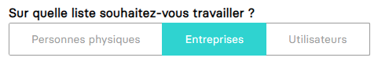
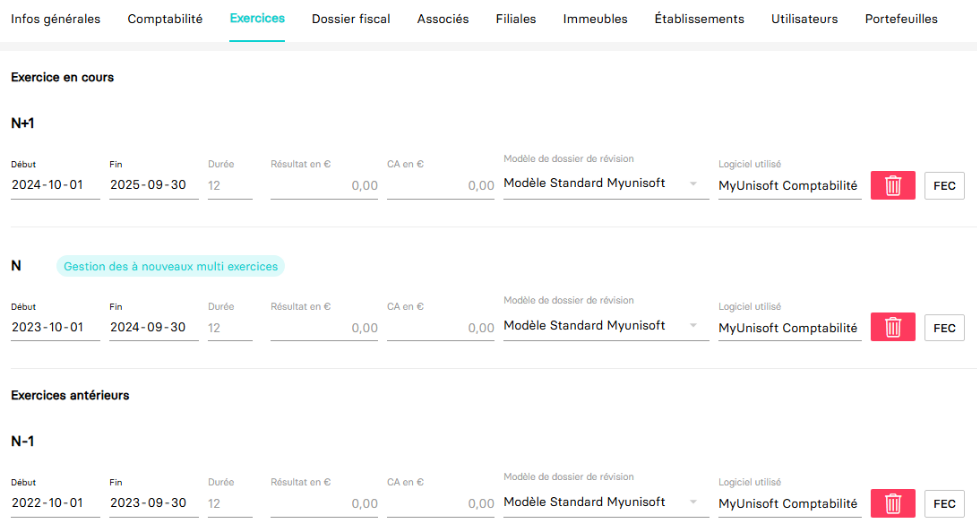

<span id="readme-top"></span>

# Récupérer les exercices d'une société (dossier)
Ce guide a pour objectif de vous aider dans la récupération des exercices d'une société (dossier).

Dans MyUnisoft les exercices peuvent être gérés par le biais du CRM: `Ecosystème` > `CRM` > `Entreprise / Personne physique`.

Choisir "Entreprises" dans la liste:



Choisir l'onglet "Exercices":



## API

La route https://api.myunisoft.fr/api/v1/society/exercice permet de récupérer la même liste mais par le biais de l'API partenaires.

```bash
$ curl --location --request GET 'https://api.myunisoft.fr/api/v1/society/exercice' \
--header 'X-Third-Party-Secret: nompartenaire-L8vlKfjJ5y7zwFj2J49xo53V' \
--header 'Authorization: Bearer {{API_TOKEN}}'
```

> [!IMPORTANT]
> Penser à préciser l'en-tête **society-id** si vous utilisez un 🔹 Accès cabinet.

Si tout va bien vous devriez recevoir un JSON avec **une structure similaire à l'exemple ci-dessous**
```json
[
  {
    "exercice_id": 54,
    "start_date": "20210101",
    "end_date": "20211231",
    "label": "N+1",
    "result": 52457.86,
    "ca": 105046.85,
    "closed": false,
    "duration": 12,
    "closed_at": null,
    "closed_by": null,
    "review_model": {
      "label": "Modèle Standard Myunisoft",
      "id_review_model": 1
    },
    "lettering_method_id": 1
  },
  {
    "exercice_id": 2,
    "start_date": "20200101",
    "end_date": "20201231",
    "label": "N",
    "result": 328414.96,
    "ca": 323218.38,
    "closed": false,
    "duration": 12,
    "closed_at": null,
    "closed_by": null,
    "review_model": {
      "label": "Modèle Standard Myunisoft",
      "id_review_model": 1
    },
    "lettering_method_id": 1
  }
]
```

La propriété `lettering_method_id` permet de savoir si l'exercice est **MONO** ou **MULTI**. Par défaut un exercice est **MONO**.

| id | nom |
| --- | --- |
| 1 | MONO |
| 2 | MULTI |

## Définition TypeScript

Le endpoint **society/exercice** retourne un tableau de structure Exercice.

```ts
export interface Exercice {
  exercice_id: number;
  start_date: string;
  end_date: string;
  /**Label de l'exercice ( N-1, N, N+1 etc..). */
  label: string;
  result: number;
  /* Chiffre d'affaire sur l'exercice. */
  ca: number;
  closed: boolean;
  duration: number;
  closed_at: null | string;
  /** ID de l'utilisateur qui a clotûré l'exercice. */
  closed_by: null | number;
  review_model: {
    label: string;
    id_review_model: number;
  };
  lettering_method_id: number;
}
```

Si l'exercice n'est pas un clos les valeurs `closed_at` et `closed_by` seront null.

<p align="right">(<a href="#readme-top">retour en haut de page</a>)</p>
