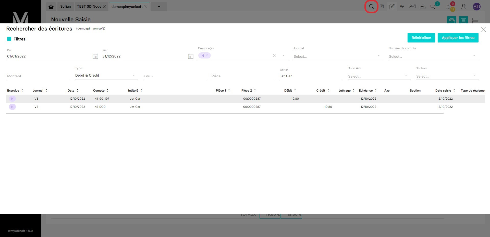

# Recherche simplifiée dans les écritures d'un dossier

Ce guide a pour objectif de vous aider à effectuer une recherche dans les écritures d'un dossier.

Dans MyUnisoft, vous pouvez accéder à la recherche rapide en cliquant sur la loupe du menu rapide comme indiqué dans l'image ci-dessous.



## Liste des paramètres de recherche

| Nom | Description | Obligatoire |
|---|---|---|
|idEtablissement|Id du dossier de production/société|✔️|
|fetchTotals|Récupérer le total débit + credit|❌|
|fetchDocuments|Récupérer les documents attachés aux écritures et lignes d'écritures|❌|
|startDate|Timestamp ou format valide en JavaScript|❌|
|endDate|Timestamp ou format valide en JavaScript|❌|
|journalIds[]|Recherche avec un ou plusieurs Ids de journaux|❌|
|accountIds[]|Recherche avec un ou plusieurs Ids de comptes|❌|
|exerciceIds[]|Recherche avec un ou plusieurs Ids d'exercices|❌|
|axeId|Recherche par **axe** analytique|❌|
|sectionId|Recherche par **section** analytique|❌|
|sectionAmount||❌|
|intitule||❌|
|debit||❌|
|credit||❌|
|plusMinusRange||❌|
|piece|Recherche sur piece et piece2|❌|
|accountClass|Recherche par classe du plan comptable (1, 2, 3 ...)|❌|
|havingAnalytics|Récupérer uniquement les écritures attachées à un axe analytique|❌|
|page|égal à **1** par défaut|❌|
|resultPerPage|**100** résultats par pages (valeur par défaut)|❌|

Le paramètre `fetchTotals` permet de récupérer le total débit + crédit

```json
{
  "totals": {
    "totalDebit": 48500,
    "totalCredit": 54620
  },
  "data": []
}
```

## Quick Search

```bash
curl --location 'https://api.myunisoft.fr/api/v1/accounting/entry/search' \
--header 'X-Third-Party-Secret: X-Third-Party-Secret-Key' \
--header 'content-type: application/json' \
--data '{
	"idEtablissement": "1",
  "accountIds": ["1", "2"],
  "axeId": null,
  "credit": 100,
  "debit": 100,
  "endDate": "2020-12-31",
  "searchType": "analytics",
  "havingAnalytics": true,
  "sortByDirection": "DESC"
}'
```

<details>
  <summary>Retour JSON de l'API</summary>

  ```json
    {
      "data": [
        {
          "ligneEcriture_piece": null,
          "ligneEcriture_piece_2": "0000",
          "ligneEcriture_lettrage": null,
          "ligneEcriture_debit": "0",
          "ligneEcriture_credit": "14.62",
          "journal_code": "20",
          "id_etablissement": "5300",
          "id_ecriture": "46889055",
          "date_comptabilisation": "2020-12-30T23:00:00.000Z",
          "date_piece": "2020-12-30T23:00:00.000Z",
          "id_axe": null,
          "code_axe": null,
          "label_axe": null,
          "id_journal": "128926",
          "intitule_journal": "JOURNAL D' OD",
          "no_compte": "280500",
          "id_compte": "6393513",
          "intitule_ligne": "DOT. AMORT. 12/2020",
          "idligneecriture": "141757599",
          "date_echeance": null,
          "id_exercice": "29623",
          "exercice_date_debut": "2019-12-31T23:00:00.000Z",
          "exercice_date_fin": "2020-12-30T23:00:00.000Z",
          "type_reglement_name": null,
          "type_reglement_abbreviation": null,
          "analytics": null
        },
        // ...
        {
          "ligneEcriture_piece": null,
          "ligneEcriture_piece_2": "0000",
          "ligneEcriture_lettrage": null,
          "ligneEcriture_debit": "2.1",
          "ligneEcriture_credit": "0",
          "journal_code": "20",
          "id_etablissement": "5300",
          "id_ecriture": "46889057",
          "date_comptabilisation": "2020-12-30T23:00:00.000Z",
          "date_piece": "2020-12-30T23:00:00.000Z",
          "id_axe": null,
          "code_axe": null,
          "label_axe": null,
          "id_journal": "128926",
          "intitule_journal": "JOURNAL D' OD",
          "no_compte": "681000",
          "id_compte": "6393510",
          "intitule_ligne": "DOT. AMORT. 12/2020",
          "idligneecriture": "141757603",
          "date_echeance": null,
          "id_exercice": "29623",
          "exercice_date_debut": "2019-12-31T23:00:00.000Z",
          "exercice_date_fin": "2020-12-30T23:00:00.000Z",
          "type_reglement_name": null,
          "type_reglement_abbreviation": null,
          "analytics": null
        }
      ]
    }
  ```
</details>

---

⬅️ [README](../../../../README.md)
