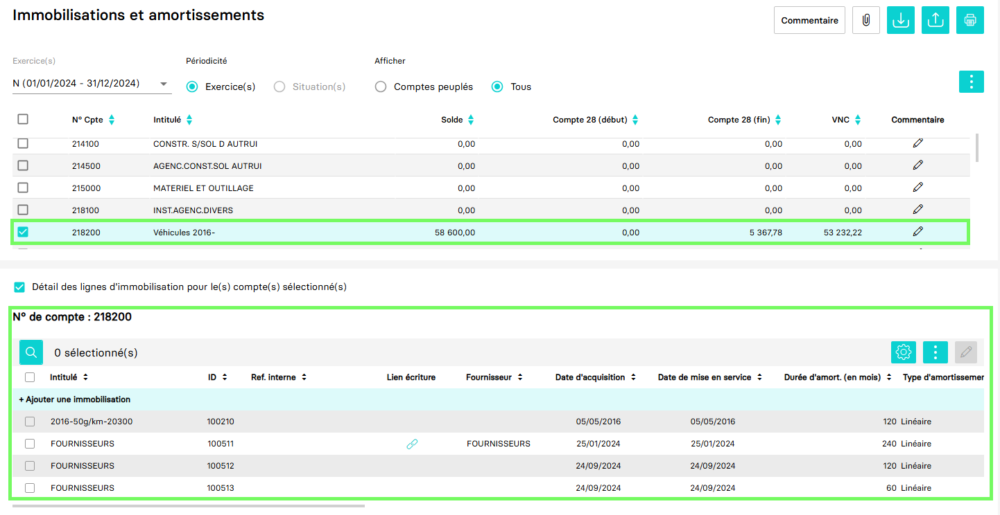

---
prev:
  text: 🐤 Introduction
  link: documentation.md
next: false
---

<span id="readme-top"></span>

# Récupérer la liste des immobilisations d'une société (dossier)

Ce guide a pour objectif de vous accompagner dans l'opération de récupération de la liste des immobilisations d'une société (dossier).

Dans MyUnisoft les immobilisations sont gérées depuis : `Révision` > `Feuilles de travail` > `Immobilisations`.


Vous obtenez la liste des comptes d'immobilisations et le détails de chacun.



## API

La route https://api.myunisoft.fr/api/v1/immo permet de récupérer cette liste avec l'API partenaires.

```bash
curl --location 'https://app.myunisoft.fr/api/v1/immo?dossier_revision_id=12345' \
--header 'X-Third-Party-Secret: nompartenaire-L8vlKfjJ5y7zwFj2J49xo53V' \
--header 'society-id: 1' \
--header 'Authorization: Bearer {{API_TOKEN}}'
```

> [!IMPORTANT]
> Penser à préciser l'en-tête **society-id** si vous utilisez un 🔹 Accès cabinet.

L'endpoint attend un paramètre de requête (QuerryParams) `dossier_revision_id` pour pouvoir être exécuté.

| paramètre | decription |
| --- | --- |
| dossier_revision_id | L'id du dossier de révision de l'exercice que vous interrogez |

Pour obtenir la liste des dossiers de révision et leur id : [Récupérer les dossiers de révision](./dossiers_de_révision.md).

<details class="details custom-block"><summary>Retour JSON de l'API</summary>

```json
[
  // ...
  {
    "id_compte": 23011884,
    "id_societe": 38758,
    "noCompte": "218200",
    "label": "Véhicules 2016-",
    "comm": 0,
    "isPopulate": true,
    "arrayImmo": [
      {
        "id_immo": 100210,
        "id_account": 23011884,
        "no_account": "218200",
        "account_label": "Véhicules 2016-",
        "id_type_amort": 1,
        "id_line_entry_purchase": 0,
        "subvention_id": 0,
        "id_entry_purchase": 0,
        "provider": "",
        "label": "2016-50g/km-20300",
        "purchase_date": "2016-05-05",
        "start_date": "2016-05-05",
        "purchase_value": 50000,
        "month": 120,
        "end_date": "0000-00-00",
        "sale_value": 0,
        "intern_ref": "",
        "param_vat_id": 0,
        "vat_amount": 0,
        "removal_entry_id": [],
        "original_removal_entry_id": 0,
        "bulk_removal": false,
        "quantity": 1,
        "unit_costs": 50000,
        "additional_depreciation_rate": 0,
        "analytics": false,
        "id_vehicule": 802,
        "dotation_account_id": 0,
        "dotation_account_number": "",
        "date_transfert": "",
        "arrayDotation": [
          {
            "id_amort": 0,
            "id_immo": 100210,
            "id_dossier_revision": -8,
            "id_entry": 0,
            "value": 5000,
            "periode": "01/01/2033 - 31/12/2033",
            "dotation_type": 1,
            "previous_value": 45000,
            "periode_value": 5000,
            "end_periode_value": 50000,
            "vnc": 0,
            "m_debut_periode": "2033-01-01",
            "m_fin_periode": "2033-12-31"
          },
          {
              "id_amort": 0,
              "id_immo": 100210,
              "id_dossier_revision": -7,
              "id_entry": 0,
              "value": 5000,
              "periode": "01/01/2032 - 31/12/2032",
              "dotation_type": 1,
              "previous_value": 40000,
              "periode_value": 5000,
              "end_periode_value": 45000,
              "vnc": 5000,
              "m_debut_periode": "2032-01-01",
              "m_fin_periode": "2032-12-31"
          }
          // ...
        ],
        "fiscal_arrayDotation": [
          {
            "id_amort": 0,
            "id_immo": 100210,
            "id_dossier_revision": -8,
            "id_entry": 0,
            "value": 5000,
            "periode": "01/01/2033 - 31/12/2033",
            "dotation_type": 2,
            "previous_value": 45000,
            "periode_value": 5000,
            "end_periode_value": 50000,
            "vnc": 0,
            "m_debut_periode": "2033-01-01",
            "m_fin_periode": "2033-12-31"
          },
          {
            "id_amort": 0,
            "id_immo": 100210,
            "id_dossier_revision": -7,
            "id_entry": 0,
            "value": 5000,
            "periode": "01/01/2032 - 31/12/2032",
            "dotation_type": 2,
            "previous_value": 40000,
            "periode_value": 5000,
            "end_periode_value": 45000,
            "vnc": 5000,
            "m_debut_periode": "2032-01-01",
            "m_fin_periode": "2032-12-31"
          }
          // ...
        ],
        "additional_depreciation_arrayDotation": [],
        "derogatoire_arrayDotation": [],
        "excess_deprecation_arrayDotation": [
          {
            "id_amort": 358228,
            "id_immo": 100210,
            "id_dossier_revision": 131558,
            "id_entry": 0,
            "value": 0,
            "periode": "01/01/2023 - 31/12/2023",
            "dotation_type": 4,
            "previous_value": 0,
            "periode_value": 0,
            "end_periode_value": 0,
            "vnc": 0,
            "m_debut_periode": "2023-01-01",
            "m_fin_periode": "2023-12-31"
          },
          {
            "id_amort": 358227,
            "id_immo": 100210,
            "id_dossier_revision": 131557,
            "id_entry": 0,
            "value": 3170,
            "periode": "01/01/2024 - 31/12/2024",
            "dotation_type": 4,
            "previous_value": 0,
            "periode_value": 3170,
            "end_periode_value": 0,
            "vnc": 0,
            "m_debut_periode": "2024-01-01",
            "m_fin_periode": "2024-12-31"
          }
          // ...
        ],
        "fiscal_type": 1,
        "fiscal_duration": 120,
        "fiscal_amount": 50000,
        "type_calcul_dotation": 1,
        "previousDotation": 0,
        "currentAnnualDotation": 5000,
        "EndingAnnualDotation": 5000,
        "FiscalpreviousDotation": 0,
        "FiscalcurrentAnnualDotation": 5000,
        "FiscalEndingAnnualDotation": 5000,
        "additional_depreciation_previousDotation": 0,
        "additional_depreciation_currentAnnualDotation": 0,
        "additional_depreciation_EndingAnnualDotation": 0,
        "netBookValue": 45000,
        "capitalGain": 0,
        "hasEntry": false,
        "PJNumber": 0,
        "hasComment": false,
        "TableauModificationPlanAmortissement": [],
        "param_amortissement": {
            "montant": 50000,
            "duree": 3600,
            "depuis_le": "1900-01-01",
            "id_review": -1,
            "taux_linéaire": 0,
            "taux_linéaireDegressif": 0,
            "taux_degressif": 0,
            "NumOccurenceDepuisDebutPlan": 0
        }
      }
      // ...
    ],
    "value": 58600,
    "previousDotation": 0,
    "currentAnnualDotation": 5367.78,
    "EndingAnnualDotation": 5367.78,
    "FiscalpreviousDotation": 0,
    "FiscalcurrentAnnualDotation": 0,
    "FiscalEndingAnnualDotation": 0,
    "netBookValue": 0,
    "mismatch": false,
    "m_achat_compta": 58600,
    "m_amort_ant_compta": 0,
    "m_dotation_periode_compta": 5367.78,
    "m_amortissement_fin_periode_compta": 5367.78
  }
  // ...
]
```

</details>

<details class="details custom-block"><summary>Interface TypeScript Immobilisation</summary>

```ts
export interface Immobilisation {
  id_compte: number,
  id_societe: number,
  noCompte: string,
  label: string,
  comm: number,
  isPopulate: boolean,
  arrayImmo: [],
  value: number,
  previousDotation: number,
  currentAnnualDotation: number,
  EndingAnnualDotation: number,
  FiscalpreviousDotation: number,
  FiscalcurrentAnnualDotation: number,
  FiscalEndingAnnualDotation: number,
  netBookValue: number,
  mismatch: boolean,
  m_achat_compta: number,
  m_amort_ant_compta: number,
  m_dotation_periode_compta: number,
  m_amortissement_fin_periode_compta: number
}
```

</details>

<p align="right">(<a href="#readme-top">retour en haut de page</a>)</p>
