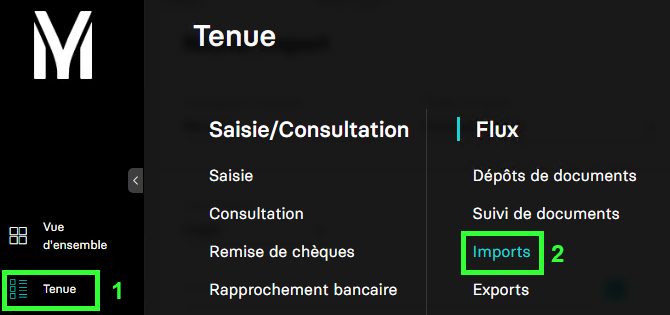
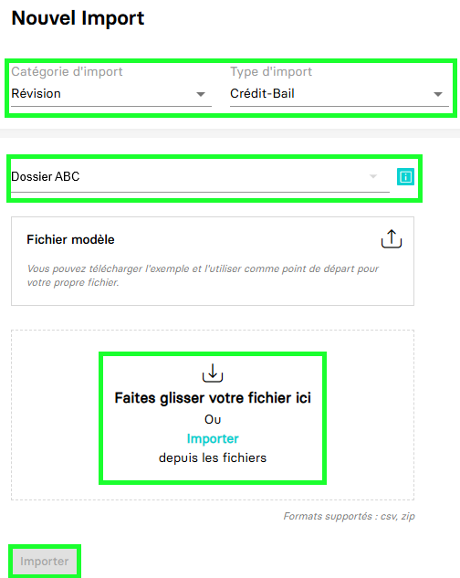

---
prev:
  text: 🐤 Introduction
  link: documentation.md
next: false
---

<span id="readme-top"></span>

# Importer des crédits-bails

Ce guide va vous accompagner pour vous permettre d'importer des crédits-bails.

Dans MyUnisoft, il est possible de procéder à un import des crédits-bails depuis : `Tenue` > `Flux` > `Imports`.



Vous obtenez la page permettant de procéder à des imports :



Une fois la catégorie, le type d'import et le dossier sur lequel travailler, il suffit de sélectionner le fichier et cliquer sur `importer`.

## API

La route <https://api.myunisoft.fr/api/v1/leasings> permet de récupérer cette liste avec l'API partenaires.

```bash
curl --location 'https://api.myunisoft.fr/api/v1/leasings/import' \
--header 'X-Third-Party-Secret: nompartenaire-L8vlKfjJ5y7zwFj2J49xo53V' \
--header 'Society-id: 1' \
--header 'Content-Type: application/json' \
--header 'Authorization: Bearer {{API_TOKEN}}' \
--form 'attachment=@"/C:/Test_Credits_bails.zip"'
```

> [!IMPORTANT]
> Penser à préciser l'en-tête **society-id** pour fournir le dossier comptable sur lequel vous souhaitez importer.

Les format de fichiers d'import supportés sont :

| formats | decription |
| --- | --- |
| **.zip** | Pour un import global, contenant un premier fichier (Contrats.csv) pour le(s) contrat(s) et un second (Echéanciers.csv) pour les échéances. |
| **.csv** | Dans le cas d'import individuels de fichiers. (Les noms des fichiers restent Contrats.csv et Echéanciers.csv)|

Un modèle de fichier est disponible au téléchargement dans la page import de l'application.

Une fois l'opération accomplie avec succès l'API retournera un `statusCode` 204.

<p align="right">(<a href="#readme-top">retour en haut de page</a>)</p>
