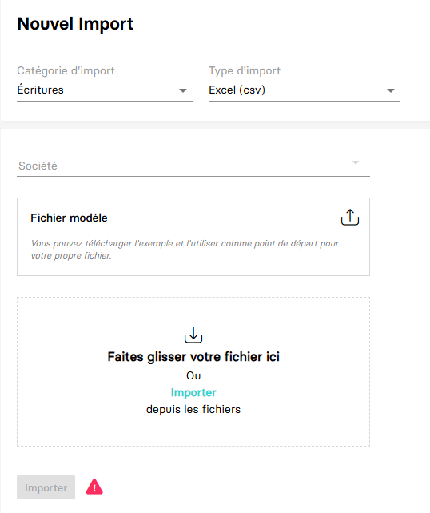

---
prev:
  text: 🐤 Introduction
  link: documentation.md
next: false
---

# Création d'écriture comptable avec le format CSV
MyUnisoft met à disposition son propre [modèle/format](./Modele_import_csv.csv) CSV pour l'import d'écritures comptable.

Cela correspond à la même API utilisé dans l'interface MyUnisoft `Tenue` > `Imports`



## API

```bash
$ curl --location \
--request POST 'https://api.myunisoft.fr/api/v1/CSV?filename=file.csv' \
--header 'X-Third-Party-Secret: nompartenaire-L8vlKfjJ5y7zwFj2J49xo53V' \
--header 'Content-Type: application/octet-stream' \
--header 'Authorization: {{API_TOKEN}}' \
--data-binary '@/C:/Users/name/Downloads/file.csv'
```

La route prend plusieurs arguments:
- **filename** (le nom du fichier qui est attaché avec la requête).
- **HascodeVerif** (si l'argument est à `true` cela permet d'éviter les doublons).
