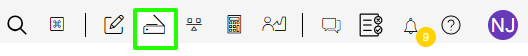
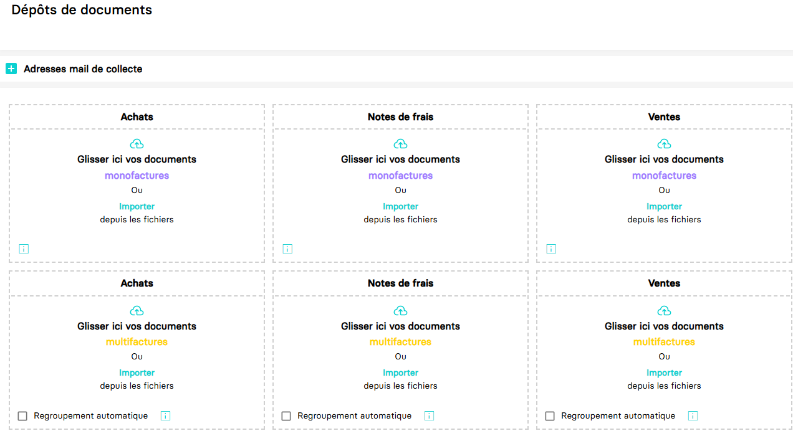

---
prev:
  text: 🐤 Introduction
  link: documentation.md
next: false
---

# Envoyer des documents typés (achats, ventes, avoirs, notes de frais)

Ce guide a pour objectif de vous aider à envoyer des documents typés à un dossier comptable.

Un document typé est un document de nature comptable définie. Dans MyUnisoft on retrouve cinq types de documents rattachables à une écriture :

- Factures d'achats
- Factures de ventes
- Avoirs sur achats
- Avoirs sur Ventes
- Notes de frais

Ils peuvent être transmis via le système automatisé d'OCR, en flux manuel par l'utilisateur, ou via [Facture X](./facturx.md).

Dans l'application MyUnisoft, ces documents peuvent être importés après avoir sélectionné un dossier comptable par le bouton "Déposer un nouveau document".



Vous obtenez la page suivante :



## API

La route https://api.myunisoft.fr/api/v1/invoice vous permet d'envoyer des documents typés.

```bash
curl --location 'https://api.myunisoft.fr/api/v1/invoice?invoice_type_id=1&ocr_type_id=2&name=facture&extension=png' \
--header 'X-Third-Party-Secret: {{X-Third-Party-Secret}}' \
--header 'Authorization: Bearer {{API_TOKEN}}' \
--header 'Content-Type: application/octet-stream' \
--header 'society-id: 1' \
--data-binary '@/C:/facture.png'
```

> [!IMPORTANT]
> Penser à préciser l'en-tête **society-id**.

La route requiert des paramètres [(query string)](https://en.wikipedia.org/wiki/Query_string) suivants :

| clé | description | valeurs | obligatoire |
| --- | --- | --- | --- |
| `invoice_type_id` | l'id du type de document | 1 = Achat<br> 2 = Note de frais<br> 3 = Vente<br> 4 = Avoir | ✅ |
| `ocr_type_id` | l'id de type d'OCR utilisé |  2 = MANUEL<br> 3 = OCR MyUnisoft<br> 6 = Factur-X | ✅ |
| `name` | le nom du document |  | ❌ |
| `extension` | l'extension de fichier du document | formats supportés : **jpg, jpeg, tiff, tif, bmp, png, pdf**<br> Taille maximale : **15 Mégaoctets (15Mo)** | ✅ |

En cas de succès, l'API retournera un status code `200` ainsi que la réponse JSON suivante :

```json
{
    "result": "success"
}
```
