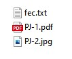

# Création d'une entrée comptable avec le format FEC
Documentation sur la création d’une entrée comptable au format FEC.
​

Les routes HTTP concernées;
- https://api.myunisoft.fr/api/v1/FEC

## Introduction

FEC est le diminutif de fichier des écritures comptables. Si n'êtes pas encore à l'aise avec ce format nous vous recommandons de lire la ressource [suivante](https://www.compta-facile.com/fichier-des-ecritures-comptables-fec-definition-contenu-utilite/) ou encore [Tout savoir sur le fec](https://info.masterfec.fr/tout-savoir-sur-le-fec).

Exemple du format à plat:


## API

MyUnisoft permet de créer ou supprimer des écritures par le biais du format FEC grâce à la route `api/v1/fec`.

```bash
$ curl --location --request POST 'https://api.myunisoft.fr/api/v1/fec?type=2&exercice_id=13647&filename=export_fec_20201002.txt' \
--header 'X-Third-Party-Secret: nompartenaire-L8vlKfjJ5y7zwFj2J49xo53V' \
--header 'Content-Type: application/octet-stream' \
--header 'Authorization: {{API_TOKEN}}' \
--data-binary '@/C:/Users/name/Downloads/export_fec_20201002.txt'
```

La route prend plusieurs arguments:
- **exercice_id** (l'id de l'exercice. Il est possible de le récupérer par API, merci de suivre [le guide suivant](../exercices.md)).
- **filename** (le nom du fichier qui est attaché avec la requête).
- **type** (valeur numérique entre `0` et `2`).

Le type permet de configurer le comportement de la requête:
- **0** = vérification si écriture sur l'exercice (renvoie d'un message d'erreur).
- **1** = aucune vérification on rajoute les données a l'exercice existant.
- **2** = on supprime les écritures si présent sur l'exercice.

## Pièce jointe

Il est possible d'attacher des pièces jointes aux écritures importées au format FEC. Pour ce faire il suffit d'ajouter les pièces jointes dans le dossier compressé (dossier `.zip`) et de renseigner le nom de fichier correspondant dans la colonne `Pièce jointe` du fichier FEC.

### Exemple



Ficher fec.txt:
```
JournalCode	JournalLib	EcritureNum EcritureDate	CompteNum	  CompteLib	                              CompAuxNum	CompAuxLib	PieceRef	PieceDate	EcritureLib	Debit	Credit	EcritureLet	DateLet	ValidDate	MontantDevise	IdDevise	PieceJointe
AC	        Achats                  20200220	    625ACCOUNT  Frais déplacements		          	                              0320-1	  20200331	sncf	      52	  0					                                          EUR     	PJ-1.pdf
[...]
AC	        Achats                  20200220	    625ACCOUNT  Frais déplacements			                                        0320-2	  20200331	sncf	      52	  0					                                          EUR	      PJ-2.jpg
```
---

⬅️ [README](../../../../README.md)
