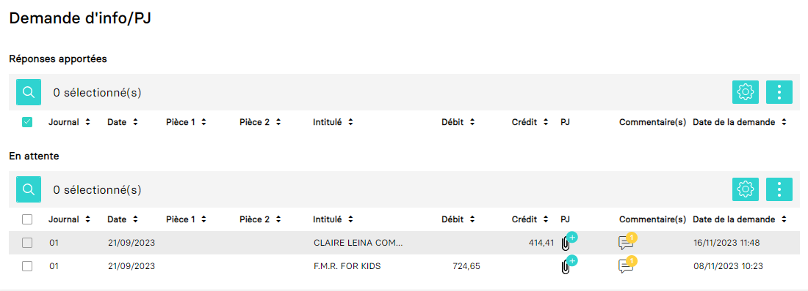

# Récupérer et créer des drapeaux (flag) sur des lignes/mouvements
Ce guide a pour objectif de vous aider:

- À récupérer des informations sur les drapeaux.
- Création/modification d'un flag sur une ligne écriture (aussi appelé un mouvement).

Dans MyUnisoft vous pouvez retrouver l'information avec le module `Demande d'info/PJ` de la page d'accueil société:



## API

La route <kbd>GET</kbd> https://api.myunisoft.fr/api/v1/flags/comment_attach_doc permets de récupérer les mêmes données que le module `Demande d'info/PJ`:

```bash
curl --location --request GET 'https://api.myunisoft.fr/api/v1/flags/comment_attach_doc' \
--header 'X-Third-Party-Secret: {{X-Third-Party-Secret}}' \
--header 'society-id: 1' \
--header 'Authorization: Bearer {{API_TOKEN}}'
```

<details>
  <summary markdown="span">Retour JSON de l'API</summary>

```json
{
  "response_list": [],
  "waiting_list": [
    {
      "location_pj": "ENTRIES_LINE",
      "object_id_pj": 66462271,
      "location_comment": "ENTRIES",
      "object_id_comment": 19299950,
      "entry_id": 19299950,
      "entry_line_id": 66462271,
      "diary_id": 35898,
      "diary_code": "01",
      "diary_label": "JOURNAL D'ACHATS",
      "entry_date": "20230921",
      "date_piece": "20230921",
      "account_id": 4204363,
      "account_number": "401CLAIRELE",
      "piece": "",
      "piece_2": "",
      "label": "CLAIRE LEINA COMPANY",
      "debit": 0,
      "credit": 414.41,
      "demand_date": "2023-11-16T11:48:13.000",
      "comment_occ": 1,
      "comment_list": [
        {
          "comment_id": 198181,
          "date": "2023-09-21T10:42:59",
          "body": "Article & Description Quantity Price Amount house 10 Inside out Medium 10,90 21,80 2 Prints M SKU: APM83 Print 29,7X39,7cm Rock 3 11 4,00 12,00 Pins SKU: P03 Pinswith and cellobag card Medium 12 Wooden Magnetic 54,00 Hanger 6 9,00 Hangers SKU: WMHO2 setin box 13 Wooden Magnetio Hanger Large 40,80 3 13,60 Hangers WMH03 SKU: set in box Sub Total 345,34 VAT (20%) 69,07 \u20ac414,41 Total (-229,27 Payment Made Balance Due \u20ac385,14 Notes Thank the you for payment You just made our day. Payment options PayPal Payment term: NET 30 Account Claire eina Company name: EURO BANK: 10100826 1P02944 BIC PSSTFRPPMAR (\u20ac) I Banque postale IBAN : FR27 2004 1411 Transferwise GBP Code: Account number 10857935 (E) BANK: Sort 23-14-70- - USD ($) I BANK: Transferwise ACH ROUTING NUMBER: 026073150 ACCOUNT NUMBER: 8310006864 - - PAYPAL: contactallthewastosaa CLAIRE LEINA COMPANY-SAS\u00e0 variable Penalty L441-3 14%perr capital RCS d''Aix en Provence Late art. year - 18308025 SIRET 818308025 00035 TVA: FR 7281 Collection & admin fee 40\u20ac costs *ff this supply iszero-rate according tothe French VAT and youareVATT registeredin your country, Act subject to reverse charge OfVAT Exon\u00e9 262 ation TVA article ter Id code g\u00e9n\u00e9raldes imp\u00f4ts"
        }
      ],
      "pj_occ": 0,
      "pj_list": []
    }
  ]
}
```

> [!NOTE]
> Les propriétés response_list et waiting_list sont structurés de la même façon.

</details>

### Ajout ou mise à jour d'un drapeau

Il est aussi possible d'ajouter ou modifier un drapeau sur une ligne d'écriture à tout moment en utilisant la route <kbd>PUT</kbd> https://api.myunisoft.fr/api/v1/flags

```bash
curl --location --request PUT 'https://api.myunisoft.fr/api/v1/flags?type_entry=ENTRIES_LINE&line_entry_id=156009180&type_flag=INFO_PJ&flagged=true&dh=2021-01-01T22%3A00%3A00.45654' \
--header 'X-Third-Party-Secret: {{X-Third-Party-Secret}}' \
--header 'society-id: 1' \
--header 'Content-Type: application/json' \
--header 'Authorization: Bearer {{API_TOKEN}}'
```

Les arguments disponibles pour la querystring sont les suivants:

| nom | description | obligatoire |
| --- | --- | --- |
| type_entry | `ENTRIES_LINE` ou `ENTRIES_LINE_TEMP` | ✔️ |
| line_entry_id | id de la ligne d'écriture | ✔️ |
| type_flag | `INFO_PJ` | ✔️ |
| flagged | `true` ou `false` (pour créer ou supprimer le drapeau) | ✔️ |
| dh | date à indiquer pour le drapeau (attention à respecter le format `YYYY-MM-DDTHH:MM:SS.CCCCC`) | ✔️ |

> [!IMPORTANT]
> `ENTRIES_LINE_TEMP` doit être utilisé pour les flux à valider (comme les intégrations bancaires ou partenaires).

---

⬅️ [README](../../../../README.md)
