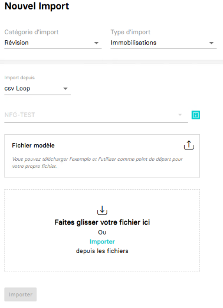

---
prev:
  text: 🐤 Introduction
  link: documentation.md
next: false
---

<span id="readme-top"></span>

# Importer des immobilisations

Ce guide va vous accompagner pour vous permettre d'importer des immobilisations.

Dans MyUnisoft, il est possible de procéder à un import des immobilisations depuis : `Tenue` > `Flux` > `Import`.


Vous obtenez la page permettant de procéder à des imports :



Après sélection de la catégorie, du type et du format d'import, il suffit de choisir le fichier et cliquer sur `Importer`.

## API

La route https://api.myunisoft.fr/api/v1/immo_import permet d'effectuer la même opération depuis l'API partenaire.

```bash
curl --location --request POST 'https://api.myunisoft.fr/api/v1/immo_import?filename=Immo_2023.csv&format=LOOP&society_id=1' \
--header 'X-Third-Party-Secret: nompartenaire-L8vlKfjJ5y7zwFj2J49xo53V' \
--header 'Society-id: 1' \
--header 'Content-Type: application/octet-stream' \
--header 'Authorization: Bearer {{API_TOKEN}}' \
--data-binary '@/C:/Immo_2023.csv'
```

> [!IMPORTANT]
> Penser à préciser l'en-tête **society-id** si vous utilisez un 🔹 Accès cabinet.

La route attend les paramètres suivants :

| paramètres | decriptions |
| --- | --- |
| `filename` | Le nom du fichier (extension incluse) contenant les données que vous souhaitez importer |
| `format` | Le format d'import du fichier |

Voici les différents formats de fichier supportés :

| format | correspondance valeur paramètre |
| --- | --- |
| `Cegid` | CEGID |
| `EIC` | EIC |
| `Quadra (ASCII)` | ASCII |
| `Coala` | COALA |
| `csv Loop` | LOOP |
| `Agiris` | AGIRIS |
| `ACD` | non disponible |

<details class="details custom-block"><summary>Retour JSON de l'API</summary>

```json
{
    "status": "success"
}
```

</details>

<p align="right">(<a href="#readme-top">retour en haut de page</a>)</p>
