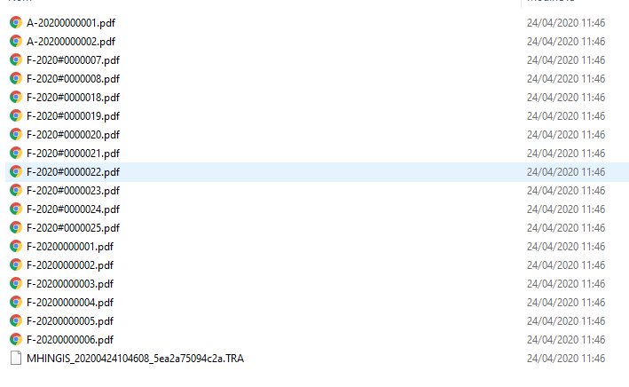

---
prev:
  text: 🐤 Introduction
  link: documentation.md
next: false
---

# Création d'une entrée comptable avec le format TRA+PJ
Documentation sur la création d’une entrée comptable au format TRA+PJ.
​
Les routes HTTP concernées;
- https://api.myunisoft.fr/api/v1/TRA/partial

## Introduction

Un TRA + PJ est une archive .zip contenant un fichier .TRA et optionnellement des pièces jointes (à la racine de l'archive).

Le format du fichier .TRA est documenté dans <a href="https://github.com/MyUnisoft/api-partenaires/blob/main/docs/MAD/TRA.pdf" target="_blank">le PDF ici</a>.

### Arguments

Par défaut, l'API n'échouera pas en cas de pièces manquantes (que ce soi dans l'archive ou suite à une indisponibilité d'un de nos services de stockage). Ce comportement peut être modifié en activant le paramètre (querystring) `mandatory_docs` avec la valeur **1**.
