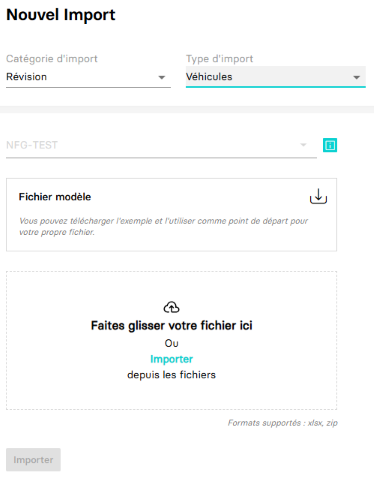

---
prev:
  text: 🐤 Introduction
  link: documentation.md
next: false
---

<span id="readme-top"></span>

# Importer des Véhicules

Ce guide va vous accompagner dans l'opération d'import de véhicules dans une société (dossier).

Dans MyUnisoft, vous pouvez procéder à des imports de données concernant la flotte de véhicules d'un dossier depuis : `Tenue` > `Flux` > `Imports`


Vous obtenez la page permettant de procéder à des imports :



Après sélection de la catégorie, du type et du format d'import, il suffit de choisir le fichier et cliquer sur `Importer`.

## API

La route https://api.myunisoft.fr/api/v1/vehicles_import permet d'effectuer la même opération depuis l'API partenaire.

```bash
curl --location 'https://api.myunisoft.fr/api/v1/vehicles_import?filename=imports_vhl.xlsx' \
--header 'X-Third-Party-Secret: nompartenaire-L8vlKfjJ5y7zwFj2J49xo53V' \
--header 'Society-id: 1' \
--header 'Content-Type: application/octet-stream' \
--header 'Authorization: Bearer {{API_TOKEN}}' \
--data-binary '@/C:/imports_vhl.xlsx'
```

> [!IMPORTANT]
> Penser à préciser l'en-tête **society-id** afin de fournir le dossier comptable sur lequel vous souhaitez effectuer l'opération d'import.

La route attend le paramètre (querry string) suivant :

| paramètres | decriptions |
| --- | --- |
| `filename` | Le nom du fichier (extension incluse) contenant les données que vous souhaitez importer |

Un modèle de fichier est disponible au téléchargement dans la page import de l'application.

Les formats de fichiers d'import supportés sont les feuilles de calculs en **.xlsx** , et les archives en **.zip** (contenant des **.xlsx**).

Une fois l'opération accomplie avec succès l'API retournera un `statusCode` 200 et le retour en JSON suivant :

<details class="details custom-block"><summary>Retour JSON de l'API</summary>

```json
{
    "status": "Success",
    "message": ""
}
```

</details>

<p align="right">(<a href="#readme-top">retour en haut de page</a>)</p>
