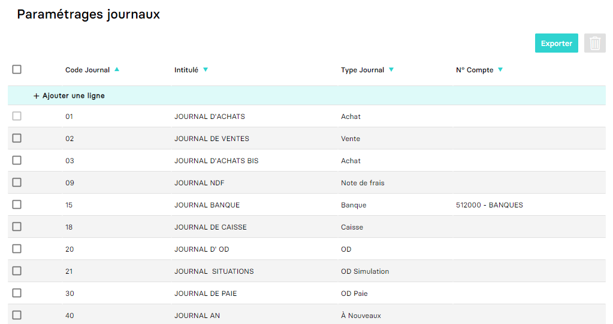

---
prev:
  text: 🐤 Introduction
  link: documentation.md
next: false
---

<span id="readme-top"></span>

# Gérer les journaux d'une société (dossier)

Ce guide a pour objectif de vous aider dans la gestion (création, mise à jour, suppression) des journaux d'une société (dossier).

Dans MyUnisoft, la gestion des journaux est accessible en passant par `Paramètres` > `Dossier` > `Journaux`.



## Ajouter un nouveau journal au dossier

Pour créer un nouveau journal depuis l'application, il suffit de cliquer sur le lien `+ Ajouter une ligne`.

### API

La route https://api.myunisoft.fr/api/v1/diary permet de créer un nouveau journal par le biais de l'API partenaires.

```bash
curl --location 'https://api.myunisoft.fr/api/v1/diary' \
--header 'X-Third-Party-Secret: nompartenaire-L8vlKfjJ5y7zwFj2J49xo53V' \
--header 'society-id: 1' \
--header 'Content-Type: application/json' \
--header 'Authorization: Bearer {{API_TOKEN}}' \
--data '{
    "code": "TEST",
    "name": "JOURNAL TESTS",
    "diary_type_id": 3,
    "diary_account_id": 18720228
}'
```

> [!IMPORTANT]
> Penser à préciser l'en-tête **society-id** si vous utilisez un 🔹 Accès cabinet.

En cas de succès de la requête, vous obtiendrez un status code `200`, ainsi que la réponse au format JSON suivante :

```json
{
    "diary_id": 123456
}
```

La route attend un body contenant plusieurs propriétés dont voici quelques détails :

- `code` : Le code journal que vous souhaitez affecter. Il doit être de **maximum 4 caractères**.
- `name` : Le nom du journal que vous souhaitez lui attribuer.
- `diary_type_id` : Il s'agit d'indiquer ici l'id du type de journal. La liste des différents types de journaux est **référencée plus bas dans cette page** à la section "Informations complémentaires".
- `diary_account_id` : En indiquant l'id du compte souhaité, vous pouvez le rattacher au journal que vous tentez de créer. Pour récupérer la liste des comptes d'un dossier, consultez cette [page](./account/create.md).

#### Définition TypeScript du body

```ts
interface Diary {
  code: string;
  name: string;
  diary_type_id: number;
  diary_account_id: number;
}
```

## Mettre à jour, fermer ou rouvrir un journal au dossier

Il est possible dans MyUnisoft de mettre à jour, fermer ou rouvrir un journal.

### API

La route https://api.myunisoft.fr/api/v1/diary permet ces opérations par le biais de l'API partenaires.

```bash
curl --location --request PUT 'https://api.myunisoft.fr/api/v1/diary?id=123456' \
--header 'X-Third-Party-Secret: nompartenaire-L8vlKfjJ5y7zwFj2J49xo53V' \
--header 'society-id: 1' \
--header 'Content-Type: application/json' \
--header 'Authorization: Bearer {{API_TOKEN}}' \
--data '{
    "name": "JOURNAL TEST MODIFIE",
    "diary_type_id": 1,
    "diary_account_id": 18721456
}'
```

> [!IMPORTANT]
> Penser à préciser l'en-tête **society-id** si vous utilisez un 🔹 Accès cabinet.

En cas de succès de la requête, vous obtiendrez un status code `200`, ainsi que la réponse au format JSON suivante :

```json
{
    "code": "Success",
    "message": ""
}
```

> [!NOTE]
> Afin de cibler le journal que vous désirez mettre à jour, fermer ou ouvrir, la route attend en paramètre [query string](https://en.wikipedia.org/wiki/Query_string) l'`id` du journal. Pour récupérer la valeur de ce paramètre vous pouvez consulter cette [page](./journaux.md).

La route attend un body contenant plusieurs propriétés dont voici quelques détails :

- `name` : Le nom du journal que vous souhaitez lui attribuer.
- `diary_type_id` : Il s'agit d'indiquer ici l'id du type de journal. La liste des différents types de journaux est **référencée plus bas dans cette page** à la section "Informations complémentaires".
- `diary_account_id` : En indiquant l'id du compte souhaité, vous pouvez le rattacher au journal que vous tentez de créer. Pour récupérer la liste des comptes d'un dossier, consultez cette [page](./account/create.md).
- `closed`: permet de fermer ou rouvrir un journal.

#### Définition TypeScript du body

```ts
interface Diary {
  name: string;
  diary_type_id: number;
  diary_account_id: number;
  closed: boolean;
}
```

## Supprimer un journal existant d'un dossier

Il est possible de supprimer un ou plusieurs journaux personnalisés depuis l'application.

### API

La route https://api.myunisoft.fr/api/v1/diary permet ces opérations par le biais de l'API partenaires.

```bash
curl --location --request DELETE 'https://app.myunisoft.fr/api/v1/diary' \
--header 'X-Third-Party-Secret: nompartenaire-L8vlKfjJ5y7zwFj2J49xo53V' \
--header 'society-id: 1' \
--header 'Content-Type: application/json' \
--header 'Authorization: Bearer {{API_TOKEN}}' \
--data '{
    "diary": [
        915140
    ]
}'
```

> [!IMPORTANT]
> Penser à préciser l'en-tête **society-id** si vous utilisez un 🔹 Accès cabinet.

En cas de succès de la requête, vous obtiendrez un status code `200`, ainsi que la réponse au format JSON suivante :

```json
{
    "code": "Success",
    "message": ""
}
```

La route attend un body contenant la propriété suivante :

- `diary` : Vous devrez passer un tableau avec l'id du journal que vous souhaitez supprimer. Pour récupérer la valeur de l'id du journal vous pouvez consulter cette [page](./journaux.md).

#### Définition TypeScript du body

```ts
interface DiariesToRemove {
  diary: number[]
}
```

## Informations complémentaires

### Type de journaux

| id | label | code |
| --- | --- | --- |
| 1 | Achat | ACH |
| 2 | Vente | VTE |
| 3 | Banque | BQ |
| 4 | Caisse | CAISSE |
| 5 | OD | OD |
| 6 | OD Audit | OD_AUDIT |
| 7 | OD Simulation | OD_SIMUL |
| 8 | À extourner | A_EXT |
| 9 | Extourne | EXT |
| 10 | À Nouveaux | AN |
| 11 | OD Paie | OD_PAIE |
| 12 | OD Lettrage | OD_LET |
| 13 | Note de frais | NDF |
| 14 | OD TVA | OD_DECL_FISCALE |
| 15 | OD Extracomptable | OD_EXC |
| 19 | Reprise Balance | RBAL |

<p align="right">(<a href="#readme-top">retour en haut de page</a>)</p>
