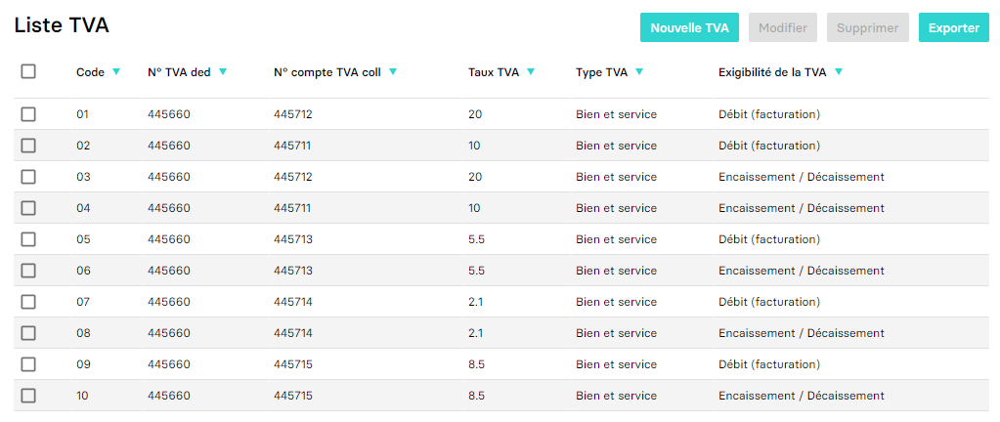

---
prev:
  text: 🐤 Introduction
  link: documentation.md
next: false
---

<span id="readme-top"></span>

# Récupérer la TVA d'une société (dossier)
Ce guide a pour objectif de vous aider dans la récupération des paramètres de TVA d'un dossier (société).

Dans MyUnisoft les paramètres de TVA peuvent être récupérés dans `Paramètres` > `Tenue` > `Plan comptable` > `Liste TVA`.



> 🐤 Développeur ? Débutant en comptabilité ? Nous vous recommandons les ressources suivantes:
> - [TVA collectée et TVA déductible](https://intia.fr/fr/ressources/lexique/tva-collectee-et-tva-deductible/)

## API

La route https://api.myunisoft.fr/api/v1/vat_param permet de récupérer la même liste mais par le biais de l'API partenaires.

```bash
$ curl --location --request GET 'https://api.myunisoft.fr/api/v1/vat_param' \
--header 'X-Third-Party-Secret: nompartenaire-L8vlKfjJ5y7zwFj2J49xo53V' \
--header 'Authorization: Bearer {{API_TOKEN}}'
```

> [!IMPORTANT]
> Penser à préciser l'en-tête **society-id** si vous utilisez un 🔹 Accès cabinet.

Si tout va bien vous devriez recevoir un JSON avec **une structure similaire à l'exemple ci-dessous**
```json
[
    {
        "vat_param_id": 6628,
        "code": "01",
        "account_ded": {
            "account_id": 1180209,
            "account_number": "445660",
            "label": "TVA DEDUCT.S/ACHATS"
        },
        "account_coll": {
            "account_id": 1180443,
            "account_number": "445712",
            "label": "TVA collectée"
        },
        "vat": {
            "id": 4,
            "rate": 20
        },
        "vat_type": {
            "id": 1,
            "label": "Bien et service"
        },
        "vat_exigility": {
            "id": 1,
            "label": "Débit (facturation)"
        },
        "blocked": false
    }
]
```

> [!WARNING]
> Il y a une erreur de frappe sur la clé **vat_exigility** (ce n'est pas une erreur dans l'exemple).

### Rate
Les rates possibiles sont: 2.10%, 5.5%, 10%, 20%, 8.5%, 0%, 0.90%, 1.05%, 1.75%. Leur Ids dans le même ordre (de 1 à 9).

<p align="right">(<a href="#readme-top">retour en haut de page</a>)</p>

### Type de TVA (vat_type)

| id | label |
| --- | --- |
| 1 | Bien et services |
| 2 | Immobilisation |
| 3 | Auto-liquidation |
| 4 | Non soumis / Exclu |
| 6 | Autres opérations imposables basées sur le CA (02/A2) |
| 7 | Autoliquidation SSBAT (02) |
| 8 | Livraison soi-même (02) |
| 9 | Autoliquidation intra S (2A/A3) |
| 10 | Autoliquidation import (2B) |
| 11 | Autoliquidation intra B (03/B2) |
| 12 | Export (04/E1) |
| 13 | Autres opérations non imposables (05/E2) |
| 14 | OP non imposables ventes à distances taxables état membre (5A/E3) |
| 15 | Livraisons intra (06/F2) |
| 16 | OP non imposables ventes B ou S par assujetti non établi en France  (7A/F7) |
| 17 | OP non imposables en franchise de Taxe (07/F6) |
| 18 | Autres opérations imposables basées sur les charges (02/A2) |
| 19 | Livraisons d'électricité (6A/F3) |
| 20 | Tva sur marge |
| 21 | Autoliquidation Importation (A4) |
| 22 | Autoliquidation Pétro (2D/B1) |
| 23 | Autoliquidation sortie de régime (A5) |
| 24 | OP non taxée importations (E4) |
| 25 | OP non taxée sortie de régime (E5) |
| 26 | OP non taxée importations  hors pétro sous régime susp (E6) |
| 27 | OP non taxée Acquisition intra (F1) |
| 28 | OP non taxée Importations pétro sous régime susp (F5) |

### Type d'Exigibilité (vat_exigility)

| id | label |
| --- | --- |
| 1 | Débit (facturation) |
| 2 | Encaissement / Décaissement |
| 3 | Mixte |

### Note sur la construction d'un label TVA

Les TVA sur MyUnisoft ne sont pas labellisés (ce qui peut être problématique dans certaines interconnexions). Si vous avez ce besoin il vous sera nécessaire de construire le label vous-même.

Nous vous recommandons de conserver le "**code**" ce qui vous permettra de visuellement faire le lien avec ce qui est présent dans My Unisoft.

## Définition TypeScript

Le endpoint **vat_param** retourne un tableau de structure VatParam.

```ts
interface Account {
  /** Internal (postgres incremented) account id */
  account_id: number;

  /** Account number (or class). Example: 411FOOBAR */
  account_number: string;

  /** Account name */
  label: string;
}

interface VatParam { 
  vat_param_id: number;
  code: string;
  account_ded: Account | null;
  account_coll: Account | null;
  vat: {
    id: number;
    rate: number;
  };
  vat_type: VatType;
  vat_exigility: VatExigility;
  blocked: boolean;
}

interface VatType {
  id: number;
  label: string;
  code: string;
}

interface VatExigility {
  id: number;
  label: string;
  code: string;
}

interface VatRegime {
  id: number;
  name: string;
  code: string;
}
```

Attention `account_ded` et `account_coll` peuvent être null (dans le cas d'un rate à 0% par exemple). La TVA `Autres opérations imposables basées sur le CA (02/A2)` ne possède pas de compte déductible.

## Architecture d'une TVA MyUnisoft
À la différence de plusieurs autres logiciels la TVA sur MyUnisoft est directement composé d'un compte achat (déductible) et vente (collectée). Dans le cadre d'une auto-liquidation vous aurez donc au sein d'une même TVA l'intégralité des informations qui vous sont nécessaires.

<p align="right">(<a href="#readme-top">retour en haut de page</a>)</p>
